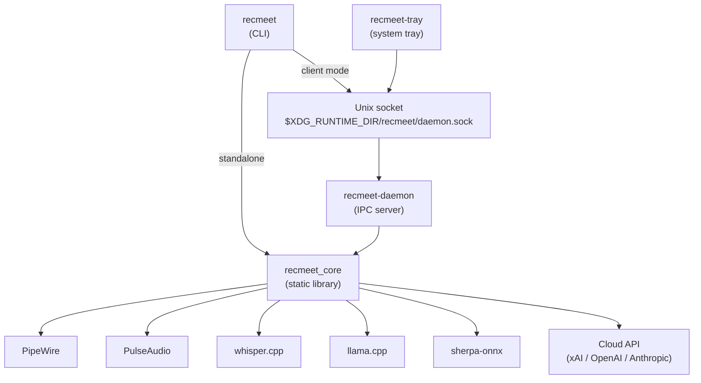
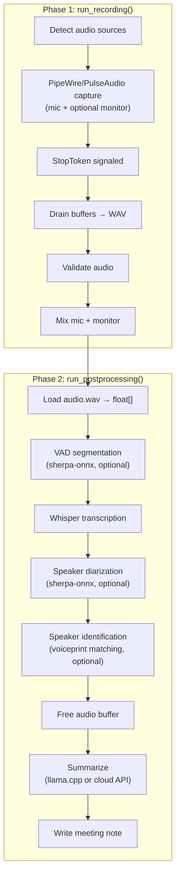
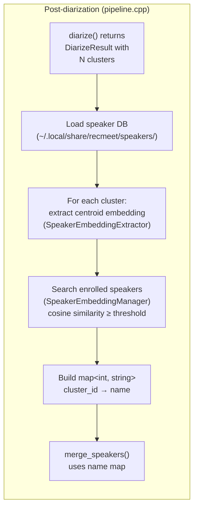
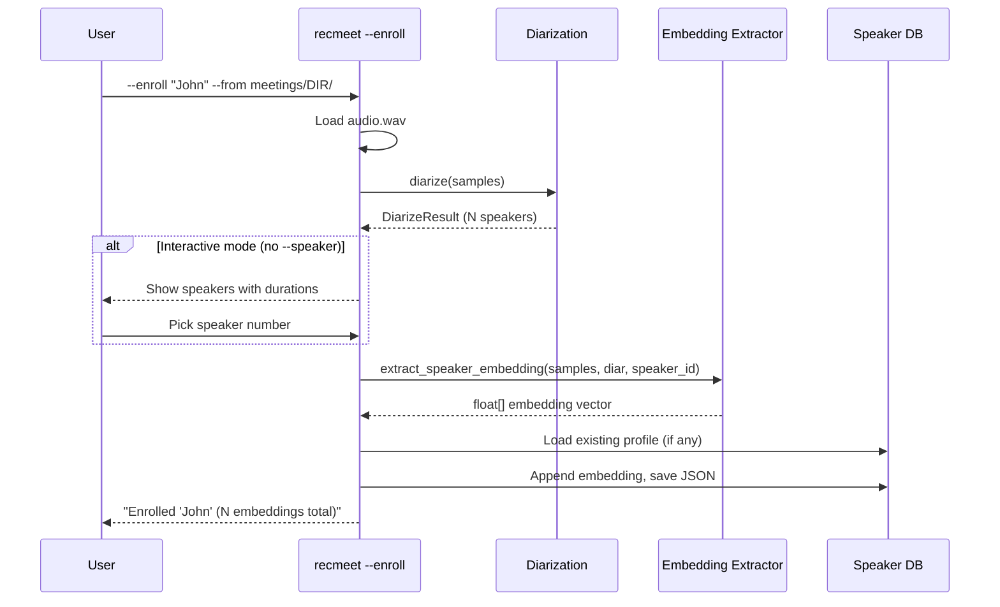
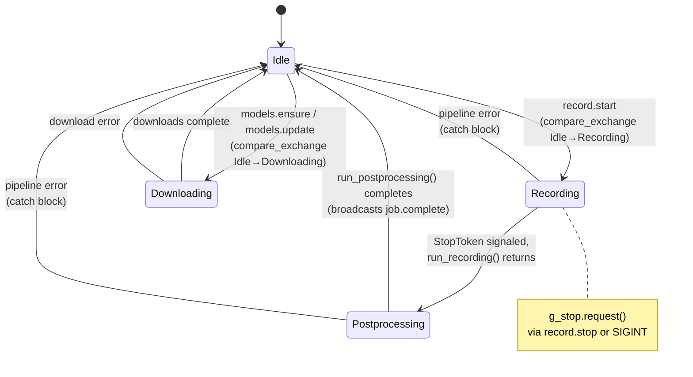
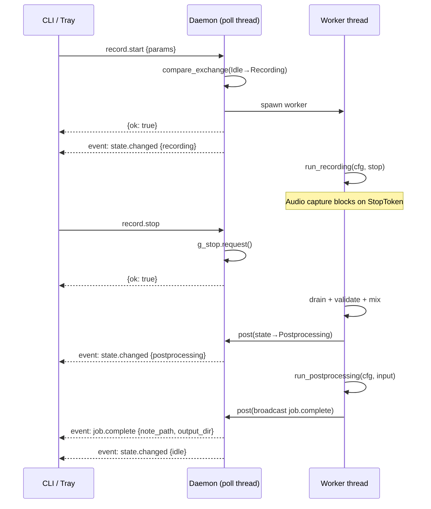
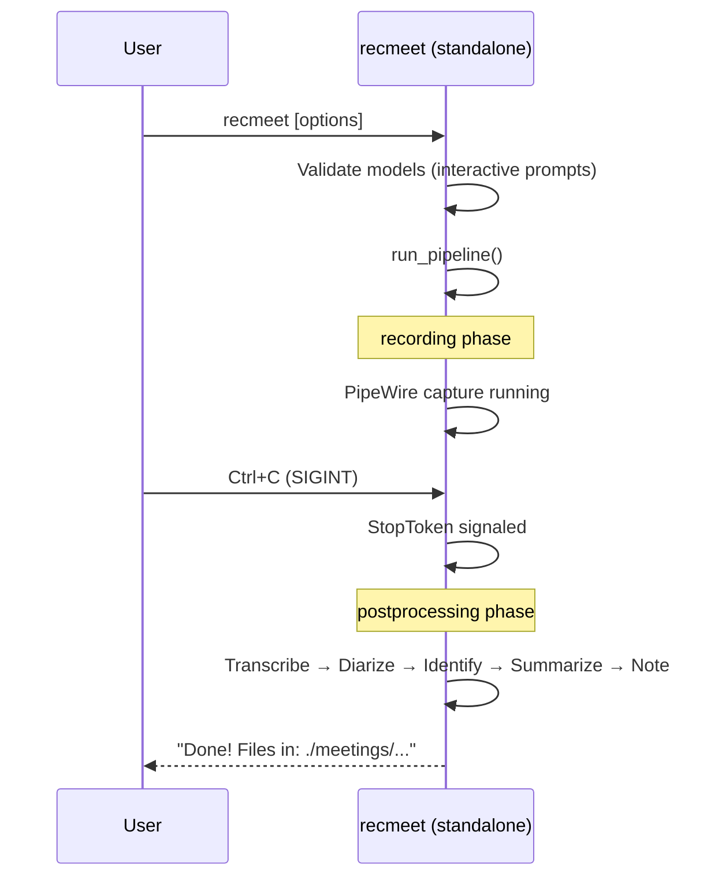
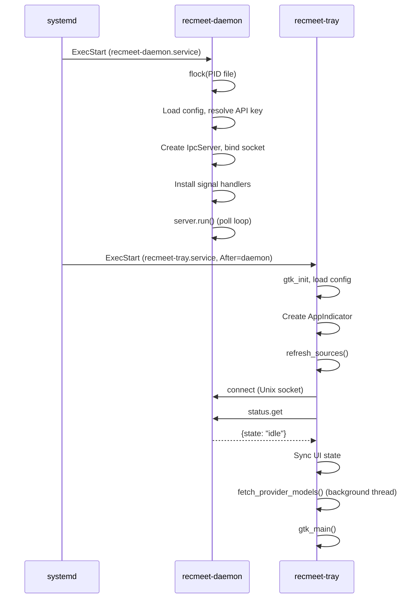
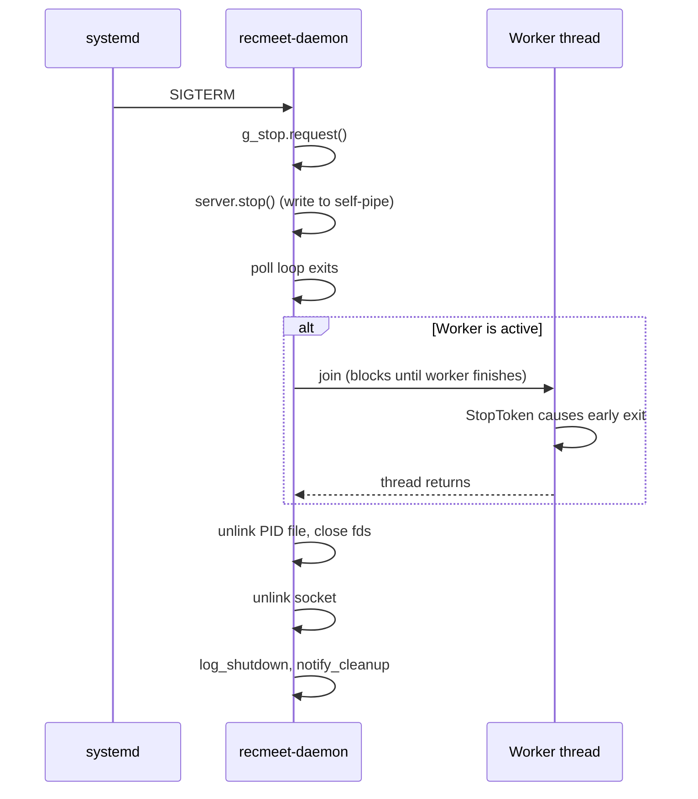
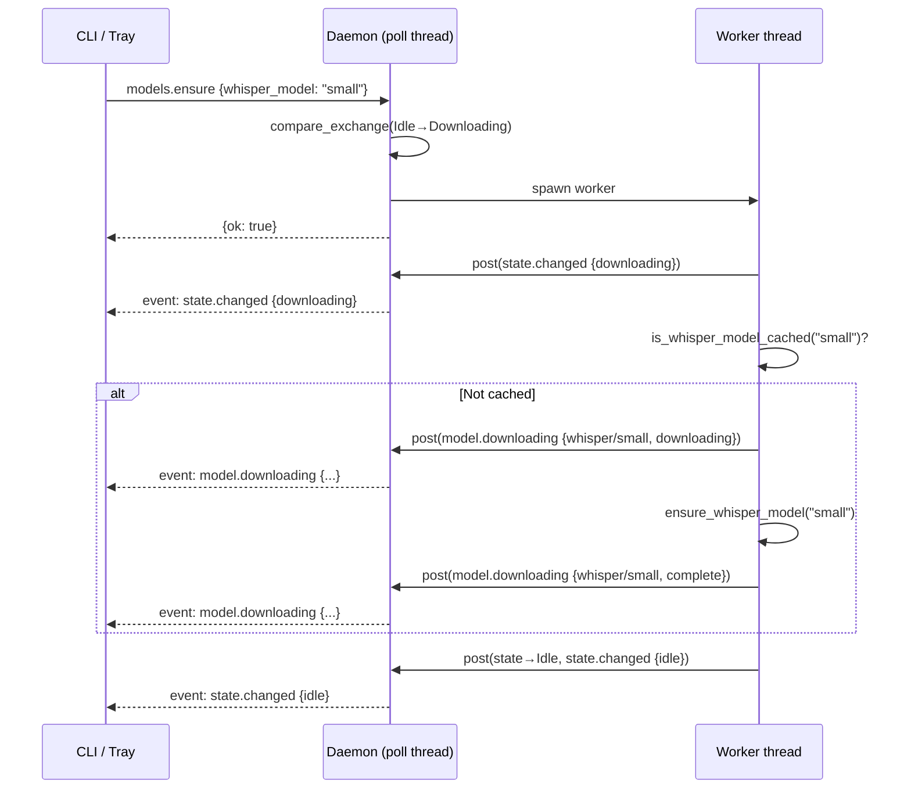

# Architecture

## Purpose

Recmeet records, transcribes, and summarizes meetings entirely on-device. Audio is captured via PipeWire/PulseAudio, transcribed with whisper.cpp, optionally diarized with sherpa-onnx, identified against enrolled voiceprints, and summarized either locally (llama.cpp) or through a cloud API. Everything runs on the user's machine — no audio or transcript data leaves the system unless the user explicitly configures a cloud summarization provider.

The system ships as three cooperating binaries connected by a Unix socket IPC layer, plus a static library that contains all shared logic.

## High-Level Architecture



## Build System and Binary Topology

CMake builds one static library (`recmeet_core`) from all shared sources, then links it into three executables:

| Target | Source | Extra link deps | Feature-gated |
|---|---|---|---|
| `recmeet` | `src/main.cpp` | — | — |
| `recmeet-daemon` | `src/daemon.cpp` | — | — |
| `recmeet-tray` | `src/tray.cpp` | GTK3, ayatana-appindicator3 | `RECMEET_BUILD_TRAY` |

### Feature flags (CMake options)

| Flag | Default | Effect |
|---|---|---|
| `RECMEET_BUILD_TRAY` | ON | Build `recmeet-tray` |
| `RECMEET_USE_LLAMA` | ON | Link llama.cpp for local summarization |
| `RECMEET_USE_SHERPA` | ON | Link sherpa-onnx for diarization + VAD |
| `RECMEET_USE_NOTIFY` | ON | Link libnotify for desktop notifications |
| `RECMEET_BUILD_TESTS` | ON | Build Catch2 test suite |

### systemd units

| Unit | Type | Purpose |
|---|---|---|
| `recmeet-daemon.service` | simple | Runs the daemon, restarts on failure |
| `recmeet-daemon.socket` | socket | Socket activation at `%t/recmeet/daemon.sock` |
| `recmeet-tray.service` | simple | Runs the tray, `Wants=recmeet-daemon.service` |

## Binary: `recmeet` (CLI)

**Source:** `src/main.cpp`

The CLI operates in one of two modes, selected at startup:

1. **Client mode** — sends IPC requests to a running daemon.
2. **Standalone mode** — runs the full pipeline in-process (original single-binary behavior).

### Mode selection logic

```
if --daemon flag        → client mode (fail if daemon unreachable)
if --no-daemon flag     → standalone mode
if --status or --stop   → client mode (always)
else (auto)             → client mode if daemon_running(), otherwise standalone
```

In client mode, the CLI sends `record.start` with config overrides, installs a SIGINT handler that sends `record.stop`, and blocks on `read_events("job.complete")` until the daemon reports completion.

In standalone mode, the CLI runs `run_pipeline()` directly — model validation, audio capture, transcription, and summarization all happen in the same process.

## Binary: `recmeet-daemon`

**Source:** `src/daemon.cpp`

A long-running IPC server that owns the recording pipeline. Designed for headless or always-on operation under systemd.

### State machine

The daemon tracks a single atomic state with four values:

| State | Meaning |
|---|---|
| `Idle` | Ready to accept work |
| `Recording` | Audio capture in progress (worker thread) |
| `Postprocessing` | Transcription + summarization in progress (worker thread) |
| `Downloading` | Model download in progress (worker thread) |

State transitions use `compare_exchange_strong` — only one job runs at a time.

### Worker threads

Heavy work (recording, postprocessing, model downloads) runs on a detached `std::thread` (`g_worker`). The worker communicates results back to the poll thread via `server.post()`, which writes to a self-pipe to wake `poll()` and execute the callback on the main thread. This keeps all IPC I/O and broadcast calls single-threaded.

### PID locking

The daemon creates `<socket_path>.pid` and holds an `flock(LOCK_EX|LOCK_NB)` for its lifetime, preventing duplicate instances.

### Signal handling

| Signal | Behavior |
|---|---|
| `SIGHUP` | Reload config from disk via `server.post()` |
| `SIGINT` / `SIGTERM` | Request stop on active recording, then exit the poll loop |

## Binary: `recmeet-tray`

**Source:** `src/tray.cpp`

A GTK system tray applet using ayatana-appindicator. The tray is a pure IPC client — it never runs the pipeline directly.

### GTK + GIO integration

The tray wraps the IPC client's socket fd in a `GIOChannel` watched by the GTK main loop (`g_io_add_watch`). When the daemon pushes an event, `on_ipc_data()` fires, calls `ipc.read_and_dispatch(0)`, and the event callback updates the UI.

### Reconnection

On disconnect (`G_IO_HUP`), the tray tears down the watch, schedules `try_reconnect()` via `g_timeout_add_seconds`, and uses exponential backoff (1, 2, 4, 8, 16, 30, 30, ...) until the daemon reappears.

### Menu-driven config

The tray builds a GTK menu with radio groups for mic source, monitor source, whisper model, language, summary provider, and API model. Changes are persisted to `~/.config/recmeet/config.yaml` immediately. When the user selects a whisper model, the tray sends `models.ensure` to trigger a background download.

## IPC Protocol

### Wire format

Newline-delimited JSON (NDJSON) over a Unix stream socket at `$XDG_RUNTIME_DIR/recmeet/daemon.sock` (fallback: `/tmp/recmeet-<uid>/daemon.sock`).

### Message types

| Direction | Type | Discriminant field | Structure |
|---|---|---|---|
| client → server | Request | `"method"` | `{"id": N, "method": "...", "params": {...}}` |
| server → client | Response | `"result"` | `{"id": N, "result": {...}}` |
| server → client | Error | `"error"` | `{"id": N, "error": {"code": N, "message": "..."}}` |
| server → client | Event | `"event"` | `{"event": "...", "data": {...}}` |

### JSON value types

Values are `string | int64 | double | bool | null`. Nested objects/arrays are stored as raw JSON strings in the flat `JsonMap`.

### Methods

| Method | Params | Result | Notes |
|---|---|---|---|
| `status.get` | — | `{state}` | Returns current daemon state name |
| `sources.list` | — | `{sources, count}` | JSON array of audio sources |
| `config.reload` | — | `{ok}` | Re-read config from disk |
| `config.update` | config key/values | `{ok}` | Merge into running config |
| `record.start` | config overrides | `{ok}` | Idle → Recording; error if busy |
| `record.stop` | — | `{ok}` | Signal stop; error if not recording |
| `models.list` | — | `{models}` | JSON array of cached model info |
| `models.ensure` | `{whisper_model?}` | `{ok}` | Download missing models; Idle → Downloading |
| `models.update` | — | `{ok}` | Re-download all cached models |

### Events (server → all clients)

| Event | Data | When |
|---|---|---|
| `state.changed` | `{state, error?}` | Any state transition |
| `phase` | `{name}` | Pipeline phase change (recording, transcribing, etc.) |
| `job.complete` | `{note_path, output_dir}` | Recording + postprocessing finished |
| `model.downloading` | `{model, status, error?}` | Model download progress |

### Error codes

| Code | Name | Meaning |
|---|---|---|
| -32600 | InvalidRequest | Malformed JSON |
| -32601 | MethodNotFound | Unknown method |
| -32602 | InvalidParams | Bad parameters |
| -32603 | InternalError | Server-side failure |
| 1 | AlreadyRecording | — |
| 2 | NotRecording | `record.stop` when idle |
| 3 | Busy | State is not Idle |

### Concurrency model

The IPC server runs a single-threaded `poll()` loop. All socket reads, writes, and broadcasts happen on this thread. Worker threads marshal results back via `server.post()` + self-pipe wakeup, ensuring no concurrent access to client fd state.

## Recording Pipeline

The pipeline has two phases, split at the point where audio capture completes:

1. **`run_recording()`** — audio capture (blocking on `StopToken`), WAV output, validation, mixing.
2. **`run_postprocessing()`** — transcription, diarization, speaker identification, summarization, note output.

In standalone mode, `run_pipeline()` calls both sequentially. In daemon mode, the worker thread calls them separately so it can broadcast `state.changed` between phases.



### Memory scoping strategy

The postprocessing phase uses nested scopes to minimize peak memory:

1. **Audio buffer scope** — `samples` vector is alive during transcription and diarization, freed before summarization.
2. **Whisper model scope** — the `WhisperModel` object is freed after transcription completes, before diarization begins.

This matters because whisper models (75 MB–1.5 GB) and audio buffers (16-bit, 16 kHz) can be large.

## Speaker Identification

Speaker identification matches diarization clusters against a persistent database of enrolled voiceprints, replacing generic `Speaker_XX` labels with real names across sessions.

### Architecture

The feature reuses the same 3D-Speaker embedding model (`eres2net_base`) already downloaded for diarization. No additional models are needed. The identification step runs inside the audio buffer scope, after diarization and before `merge_speakers()`.

**Source:** `src/speaker_id.h`, `src/speaker_id.cpp`

### Data flow



### Enrollment flow



### Speaker database

Each enrolled speaker is stored as a JSON file:

```
~/.local/share/recmeet/speakers/
├── John.json
├── Alice.json
└── Bob.json
```

**File format:**

```json
{
  "name": "John",
  "created": "2026-03-08T10:00:00Z",
  "updated": "2026-03-09T14:30:00Z",
  "embeddings": [
    [0.12, -0.34, 0.56, ...],
    [0.11, -0.32, 0.58, ...]
  ]
}
```

Each embedding is a float vector (typically 192 dimensions for the eres2net model, ~2-4 KB per enrollment). Multiple embeddings per speaker improve accuracy — they are all registered with the sherpa-onnx `SpeakerEmbeddingManager`, which handles averaging internally during search.

### sherpa-onnx API usage

The speaker identification module uses two sherpa-onnx C APIs that are separate from the high-level diarization API:

| API | Purpose | Lifecycle |
|---|---|---|
| `SherpaOnnxSpeakerEmbeddingExtractor` | Extract embedding vectors from audio segments | Created per identification run |
| `SherpaOnnxSpeakerEmbeddingManager` | Register enrolled embeddings and search by cosine similarity | Created per identification run, populated from disk DB |

**Embedding extraction** feeds all audio segments belonging to a diarization cluster into a single `OnlineStream`, then calls `ComputeEmbedding()` to get the centroid vector.

**Speaker search** uses `GetBestMatches(mgr, embedding, threshold, 1)` to find the highest-scoring enrolled speaker above the similarity threshold. Conflict resolution ensures no two clusters are assigned the same enrolled name — the highest-scoring match wins.

### Configuration

| Config field | CLI flag | Default | Description |
|---|---|---|---|
| `speaker_id.enabled` | `--no-speaker-id` | `true` | Enable/disable identification |
| `speaker_id.threshold` | `--speaker-threshold` | `0.6` | Cosine similarity threshold |
| `speaker_id.database` | `--speaker-db` | `~/.local/share/recmeet/speakers/` | Database directory path |

### Integration with merge_speakers()

`merge_speakers()` accepts an optional `std::map<int, std::string>` mapping cluster IDs to enrolled names. For clusters with no match, it falls back to `format_speaker()` (`Speaker_XX`). This keeps the merge logic clean — identification is fully decoupled from label assignment.

```cpp
// Without speaker ID (original behavior)
result.segments = merge_speakers(result.segments, diar);
// → "Speaker_01: Hello"

// With speaker ID
auto names = identify_speakers(samples, diar, db, model_path, threshold);
result.segments = merge_speakers(result.segments, diar, names);
// → "John: Hello"
```

## Dependencies

### Vendored (compiled from source)

| Library | Purpose | CMake target |
|---|---|---|
| whisper.cpp | Speech-to-text transcription | `whisper` |
| llama.cpp | Local LLM summarization | `llama` (gated by `RECMEET_USE_LLAMA`) |
| sherpa-onnx | Speaker diarization, identification + VAD | `sherpa-onnx-c-api` (gated by `RECMEET_USE_SHERPA`) |

### Platform (pkg-config)

| Package | Purpose |
|---|---|
| `libpipewire-0.3` | Audio capture (primary) |
| `libpulse`, `libpulse-simple` | Monitor source fallback |
| `sndfile` | WAV read/write |
| `libcurl` | HTTP client (API calls, model downloads) |
| `libnotify` | Desktop notifications (optional) |
| `gtk+-3.0` | Tray UI (tray only) |
| `ayatana-appindicator3-0.1` | System tray indicator (tray only) |

### Runtime (not linked)

| Dependency | Purpose |
|---|---|
| PipeWire (running) | Audio routing |
| onnxruntime | sherpa-onnx backend (system package preferred) |

## Daemon State Machine



## Lifecycle Diagrams

### Daemon-mode recording session



### Standalone recording session



### Startup sequence



### Shutdown sequence



### Model download flow


