# Architecture

## Purpose

Recmeet records, transcribes, and summarizes meetings entirely on-device. The system is split into a **thin client** (tray or CLI) that owns local audio capture and a **headless daemon** that owns heavy compute — transcription with whisper.cpp, diarization with sherpa-onnx, voiceprint identification, and summarization (local llama.cpp or a cloud API). The client streams or uploads audio to the daemon over a framed IPC transport; the daemon enqueues postprocess work in a typed-slot `JobQueue`, processes it in a subprocess for memory containment, and emits routed events back to the originating client. Everything runs on the user's machine unless a cloud summarization provider is configured.

Two additional Go binaries provide AI-powered tooling — an MCP server for IDE integration and an agent CLI for automated meeting prep and follow-up. They read meeting artifacts directly from disk and are unaffected by IPC changes.

## High-Level Architecture

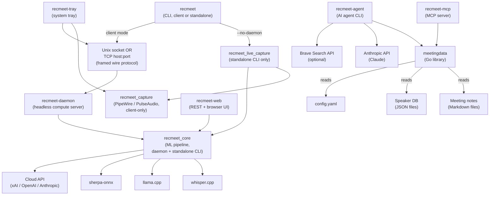

Key V2 facts the diagram encodes:

- **Audio capture is client-side.** Only the tray, the standalone CLI, and the `recmeet_live_capture` shim link `recmeet_capture` (which holds the PipeWire / PulseAudio surface). The daemon does **not** link PipeWire or PulseAudio — verify with `ldd build/recmeet-daemon | grep -E 'pipewire|pulse'` (expect no hits). See `CMakeLists.txt:251-265` (capture lib) and `CMakeLists.txt:357-361` (daemon target).
- **Two transports, one wire format.** The daemon's `--listen` flag accepts either a Unix socket path or a `host:port`. TCP listeners require `RECMEET_AUTH_TOKEN` at startup and a PSK handshake per connection; Unix listeners rely on kernel peer credentials.
- **Standalone CLI still works.** `recmeet --no-daemon` runs `run_recording()` + `run_postprocessing()` in-process via `recmeet_live_capture`. This is unchanged from V1 and is the only path that touches both capture and ML pipeline in the same address space.

## Build System and Binary Topology

CMake builds four static libraries — `recmeet_ipc`, `recmeet_capture`, `recmeet_core`, and `recmeet_live_capture` — and links them into the C++ executables in a deliberately layered way. The split exists so the daemon never has to link audio-stack dependencies and the IPC surface never has to link ML dependencies.

| Library | Source | Holds | Links |
|---|---|---|---|
| `recmeet_ipc` | `src/ipc_*`, `src/config*`, `src/session_merge.cpp`, `src/fetch_artifacts.cpp` | Wire protocol, framing, session-credential merge, artifact enumeration | Threads, CURL, (libnotify) |
| `recmeet_capture` | `src/audio_capture.cpp`, `src/audio_monitor.cpp`, `src/device_enum.cpp`, `src/tray_capture.cpp` | PipeWire + PulseAudio capture, source enumeration, tray's fan-out shim | `recmeet_ipc`, PIPEWIRE, PULSE, PULSE_SIMPLE, SNDFILE |
| `recmeet_core` | ML pipeline (`pipeline.cpp`, `transcribe.cpp`, `diarize.cpp`, `summarize.cpp`, `note.cpp`, `speaker_id.cpp`, `vad.cpp`, `caption_engine.cpp`), plus C.7 `job_queue.cpp`, C.10a `streaming_session.cpp`, C.2 `upload_session.cpp`, C.8 `diarization_cache.cpp` | Postprocess pipeline, server-side JobQueue, server-side upload + streaming session managers, diarization cache | `recmeet_ipc`, SNDFILE, whisper, (llama), (sherpa) |
| `recmeet_live_capture` | `src/live_recording.cpp`, `src/reprocess_batch.cpp` | `run_recording()` / `run_pipeline()` for the standalone CLI; batch reprocess driver | `recmeet_core`, `recmeet_capture` |

| Executable | Source | Links | Feature-gated |
|---|---|---|---|
| `recmeet` (CLI) | `src/main.cpp` | `recmeet_core`, `recmeet_live_capture` | — |
| `recmeet-daemon` | `src/daemon.cpp` | `recmeet_core` only (no capture, no PipeWire/Pulse) | — |
| `recmeet-tray` | `src/tray.cpp` | `recmeet_ipc`, `recmeet_capture`, SNDFILE, GTK3, ayatana-appindicator3 | `RECMEET_BUILD_TRAY` |
| `recmeet-web` | `src/web.cpp` + cpp-httplib | `recmeet_core` | `RECMEET_BUILD_WEB` |
| `recmeet-mcp` | `tools/cmd/recmeet-mcp/main.go` | mcp-go | — |
| `recmeet-agent` | `tools/cmd/recmeet-agent/main.go` | anthropic-sdk-go, cobra | — |

The daemon-side `streaming_session.cpp` lives in `recmeet_core` (not in `recmeet_capture`) because it composes `caption_engine` + `job_queue` and consumes network `0x03` audio frames — it never touches the local audio stack. See `CMakeLists.txt:315-321`.

### Feature flags (CMake options)

| Flag | Default | Effect |
|---|---|---|
| `RECMEET_BUILD_TRAY` | ON | Build `recmeet-tray` |
| `RECMEET_BUILD_WEB` | ON | Build `recmeet-web` |
| `RECMEET_BUILD_GO_TOOLS` | ON | Build the Go MCP server + agent CLI |
| `RECMEET_USE_LLAMA` | ON | Link llama.cpp for local summarization |
| `RECMEET_USE_SHERPA` | ON | Link sherpa-onnx for diarization + VAD |
| `RECMEET_USE_NOTIFY` | ON | Link libnotify for desktop notifications |
| `RECMEET_BUILD_TESTS` | ON | Build Catch2 test suite |

### systemd units

| Unit | Type | Purpose |
|---|---|---|
| `recmeet-daemon.service` | simple | Runs the daemon, restarts on failure |
| `recmeet-daemon.socket` | socket | Socket activation at `%t/recmeet/daemon.sock` |
| `recmeet-tray.service` | simple | Runs the tray, `Wants=recmeet-daemon.service` |

## Binary: `recmeet` (CLI)

**Source:** `src/main.cpp`

The CLI operates in one of two modes, selected at startup:

1. **Client mode** — sends IPC requests to a running daemon over the framed wire protocol (Unix socket or TCP).
2. **Standalone mode** — runs the full pipeline in-process via `recmeet_live_capture` (`src/live_recording.cpp`). This is the only path that records audio and runs the ML pipeline in the same address space.

### Mode selection logic

```
if --daemon flag        → client mode (fail if daemon unreachable)
if --no-daemon flag     → standalone mode
if --status or --stop   → client mode (always)
else (auto)             → client mode if daemon_running(), otherwise standalone
```

In **client mode**, the CLI:

1. Opens the IPC connection and, for TCP, sends the PSK auth frame; reads back `auth.ok` and stamps `client_id` + `protocol_version` (must equal `IPC_PROTOCOL_VERSION = 3`).
2. Sends `session.init` to populate the per-client credential + preference slot.
3. For a file-based postprocess (e.g. `--reprocess <dir>`): sends `process.submit { mode: "transcribe", audio_size, format, ... }`, receives `{ job_id, upload_token, max_size }`, streams the audio as `0x01` BinaryUpload frames, then polls `job.status` or watches `progress.job` events for the returned `job_id`. When the job reaches `done`, the client sends `process.fetch { job_id }` and receives a metadata NDJSON response followed by one `0x02` BinaryArtifact frame per artifact.
4. SIGINT cancels the active job via `process.cancel { job_id }` rather than the V1 `record.stop`.

In **standalone mode**, the CLI runs `run_pipeline()` directly — model validation, PipeWire/PulseAudio capture, transcription, diarization, identification, and summarization all happen in this process. The daemon-side path is irrelevant; this is the same code that postprocess subprocesses run when invoked via `recmeet --subprocess-mode <config.json>`.

## Binary: `recmeet-daemon`

**Source:** `src/daemon.cpp`

A long-running compute server. Does **not** capture audio. Designed for headless or always-on operation under systemd. The daemon's whole job is to accept upload / stream / fetch / cancel verbs from one or more authenticated clients and run the postprocess pipeline on their audio.

### Invocation

```
recmeet-daemon --listen <addr> [--log-level ...] [--log-dir ...]
```

`<addr>` is parsed by `parse_ipc_address()` (`src/ipc_protocol.cpp`) — heuristic: digits-after-last-colon in `1..65535` means TCP `host:port`, anything else is a Unix socket path. The legacy `--socket` flag is a synonym.

**TCP fail-stop.** If `<addr>` parses as TCP and `RECMEET_AUTH_TOKEN` is unset, the daemon refuses to start (`src/daemon.cpp:1485-1496`). There is no warn-and-continue — exposing the compute surface to the network without a PSK is unacceptable.

### Job queue (the core concurrency mechanism)

The pre-V2 model of three loose atomics (`g_recording` / `g_postprocessing` / `g_downloading`) guarding a single FIFO is gone. Phase C.7 replaced it with `JobQueue` (`src/job_queue.h:142`), a typed-slot scheduler with three independent capacity-1 slots:

| Slot | Capacity | Drains via | Holds |
|---|---|---|---|
| `Postprocess` | 1 | `pp_worker_loop` (single thread that fork+execs `recmeet --subprocess-mode` per job) | One transcribe / diarize / summarize job |
| `Streaming` | 1 | `stream_worker_loop` + the poll-thread `0x03` frame feed | One live caption + buffered streaming session |
| `ModelDownload` | 1 | `dl_worker` | One whisper / sherpa / llama model fetch |

The slots are **independent**: a postprocess job, a streaming session, and a model download can all be running simultaneously. Two postprocess submissions queue serially behind the postprocess slot's running marker. The single `JobQueue::mu_` mutex (`src/job_queue.cpp`) is the direct successor of the V1 `g_state_mu` — it now guards every slot's FIFO, every running marker, the job registry, and the cross-slot model-download dependency map.

Each `Job` carries `kind`, `client_id`, `state`, and the payload (`PostprocessInput` + `Config` for postprocess; `model_id` + `force_download` for downloads). Lifecycle states (lowercase on the wire — see `job_state_name()` in `src/job_queue.cpp:29`):

- `queued` — in a slot FIFO, not yet dequeued.
- `waiting_for_upload` — `process.submit` reserved the `job_id`; `0x01` upload frames have not yet finalized.
- `waiting_on_download` — dequeued postprocess job whose required model is missing; parked while an auto-enqueued `ModelDownload` runs.
- `running` — slot's running marker is set; the job is executing.
- `done` / `failed` / `cancelled` — terminal.

**Auto-download on missing model.** At `dequeue(Postprocess)` time, `JobQueue` consults the wired `ModelResolver` + `ModelCacheChecker`. If a required model is missing it auto-enqueues a `ModelDownload` job into the `model_download` slot, parks the postprocess job in `waiting_on_download`, and records the dependency. The daemon's `JobEventSink` emits a `progress.job` event with `phase: "downloading_model"` for the parked job. When `finish_download(ok)` fires, every parked dependent is re-armed at the front of its slot FIFO; on failure they are failed.

**job_id → client_id binding.** `JobQueue` is the authoritative owner of this binding. `JobQueue::client_for_job(job_id)` is what the daemon's send loop and the C.5 / C.4 / C.6 handlers consult to route `progress.job` / `job.complete` / `caption` / artifact frames to the originating client.

### State broadcast

`state.changed` is the only remaining global broadcast. It carries the composite state name plus the three per-slot booleans `postprocessing` / `streaming` / `downloading` (see `fill_state_fields()` in `src/daemon.cpp:151`). The V1 `recording` boolean is removed in C.9; clients that need to know whether something is in flight read `state` (`"idle"`, `"postprocessing"`, `"streaming"`, or `"downloading"` — priority order) or the per-slot booleans. Per-job updates (`progress.job`, `job.complete`, `caption`) flow via `IpcServer::send_to_client(client_id, event)` instead, falling back to `broadcast()` only when the originator's `client_id` is empty (a defensive path for daemon-internal jobs predating any `session.init`).

### Worker threads

Three long-lived worker threads drain the slots:

| Thread | Loop | Spawned by |
|---|---|---|
| `g_pp_worker` | `pp_worker_loop` — dequeues `Postprocess`, fork+execs `recmeet --subprocess-mode <cfg.json>`, supervises the child with the cgroup-aware kill grace machine (T1C.2) | `main()` |
| `g_dl_worker` | Drains `ModelDownload`; calls `finish_download()` on completion so parked dependents re-arm | `main()` |
| `g_stream_worker` | Drains `Streaming` slot's dequeue (sets the slot's running marker — the actual `0x03` frame feed runs on the poll thread) | `main()` |

All three marshal results back to the poll thread via `server.post()` + self-pipe wakeup. The poll thread is the only thread that touches the wire — workers never call `broadcast()` or `send_to_client()` directly.

**Postprocess subprocess isolation.** Each postprocess job runs in a fresh `recmeet --subprocess-mode` child. This is iter-90 hard-won: onnxruntime's heap can corrupt over the lifetime of a long-lived daemon, and the only reliable mitigation is a per-job address space. The parent writes `cfg` to a tmp JSON file (`write_job_config()`), `fork()` + `execv()` the self-binary, watches the child's stdout for `progress.job` lines, and reaps via `waitpid()`. The `merge_creds_for_job()` (`src/session_merge.h:55`) call resolves the per-job `Config` from three sources with precedence `daemon env > session.init credentials > daemon.yaml` so the subprocess sees the per-client view even though it never re-reads the environment.

### PID locking

The daemon creates a PID file and holds an `flock(LOCK_EX|LOCK_NB)` for its lifetime, preventing duplicate instances. For Unix socket listeners the PID lives at `<socket_path>.pid`; for TCP listeners it lives at `$XDG_RUNTIME_DIR/recmeet/daemon-tcp.pid` (`src/daemon.cpp:1097-1108`).

### Signal handling

| Signal | Behavior |
|---|---|
| `SIGHUP` | Reload `daemon.yaml` from disk via `server.post()` — the merged-config snapshot is recomputed on the next job; uploads / streams already in flight keep the snapshot they were created with |
| `SIGINT` / `SIGTERM` | Request stop on active postprocess child (`g_pp_stop.request()`), call `server.stop()` to exit the poll loop, then `JobQueue::shutdown()` wakes every blocked `dequeue()` so the worker threads can join |

## Binary: `recmeet-tray`

**Source:** `src/tray.cpp`

A GTK system tray applet using ayatana-appindicator. In V2 the tray **owns local audio capture end-to-end** via `recmeet_capture` and submits or streams audio to the daemon over the IPC connection. It is the canonical thin client.

### Local capture lifecycle (`tray_state.capture_state`, `src/tray.cpp:130`)

The tray owns:

- A `PipeWireCapture` (or `PulseMonitorCapture` for monitor sources) instance.
- A `wav_buffer` of int16 samples protected by `wav_mtx`; `start_capture()` clears it, the capture's audio callback appends on every chunk, `stop_capture()` drains it to a staging WAV under `$XDG_RUNTIME_DIR/recmeet/staging/`.
- When live captions are enabled, a second fan-out subscriber that pumps the same audio frames to a `process.stream` session on the daemon (stacking the streaming feed on top of the WAV staging feed — both consume from the same capture).

After capture stops the tray is in a `waiting_disposition` state — the operator picks **Submit** (send to daemon via `process.submit` + `0x01` upload frames), **Save** (keep the WAV on disk), or **Discard** (unlink).

### Per-connection session handshake

The tray sends `session.init` exactly once per IPC connection, immediately after connect (or after a reconnect). The handshake populates the daemon's per-client credential slot — `SessionCredentials` (provider API keys: xAI / OpenAI / Anthropic / Brave) and `SessionPreferences` (whisper model, language, vocabulary, output paths, mic/monitor source, llm_model, captions_enabled, summarization backend). Subsequent recordings use whatever the slot holds; updates land via `session.update_credentials` and `session.update_prefs`.

### Job correlation

When the user submits a recording, the tray:

1. Sends `process.submit` and stashes the returned `job_id` + `upload_token`.
2. Sends one `0x01` BinaryUpload frame containing the staged WAV bytes.
3. Watches `progress.job` events filtered by `job_id` to drive a tray-notification status string.
4. On `job.complete` (routed to this client by `JobQueue::client_for_job()`), optionally sends `process.fetch { job_id }` and writes the artifacts under the configured output directory. The tray's "Meeting note ready" desktop notification fires from the `job.complete` data, not from a state-machine transition.

The same `job_id` tracking also drives the cancel path: the tray's "Cancel" item sends `process.cancel { job_id }` regardless of which slot the job currently lives in.

### GTK + GIO integration

The tray wraps the IPC client's socket fd in a `GIOChannel` watched by the GTK main loop (`g_io_add_watch`). When the daemon pushes an event, `on_ipc_data()` fires, calls `ipc.read_and_dispatch(0)`, and the event callback updates the UI.

### Reconnection

On disconnect (`G_IO_HUP`), the tray tears down the watch, schedules `try_reconnect()` via `g_timeout_add_seconds`, and uses exponential backoff (1, 2, 4, 8, 16, 30, 30, ...) until the daemon reappears. After a successful reconnect it re-sends `session.init` (the daemon's per-client slot is keyed by the freshly-minted `client_id`, so the prior credentials are gone).

### Menu-driven config

The tray builds a GTK menu with radio groups for mic source, monitor source, whisper model, language, summary provider, and API model. Most changes are persisted to `~/.config/recmeet/config.yaml` immediately and pushed to the daemon via `session.update_prefs` so the next `process.submit` sees them. When the user selects a whisper model the tray sends `models.ensure` to enqueue a `ModelDownload` job; the daemon's `progress.job` events drive the in-menu download indicator.

## IPC Protocol

`IPC_PROTOCOL_VERSION = 3` (`src/ipc_protocol.h:66`). The version is stamped into every `auth.ok` frame; a mismatch closes the connection. The full wire-format reference lives in [`docs/IPC-WIRE-PROTOCOL.md`](IPC-WIRE-PROTOCOL.md) — this section is the architectural summary.

### Transport

The daemon's `--listen` flag accepts either a Unix socket path (default `$XDG_RUNTIME_DIR/recmeet/daemon.sock`, fallback `/tmp/recmeet-<uid>/daemon.sock`) or a TCP `host:port`. The wire format and verb surface are identical on both transports; only the auth gate differs (TCP requires the PSK handshake; Unix bypasses it).

### Frame format (Phase C.1)

Every frame on the wire begins with a 1-byte type discriminator:

| Discriminator | Name | Body |
|---|---|---|
| `0x00` | `Ndjson` | One JSON object followed by `'\n'`. Carries requests, responses, errors, events, and the auth handshake. |
| `0x01` | `BinaryUpload` | 4-byte big-endian length `N` + `N` payload bytes. Client→daemon. Used by `process.submit` to ship audio. |
| `0x02` | `BinaryArtifact` | 4-byte big-endian length + payload. Daemon→client. Used by `process.fetch` to ship artifacts. |
| `0x03` | `StreamAudio` | 4-byte big-endian length + raw PCM. Client→daemon. Used by `process.stream` to feed the streaming caption engine. |
| `0x04+` | (reserved) | `FrameReader` rejects with `BadDiscriminator` and the connection is closed. |

Default cap on a single binary frame's declared length is **16 MiB** (`kDefaultMaxBinaryFrameBytes` — `src/ipc_protocol.h:213`). A frame whose 4-byte length header exceeds the cap is rejected before any payload bytes are buffered, so a hostile peer cannot make the reader allocate.

The receiving side runs a per-connection `FrameReader` state machine (`src/ipc_protocol.h:248`) that buffers across partial reads and transparently interleaves a fully-received NDJSON request between two binary frames of an in-flight upload or stream.

### NDJSON message types (inside an `0x00` frame)

| Direction | Type | Discriminant field | Structure |
|---|---|---|---|
| client → server | Request | `"method"` | `{"id": N, "method": "...", "params": {...}}` |
| server → client | Response | `"result"` | `{"id": N, "result": {...}}` |
| server → client | Error | `"error"` | `{"id": N, "error": {"code": N, "message": "..."}}` |
| server → client | Event | `"event"` | `{"event": "...", "data": {...}, "client_id"?: "..."}` |
| client → server | Auth | `"type":"auth.token"` | `{"type":"auth.token","token":"..."}` (TCP only) |
| server → client | Auth ack | `"type":"auth.ok"` | `{"type":"auth.ok","client_id":"...","protocol_version":N}` |
| server → client | Auth reject | `"type":"auth.error"` | `{"type":"auth.error","reason":"invalid_token"\|"auth_required"}` |

Values inside `params` / `result` / `data` are `string | int64 | double | bool | null`. Nested objects and arrays are stored as raw JSON strings in the flat `JsonMap` and re-parsed on receive (the `process.fetch { artifacts: [...] }` and `job.list { jobs: [...] }` arrays use this).

### Authentication (Phase A.1 + A.5)

TCP connections start in `PendingPsk`. The client's first frame must be `{"type":"auth.token","token":"..."}`; on match the server emits `{"type":"auth.ok","client_id":"<id>","protocol_version":3}`, mints a fresh server-side `client_id` (format `c-<counter>-<6 hex>`, `src/ipc_server.h:333`), records the `client_id → fd` reverse map, and flips `auth_state` to `Authed`. The PSK comes from `RECMEET_AUTH_TOKEN` and is constant-time-compared so the daemon never leaks the prefix length. The token itself is never logged.

Unix-socket connections skip the PSK gate (kernel peer credentials are sufficient for local trust) but still receive a server-issued `client_id` and `auth.ok` so the rest of the protocol is uniform.

### Verbs (V2 surface)

Every verb except `status.get` / `config.reload` / `models.list` / `models.ensure` / `models.update` / the `speakers.*` family is new in V2. The V1 verbs `record.start`, `record.stop`, `job.context`, `sources.list`, and `config.update` were **removed in C.9 / A.6** — a stray request returns `MethodNotFound`.

**Session handshake** (Phase A.6):

| Verb | Params | Result | Purpose |
|---|---|---|---|
| `session.init` | `{credentials: {...}, preferences: {...}}` | `{ok}` | Populate the per-`client_id` session slot with `SessionCredentials` + `SessionPreferences`. Sent exactly once per connection. |
| `session.update_credentials` | `{credentials: {...}}` | `{ok}` | Partial credential refresh (e.g. tray rotates an API key). |
| `session.update_prefs` | `{preferences: {...}}` | `{ok}` | Partial preference refresh (whisper_model, language, output_dir, etc.). |

**Batch postprocess** (Phase C.2 + C.4 + C.5):

| Verb | Params | Result | Purpose |
|---|---|---|---|
| `process.submit` | `{mode, audio_size, format, sample_rate?, channels?, context?, enroll_name?}` | `{job_id, upload_token, max_size}` | Reserve a postprocess `job_id` and an upload token. Client then sends `0x01` frames totaling `audio_size` bytes. `mode` is `"transcribe"` (default) or `"enroll"` (C.8 — diarize-only, populates the per-job `DiarizationCache`). |
| `process.submit.cancel` | `{upload_token}` | `{ok}` | Abort an in-flight upload by token. Tears down the staging dir + the `waiting_for_upload` reservation. |
| `process.fetch` | `{job_id}` | `{job_id, artifacts: [{name,size,content_type}, ...], total_size}` + one `0x02` BinaryArtifact frame per artifact in order | Download the artifacts of a `Done` postprocess job. `JobNotReady` if the job is not in `done`. |
| `process.cancel` | `{job_id}` | `{ok}` | Unified cancel by `job_id`. Works for any slot — postprocess / streaming / model_download — and any non-terminal state (`queued`, `waiting_*`, `running`). |

**Streaming captions** (Phase C.10a + C.10b):

| Verb | Params | Result | Purpose |
|---|---|---|---|
| `process.stream` | `{format?, sample_rate?, channels?, language?, captions_enabled?, latency_budget_ms?, context?}` | `{job_id, stream_token}` | Open a streaming session. Captures-the-config snapshot for the eventual postprocess on `commit`. Client then sends `0x03` PCM frames; the daemon feeds them into a `CaptionEngine` and emits `caption` / `caption.degraded` events routed to this `client_id`. |
| `process.stream.cancel` | `{stream_token}` | `{ok}` | Discard the streaming session + its buffered audio (unlinks the disk-backed temp WAV) and release the slot. |
| `process.stream.commit` | `{stream_token}` | `{job_id, ok}` | Flush + close the temp WAV, enqueue a fresh `Postprocess` job from the accumulated audio (transcribe + diarize + summarize), release the streaming slot. The returned `job_id` is the NEW postprocess job; the client watches it via `progress.job` + `process.fetch` exactly like a `process.submit` job. |

**Job introspection** (Phase C.6):

| Verb | Params | Result | Purpose |
|---|---|---|---|
| `job.status` | `{job_id}` | `{job_id, kind, state, client_id, model_id, error}` | Single-job snapshot. The registry retains terminal jobs so `done`/`failed`/`cancelled` are fully queryable. |
| `job.list` | — | `{jobs: [{job_id, kind, state, client_id, model_id, error}, ...], count}` | All jobs owned by the requesting `client_id`, ascending by `job_id`. Server-side scoping; the client cannot list other clients' jobs. |

**Voiceprint enrollment** (Phase C.8):

| Verb | Params | Result | Purpose |
|---|---|---|---|
| `enroll.finalize` | `{job_id, target_speaker, enroll_name}` | `{ok}` | Two-step enrollment finalizer. Pulls the centroid for `target_speaker` out of the daemon's `DiarizationCache[job_id]`, appends it to the named speaker profile in the speakers DB. Pairs with `process.submit {mode:"enroll"}` (flow a — fresh audio) or with an existing postprocess job's diarization cache (flow b — re-use). |

**Carry-overs from V1** (still on the wire, refactored but not renamed):

| Verb | Params | Result | Notes |
|---|---|---|---|
| `status.get` | — | `{state, postprocessing, streaming, downloading}` | Composite state — see "State broadcast" above. The `recording` boolean is gone in C.9. |
| `config.reload` | — | `{ok}` | Re-read `daemon.yaml`. Per-request config overrides are NOT supported — they flow via `session.update_*` instead (A.6 removed `config.update`). |
| `models.list` | — | `{models}` | Cached model inventory. |
| `models.ensure` | `{whisper_model?}` | `{ok, job_id?}` | Enqueue a `ModelDownload` job for the missing model. Subject to the `[server] allow_client_downloads` policy — `PermissionDenied` if the operator disabled it. |
| `models.update` | — | `{ok, job_id?}` | Re-download all cached models (the refresh semantic — `force_download = true` on each enqueued job). |
| `speakers.list` / `speakers.remove` / `speakers.reset` | — | `{...}` | Speaker DB introspection + maintenance (unchanged). |

### Events (server → client, routed via `client_id`)

| Event | Data | When | Routing |
|---|---|---|---|
| `state.changed` | `{state, postprocessing, streaming, downloading, error?}` | Any slot's running marker flips | `broadcast()` — genuinely global |
| `progress.job` | `{job_id, phase, ...}` | Per-job lifecycle (queued → waiting_on_download → running → done; phase strings include `downloading_model`, `transcribing`, `diarizing`, `summarizing`, `uploading`, etc.) | `send_to_client(client_id, ...)` via `JobQueue::client_for_job()`; falls back to `broadcast()` only for daemon-internal jobs |
| `job.complete` | `{job_id, note_path, output_dir, batch_job, speakers?, enroll_mode?}` | Postprocess subprocess returned cleanly | `send_to_client` for the originator |
| `caption` | `{job_id, text, is_partial, timestamp_ms}` | `CaptionEngine` produced a result (final or partial) | `send_to_client` for the streaming job's originator |
| `caption.degraded` | `{job_id, reason, timestamp_ms}` | Streaming buffer overrun or sherpa-OFF build | `send_to_client` |
| `model.downloading` | `{model, status, error?}` | `ModelDownload` progress / completion | `send_to_client` when the download was auto-triggered for a known job; otherwise `broadcast()` |

### Error codes

| Code | Name | Meaning |
|---|---|---|
| -32600 | `InvalidRequest` | Malformed JSON / unknown frame discriminator |
| -32601 | `MethodNotFound` | Unknown verb (e.g. a stray V1 `record.start`) |
| -32602 | `InvalidParams` | Bad / missing parameters; also "unknown job_id" |
| -32603 | `InternalError` | Server-side failure |
| 1 | `AlreadyRecording` | Reserved — V2 no longer emits |
| 2 | `NotRecording` | Reserved — V2 no longer emits |
| 3 | `Busy` | Slot occupied (rare in V2 — `process.submit` of a second postprocess job queues rather than rejects) |
| 4 | `PermissionDenied` | Operator policy refused (e.g. `[server] allow_client_downloads=false`); or the caller does not own the target `job_id` |
| 5 | `JobNotReady` | Verb requires a terminal job state but the job is still in-flight (`process.fetch` on a non-`done` job) |

### Concurrency model

The IPC server runs a single-threaded `poll()` loop. All socket reads, frame assembly, NDJSON writes, broadcasts, and `send_to_client` calls happen on this thread. The worker threads (`pp_worker`, `dl_worker`, `stream_worker`) and the postprocess subprocess marshal results back via `server.post()` + a self-pipe wakeup, ensuring no concurrent access to client fd state or the outbound queue. Binary upload frames feed into the per-connection `UploadSession` / `StreamingSession` on this same thread; the upload session writes the staged WAV synchronously inside the frame handler.

## Recording Pipeline

The pipeline has two phases, split at the point where audio capture completes:

1. **`run_recording()`** — audio capture (blocking on `StopToken`), WAV output, validation, mixing. Lives in `recmeet_live_capture` (`src/live_recording.cpp`).
2. **`run_postprocessing()`** — transcription, diarization, speaker identification, summarization, note output. Lives in `recmeet_core` (`src/pipeline.cpp`).

In V2 these two phases run in different processes depending on the entry path:

- **Standalone CLI (`recmeet --no-daemon`).** `run_pipeline()` calls both sequentially in the same process.
- **Daemon-mode `process.submit`.** The client owns capture (or the file already exists, e.g. `--reprocess`), uploads the audio via `0x01` frames, and the daemon's `pp_worker_loop` fork+execs `recmeet --subprocess-mode <cfg.json>` for postprocessing only — `run_recording` does not run server-side.
- **Daemon-mode `process.stream` then `process.stream.commit`.** The client streams `0x03` PCM to the daemon; `StreamingSession` writes it to a disk-backed temp WAV; `commit` hands the WAV off to the same `pp_worker_loop` path as `process.submit`. The server-side "recording" is just the temp-WAV buffering — not the V1 PipeWire-driven capture.

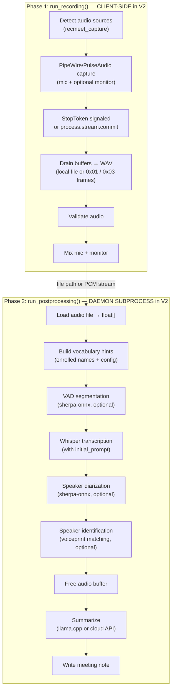

### Meeting directory layout

Every recording lives in `meetings/<YYYY-MM-DD_HH-MM>/`. All persisted artifacts inside that directory carry the meeting's timestamp as a per-instance suffix:

| File | Written when | Notes |
|---|---|---|
| `audio_<ts>.wav` | Always (live recording or pre-existing on reprocess) | 16 kHz mono S16LE |
| `context_<ts>.json` | Only when context_inline or context_file is non-empty | Persisted by the parent process before postprocessing |
| `speakers_<ts>.json` | Only when diarization ran and emitted speakers | Per-meeting voiceprint + label cache |
| `Meeting_<ts>_<title>.md` | Always | The meeting note (transcript, summary, action items) |

**Legacy-name fallback.** Meetings created before the per-instance naming convention used unsuffixed filenames (`audio.wav`, `context.json`, `speakers.json`). All read paths fall back to the legacy filenames via `find_audio_file()` / `find_context_file()` / `find_speakers_file()` (see `src/util.{h,cpp}`), so old meetings keep loading. Write paths always emit the per-instance form when a canonical timestamp is available; reprocessing a legacy meeting writes new-style files alongside the audio without renaming the audio itself.

**Save site placement.** `context_<ts>.json` is persisted by the **parent process** before postprocessing — by `pipeline::run_pipeline` (standalone CLI, between `run_recording` and `run_postprocessing`) or by the daemon's `process.submit` / `process.stream.commit` handlers (which fold the `context` request param into the per-job `Config` snapshot and the upload/streaming session writes it into the staging dir before the postprocess subprocess sees it). It is **never** written inside `run_postprocessing`. The reason is that the daemon path always forks a postprocess subprocess with `cfg.reprocess_dir` set to the staging directory; an in-postprocess save guarded on `cfg.reprocess_dir.empty()` would be dead code on every daemon path. `speakers_<ts>.json` is still written from inside `run_postprocessing` because it's downstream of diarization (which only runs in postprocessing), and the same subprocess writes it before exit.

### Memory scoping strategy

The postprocessing phase uses nested scopes to minimize peak memory:

1. **Audio buffer scope** — `samples` vector is alive during transcription and diarization, freed before summarization.
2. **Whisper model scope** — the `WhisperModel` object is freed after transcription completes, before diarization begins.

This matters because whisper models (75 MB–1.5 GB) and audio buffers (16-bit, 16 kHz) can be large.

### Reprocess flow

Single-meeting (`--reprocess <dir>`) and batch (`--reprocess-batch <parent>`) share the same per-meeting code path: `run_pipeline` (standalone) or the daemon's `process.submit` (`mode: "transcribe"`) verb with the meeting's existing `audio_<ts>.wav` shipped as `0x01` upload frames. The batch driver only adds orchestration and signal plumbing on top.

- **`run_reprocess_batch`** (`src/reprocess_batch.cpp`, in `recmeet_live_capture`) classifies immediate `YYYY-MM-DD_HH-MM(_N)?` subdirs into `WillReprocess` / `SkipNoteExists` / `SkipNoAudio` (`classify_batch_entries`), runs `ensure_models_cached_or_fail` once before the loop so a missing whisper/sherpa/VAD/llama model fails fast, locks the dispatch mode (`BatchDispatchMode::Daemon` or `Standalone`) at batch entry, and dispatches each meeting serially via `dispatch_one_reprocess`.
- **Per-iteration `StopToken` plumbing** — each iteration owns a fresh `StopToken iter_stop`. Before dispatch the driver publishes `&iter_stop` into `g_active_iter_stop` (atomic, release-store); the standalone-mode `batch_sigint_handler` and the daemon-mode `batch_daemon_sigint_handler` (installed per-iteration around the IPC call by `dispatch_one_reprocess_daemon`) read it via acquire-load and trip the token without ever touching a mutex (POSIX async-signal-safety). The handlers also set `g_batch_stop_requested` so the loop's between-iteration check breaks out cleanly. A `SigGuard` RAII helper saves and restores the previous `sigaction` on every exit path. The daemon-mode SIGINT path sends `process.cancel { job_id }` for the in-flight `job_id` returned by the most recent `process.submit`.
- **IPC `batch_job` propagation** — the `process.submit` request carries `cfg.batch_mode` in the per-submit context fields; the daemon stamps `batch_job: <bool>` onto the `job.complete` event for the originator. The tray gates its "Meeting note ready" desktop notification on `!batch_job` so a 30-meeting batch produces a single end-of-batch summary notification (emitted by the batch driver itself in the operator's terminal), not one per meeting. Pipeline-error notifications stay unconditional — failures want operator attention regardless of mode.

## Live Captioning Architecture

V2 splits live captioning across the wire. The **client** owns the capture (PipeWire / PulseAudio via `recmeet_capture`) and pushes raw PCM to the daemon over `0x03` StreamAudio frames. The **daemon** owns the `CaptionEngine` (sherpa-onnx streaming Zipformer + SPSC ring + ASR worker thread), the disk-backed temp WAV that buffers the session for later postprocess, and the emission of `caption` / `caption.degraded` events back to the originating client. Finalizing the session via `process.stream.commit` flushes the WAV, enqueues a normal `Postprocess` job from it, and releases the streaming slot.

**Source:** `src/caption_engine.{h,cpp}`, `src/caption_vtt.{h,cpp}`, `src/caption_format.{h,cpp}`, `src/streaming_session.cpp` (C.10a — daemon-side stream_token → session map, temp WAV, caption-result-to-IPC-event adapter), `src/daemon.cpp` (handler wiring, `0x03` frame routing, `process.stream.commit` postprocess handoff), `src/tray.cpp` (client-side capture fan-out, `process.stream` lifecycle, overlay).

### Component placement (V2)

| Component | Lives in | Side |
|---|---|---|
| `PipeWireCapture` / `PulseMonitorCapture` | `recmeet_capture` | **Client** (tray + standalone CLI) |
| `CaptionEngine` (sherpa-onnx streaming Zipformer wrapper, SPSC ring, ASR worker thread) | `recmeet_core` | **Daemon** (consumes `0x03` frames in place of the old PipeWire callback) |
| `StreamingSessionManager` (stream_token → session map, per-session disk-backed temp WAV, JobQueue streaming-slot reservation) | `recmeet_core` (`streaming_session.cpp`) | **Daemon** |
| `VttWriter` (append-only WebVTT sidecar persistence) | `recmeet_core` | **Daemon** — writes the sidecar into the streaming session's staging dir; the eventual postprocess job copies it into the meeting directory |
| `normalize_caption()` (ALL-CAPS → human-readable display normalization) | `recmeet_ipc` (via `caption_format.h`) | **Client** — both tray and CLI normalize at render time so the wire stays raw |
| Tray caption overlay (`GtkLabel` popup) | `recmeet-tray` | **Client** |
| CLI stderr renderer (`[caption] <text>`) | `recmeet` | **Client** |
| Caption model manager (`ensure_caption_model()`, pre-flight prompt) | `recmeet_core` | **Daemon** (auto-trigger downloads via `JobKind::ModelDownload`) |

### Data flow (V2)

```mermaid
flowchart LR
    PW["Client: PipeWire/Pulse RT thread<br/>(on_process)"] -->|"int16 mono 16 kHz<br/>chunks (lock-free)"| FAN["Client: capture fan-out<br/>(WAV stager + stream pump)"]
    FAN -->|"0x03 StreamAudio frames<br/>(4-byte BE len + PCM)"| NET["IPC connection<br/>(Unix socket / TCP)"]
    NET -->|"poll thread reads,<br/>FrameReader assembles"| ROUTE["Daemon: BinaryFrameHandler<br/>routes 0x03 by client_id<br/>→ active StreamingSession"]
    ROUTE -->|"push samples<br/>(SPSC ring)"| RING["CaptionEngine ring<br/>~2s @ 16 kHz"]
    RING -->|"drain"| WORKER["Daemon: ASR worker thread<br/>(sherpa-onnx OnlineRecognizer)"]
    WORKER --> RESULT["CaptionResult<br/>{text, is_partial, timestamp_ms}"]
    RESULT --> EMIT["server.post(...) →<br/>make_caption_event(job_id, ...)"]
    EMIT -->|"send_to_client(client_id, ev)"| OUT["Daemon poll thread:<br/>outbound NDJSON frame"]
    OUT -.->|"caption / caption.degraded"| RENDER["Client renders<br/>(tray overlay / CLI stderr)"]
    ROUTE -->|"also append PCM"| TMPWAV["StreamingSession temp WAV<br/>(disk-backed)"]
    WORKER -->|"is_partial=false only"| VTT["VttWriter::append<br/>(staging captions.vtt)"]
```

### Streaming session lifecycle

1. **Open.** Client sends `process.stream { format?, sample_rate?, channels?, language?, captions_enabled?, latency_budget_ms?, context? }`. The daemon snapshots the current `Config` (so a `SIGHUP` reload mid-session does not change the eventual postprocess), allocates a `StreamingSession`, reserves a streaming-slot job (which transitions to `running` when the `stream_worker_loop` dequeues), and returns `{ job_id, stream_token }`. The `caption` / `caption.degraded` events that follow carry this `job_id`.
2. **Feed.** Client sends `0x03` StreamAudio frames; the daemon's `BinaryFrameHandler` looks up the active streaming session by `client_id` and pushes the PCM into the `CaptionEngine`'s SPSC ring AND appends to the on-disk temp WAV. A `0x03` frame from a client with no live session closes the connection (protocol abuse).
3. **Cancel.** `process.stream.cancel { stream_token }` unlinks the temp WAV, releases the streaming slot, and marks the streaming `Job` as `cancelled`.
4. **Commit.** `process.stream.commit { stream_token }` flushes the WAV, calls `StreamingSessionManager::commit()` which constructs a fresh `Job { kind: Postprocess, cfg: <snapshotted Config with reprocess_dir = temp_dir>, input: <PostprocessInput from the WAV> }` and enqueues it into the postprocess slot. The streaming slot is released. The response carries the **new** postprocess `job_id`, which the client tracks via `progress.job` + `process.fetch` exactly like a `process.submit` job.

### Teardown ordering (load-bearing, daemon side)

The session destructor must run in the following order because the `0x03` frame handler on the poll thread and the `CaptionEngine`'s ASR worker share the SPSC ring:

1. **Mark the session ineligible** in the `StreamingSessionManager` map so a stray late `0x03` frame is dropped.
2. **`engine.stop()`** — joins the ASR worker after it drains the ring and emits any pending finals.
3. **Close + unlink (cancel) or finalize + keep (commit) the temp WAV.**

The client-side capture teardown order (capture stop → engine fan-out unsubscribe → drain) from V1 still applies for the standalone CLI's in-process `CaptionEngine`; the tray-via-daemon path replaces "engine teardown" with "`process.stream.cancel` or `process.stream.commit`".

### Wire shape (still stable)

The `caption` and `caption.degraded` event payloads are unchanged from V1:

- `{"event":"caption","data":{"job_id":N,"text":"...","is_partial":true|false,"timestamp_ms":N}}`
- `{"event":"caption.degraded","data":{"job_id":N,"reason":"...","timestamp_ms":N}}`

What changed is the routing: events now carry the top-level `client_id` field (omitted when empty) and reach the originating client via `send_to_client()` instead of `broadcast()`. The `.vtt` sidecar layout at rest is unchanged (`~/meetings/<dir>/captions.vtt`, WebVTT, finalized cues only, no cue ids).

### Default model

`sherpa-onnx-streaming-zipformer-en-2023-06-26` (int8 quantized, ~74 MB,
Apache-2.0, English-only). Resolved by `caption_model_dir(name)` in the
model manager; empty `name` resolves to this default at use time so a
future pin change touches one place.

### Limitations

- ALL-CAPS, no-punctuation engine output. Display normalization happens
  at the client (tray + CLI), not at the engine — the IPC payload is
  always raw engine text so a downstream consumer can opt out.
- Partial captions stream over IPC but never land in the `.vtt` sidecar.
- English-only. `cfg.language` other than empty/`en` disables captions
  with a warning at session start; `process.stream` accepts the
  `language` param but a non-English value falls back to the same warning
  + degraded behavior.
- Sherpa-OFF builds: `CaptionEngine::start()` returns false with the
  canonical error message; `process.stream {captions_enabled: true}`
  emits a one-shot `caption.degraded` event (routed to the originating
  client) and the streaming session continues buffering audio without
  captions — `process.stream.commit` still produces a normal postprocess
  job from the temp WAV.

## Diarization

Speaker diarization labels each transcript segment with `Speaker_01`, `Speaker_02`, etc. before speaker identification (or `merge_speakers()`) renames them. recmeet has two diarization paths that share the same `DiarizeResult` data shape; the pipeline picks one based on audio length.

**Source:** `src/diarize.h`, `src/diarize.cpp`, `src/pipeline.cpp` dispatch.

### Single-call path (default for short audio)

Below the chunked-path threshold (~17.5 minutes at default settings) the pipeline calls `diarize(samples, ...)` once. sherpa-onnx loads the pyannote segmentation + 3D-Speaker embedding models (~45 MB), processes the entire buffer in one streaming pass, and returns `{segments, num_speakers}`. Speaker identification then re-extracts one centroid per cluster from the audio. This path was the only one available before iter 121 and remains the lowest-overhead choice for typical meetings.

### Chunked path (long audio, T2.1)

When audio length exceeds `chunk_minutes * 60 + chunk_overlap_sec + 120` seconds the pipeline switches to `diarize_chunked()`. The implementation:

1. **Slices** the buffer into overlapping windows. Each chunk has a *core* region (the segment-ownership zone) and an *overlap* region (extra audio so adjacent chunks see context across boundaries).
2. **Reuses one `DiarizeSession` + `SpeakerEmbeddingSession`** across every chunk. Models stay loaded; only the cheap clustering object rebuilds when `set_clustering()` runs (T2.0a/T2.0b refactor).
3. **Runs `diarize_with_session` per chunk**, then extracts one raw embedding centroid per chunk-local speaker via `extract_speaker_embedding(session, ...)`.
4. **Stitches** chunk-local IDs into a global registry by cosine similarity on L2-normalized centroids (threshold `stitch_threshold`, default `0.6`). Centroids themselves are stored *raw* (non-normalized) so the persisted `MeetingSpeaker.embedding` format is byte-shape compatible with the legacy single-call path.
5. **Owns segments by midpoint-in-core** with full-extent emit. A boundary segment whose midpoint falls inside chunk[i]'s core is emitted by chunk[i] in full, even if its trailing edge spills into chunk[i+1]. `merge_speakers`'s max-overlap rule absorbs the benign duplicate.
6. **Compacts global IDs to `0..N-1` contiguous** after the post-stitch greedy-merge that enforces the optional `num_speakers` ceiling. Without this pass `merge(1, 2)` of `{0,1,2,3}` would leave `{0,1,3}`, surfacing as `Speaker_01, Speaker_02, Speaker_04` in transcripts.
7. **Bypasses re-extraction in identify-speakers.** The chunked diarize already produced one centroid per global cluster; the pipeline calls `identify_speakers_with_centroids(centroids, db, threshold)` instead of `identify_speakers(samples, ...)`. This skips the ~10 GB working-set spike (iter 110 / iter 114 measurements) the second extractor pass would otherwise cost on long audio.

### Configuration

| Config field | CLI flag | Default | Description |
|---|---|---|---|
| `diarization.chunk_minutes` | `--diarize-chunk-minutes` | `15.0` | Window width in minutes; threshold = `chunk_minutes*60 + chunk_overlap_sec + 120` s |
| `diarization.chunk_overlap_sec` | `--diarize-chunk-overlap-sec` | `30.0` | Overlap between adjacent chunks (positive spacing required: `chunk_minutes*60 > chunk_overlap_sec + 60`) |
| `diarization.stitch_threshold` | `--diarize-stitch-threshold` | `0.6` | Cosine-similarity floor for merging chunk-local centroids into the global registry |
| `diarization.num_speakers` | `--num-speakers` | `0` (auto) | Post-stitch global count limit; sample-weighted greedy-merge enforces |
| `diarization.cluster_threshold` | `--cluster-threshold` | `1.18` | Per-chunk clustering threshold forwarded to `set_clustering()` |

### Memory + wall-clock budget

The chunked path is gated by the `[benchmark][t2-1]` head-to-head bench (`tests/test_benchmark.cpp`), which runs `diarize()` and `diarize_chunked()` against the same input buffer with a 1 Hz `recmeet::read_self_rss_kb()` sampler thread. Pinned regression gates:

- 30-min synthetic: chunked **peak RSS < 4 GB**, chunked wall-clock < 1.5× single-call.
- iter-110 60-min real fixture: chunked peak RSS < 6 GB (vs un-chunked ~11 GB iter-114 baseline). Tagged `[slow]`; skip-on-missing-fixture.

The end-to-end integration gate `make integration-t2-1` reprocesses the iter-110 fixture under `systemd-run --user --scope -p MemoryMax=8G` to verify the cgroup containment goal.

## Vocabulary Hints

Vocabulary hints improve transcription accuracy for unusual names and domain-specific terms by biasing whisper's decoder via its `initial_prompt` parameter.

### Data flow

Before transcription begins, `run_postprocessing()` builds a combined prompt from two sources:

1. **Enrolled speaker names** — loaded automatically via `list_speakers()` (when speaker ID is enabled)
2. **User-specified vocabulary** — from `Config::vocabulary` (set via `--vocab`, `--add-vocab`, or `config.yaml`)

The helper `build_initial_prompt()` combines both into a comma-separated string (e.g., `"John Suykerbuyk, Alice, PipeWire, Kubernetes"`), which is passed to `TranscribeOptions::initial_prompt` and ultimately to `whisper_full_params::initial_prompt`.

### Token limit

Whisper limits `initial_prompt` to `whisper_n_text_ctx()/2` tokens (typically 224). With typical name lengths, this supports ~50-100 vocabulary entries before truncation.

### Configuration

| Config field | CLI flag | Default | Description |
|---|---|---|---|
| `transcription.vocabulary` | `--vocab` | `""` | Comma-separated vocabulary hints |
| — | `--add-vocab` | — | Add a word to persistent vocabulary |
| — | `--remove-vocab` | — | Remove a word from persistent vocabulary |
| — | `--list-vocab` | — | List persistent vocabulary words |
| — | `--reset-vocab` | — | Clear all persistent vocabulary words |

### IPC support

The `vocabulary` field is part of `SessionPreferences`, so the client pushes it once via `session.init` (and refreshes it via `session.update_prefs`). Per-job overrides ride the `context` parameter on `process.submit` / `process.stream`. Both paths fold into the per-job `Config` snapshot through `merge_creds_for_job()` (`src/session_merge.h:55`) before the postprocess subprocess sees it.

## Speaker Identification

Speaker identification matches diarization clusters against a persistent database of enrolled voiceprints, replacing generic `Speaker_XX` labels with real names across sessions.

### Architecture

The feature reuses the same 3D-Speaker embedding model (`eres2net_base`) already downloaded for diarization. No additional models are needed. The identification step runs inside the audio buffer scope, after diarization and before `merge_speakers()`.

**Source:** `src/speaker_id.h`, `src/speaker_id.cpp`

### Data flow

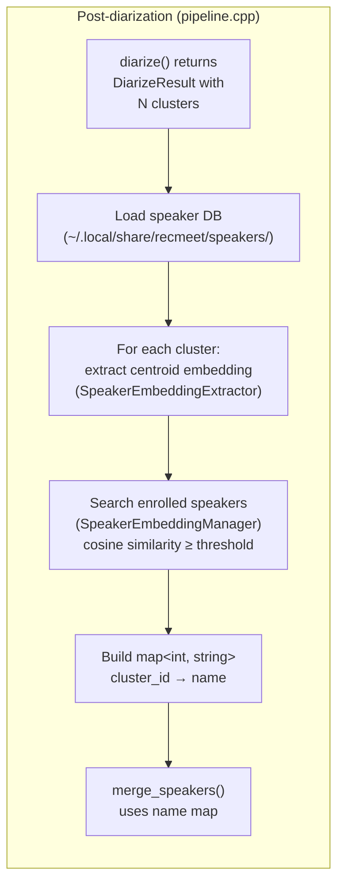

### Enrollment flow


### Speaker database

Each enrolled speaker is stored as a JSON file:

```
~/.local/share/recmeet/speakers/
├── John.json
├── Alice.json
└── Bob.json
```

**File format:**

```json
{
  "name": "John",
  "created": "2026-03-08T10:00:00Z",
  "updated": "2026-03-09T14:30:00Z",
  "embeddings": [
    [0.12, -0.34, 0.56, ...],
    [0.11, -0.32, 0.58, ...]
  ]
}
```

Each embedding is a float vector (typically 192 dimensions for the eres2net model, ~2-4 KB per enrollment). Multiple embeddings per speaker improve accuracy — they are all registered with the sherpa-onnx `SpeakerEmbeddingManager`, which handles averaging internally during search.

### sherpa-onnx API usage

The speaker identification module uses two sherpa-onnx C APIs that are separate from the high-level diarization API:

| API | Purpose | Lifecycle |
|---|---|---|
| `SherpaOnnxSpeakerEmbeddingExtractor` | Extract embedding vectors from audio segments | Created per identification run |
| `SherpaOnnxSpeakerEmbeddingManager` | Register enrolled embeddings and search by cosine similarity | Created per identification run, populated from disk DB |

**Embedding extraction** feeds all audio segments belonging to a diarization cluster into a single `OnlineStream`, then calls `ComputeEmbedding()` to get the centroid vector.

**Speaker search** uses `GetBestMatches(mgr, embedding, threshold, 1)` to find the highest-scoring enrolled speaker above the similarity threshold. Conflict resolution ensures no two clusters are assigned the same enrolled name — the highest-scoring match wins.

### Configuration

| Config field | CLI flag | Default | Description |
|---|---|---|---|
| `speaker_id.enabled` | `--no-speaker-id` | `true` | Enable/disable identification |
| `speaker_id.threshold` | `--speaker-threshold` | `0.6` | Cosine similarity threshold |
| `speaker_id.database` | `--speaker-db` | `~/.local/share/recmeet/speakers/` | Database directory path |

### Integration with merge_speakers()

`merge_speakers()` accepts an optional `std::map<int, std::string>` mapping cluster IDs to enrolled names. For clusters with no match, it falls back to `format_speaker()` (`Speaker_XX`). This keeps the merge logic clean — identification is fully decoupled from label assignment.

```cpp
// Without speaker ID (original behavior)
result.segments = merge_speakers(result.segments, diar);
// → "Speaker_01: Hello"

// With speaker ID
auto names = identify_speakers(samples, diar, db, model_path, threshold);
result.segments = merge_speakers(result.segments, diar, names);
// → "John: Hello"
```

## Dependencies

### Vendored (compiled from source)

| Library | Purpose | CMake target |
|---|---|---|
| whisper.cpp | Speech-to-text transcription | `whisper` |
| llama.cpp | Local LLM summarization | `llama` (gated by `RECMEET_USE_LLAMA`) |
| sherpa-onnx | Speaker diarization, identification + VAD | `sherpa-onnx-c-api` (gated by `RECMEET_USE_SHERPA`) |

### Platform (pkg-config)

| Package | Purpose | Linked into |
|---|---|---|
| `libpipewire-0.3` | Audio capture (primary) | `recmeet_capture` only — i.e. `recmeet-tray`, `recmeet` (via `recmeet_live_capture`). NOT `recmeet-daemon`. |
| `libpulse`, `libpulse-simple` | Monitor source fallback | `recmeet_capture` only — same scope as PipeWire. |
| `sndfile` | WAV read/write | `recmeet_capture`, `recmeet_core` |
| `libcurl` | HTTP client (API calls, model downloads) | `recmeet_ipc` |
| `libnotify` | Desktop notifications (optional) | `recmeet_ipc` |
| `gtk+-3.0` | Tray UI | `recmeet-tray` only |
| `ayatana-appindicator3-0.1` | System tray indicator | `recmeet-tray` only |

### Runtime (not linked)

| Dependency | Purpose |
|---|---|
| PipeWire (running) | Audio routing |
| onnxruntime | sherpa-onnx backend (system package preferred) |

## JobQueue Slot State Diagrams

V2 has no single global daemon state machine. Each `JobQueue` slot is its own capacity-1 FIFO + running marker, and the three slots are independent. The composite `state.changed` value is just a projection of which slots currently hold a `Running` job (`postprocessing` > `streaming` > `downloading` > `idle`).

### Postprocess slot

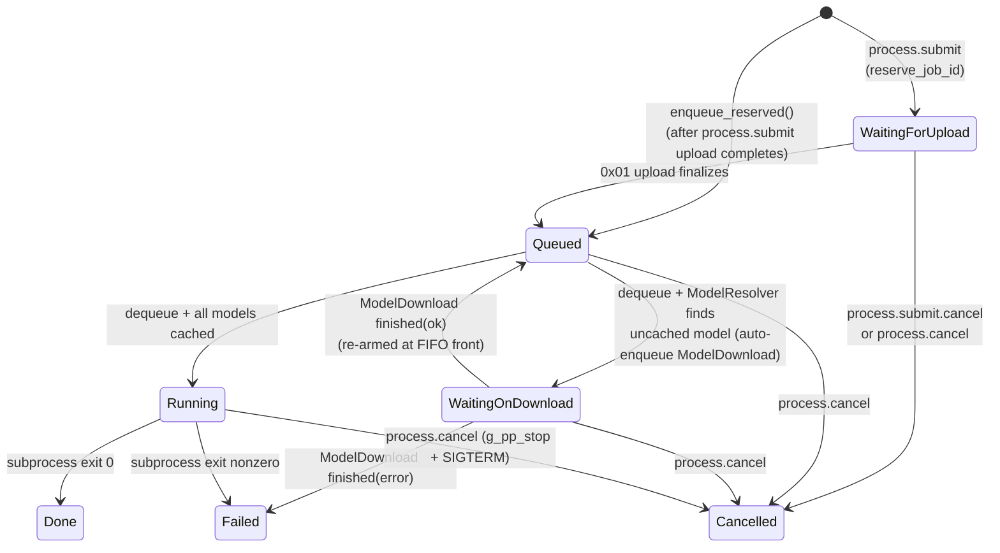

### Streaming slot

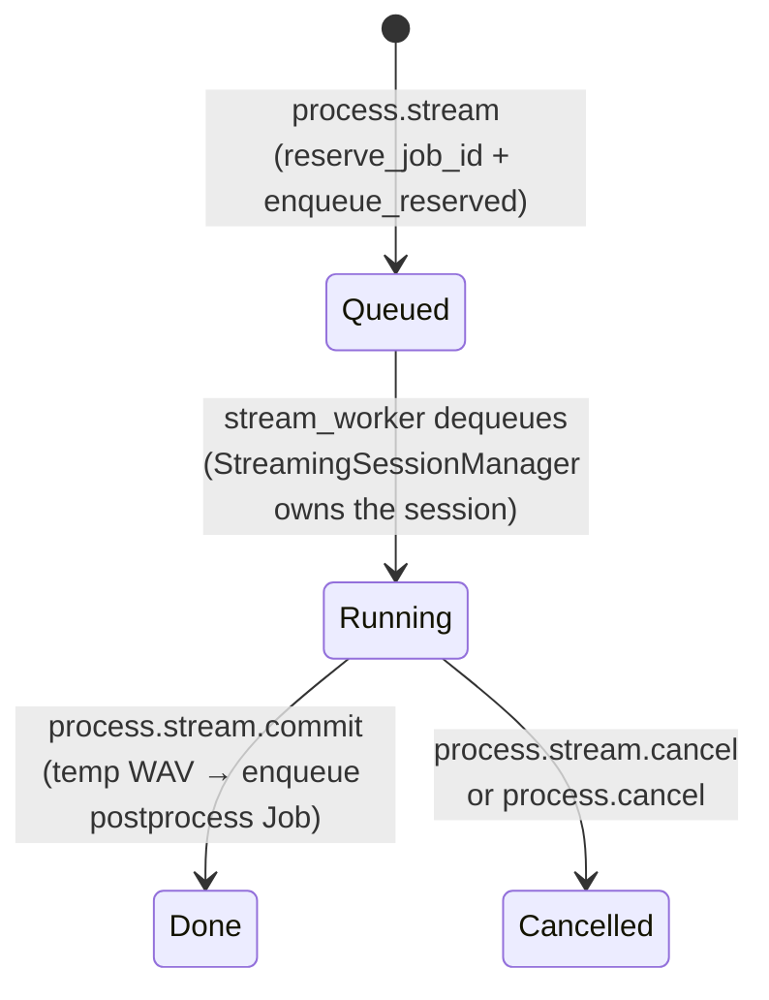

### Model download slot

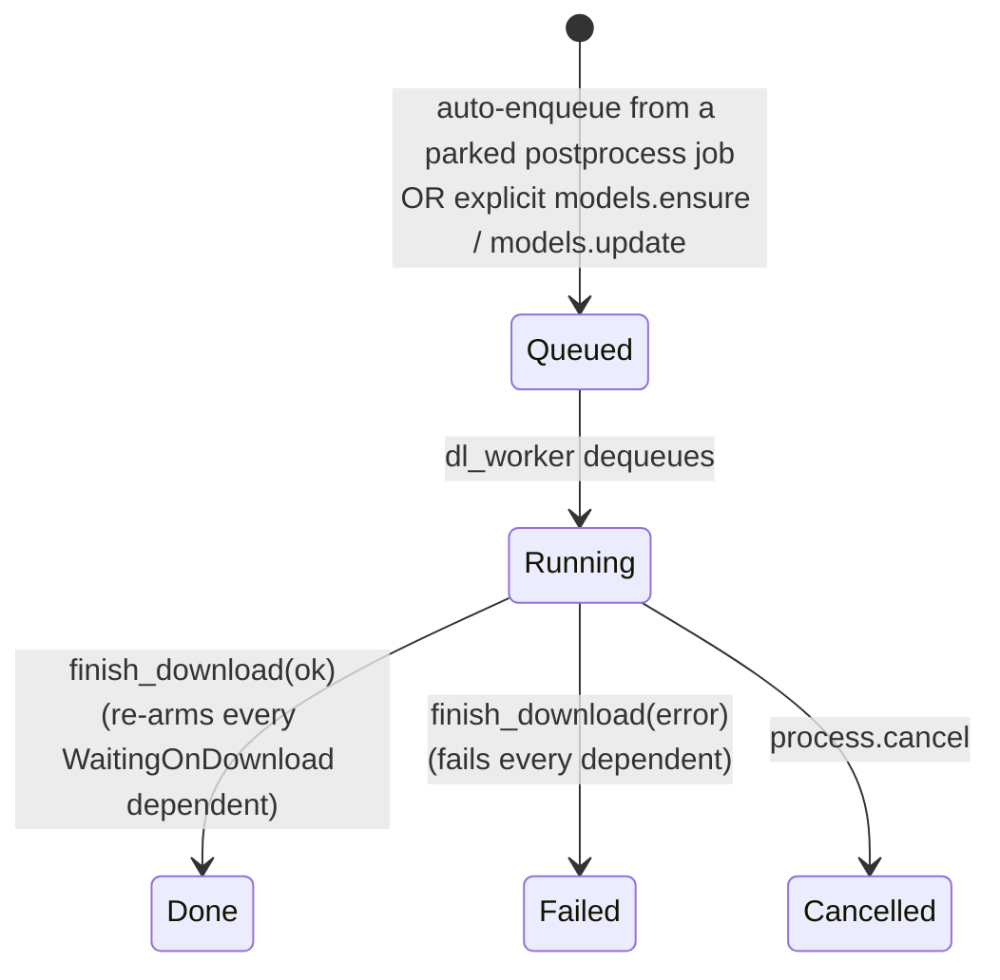

## Lifecycle Diagrams

### Daemon-mode batch postprocess (process.submit + process.fetch)

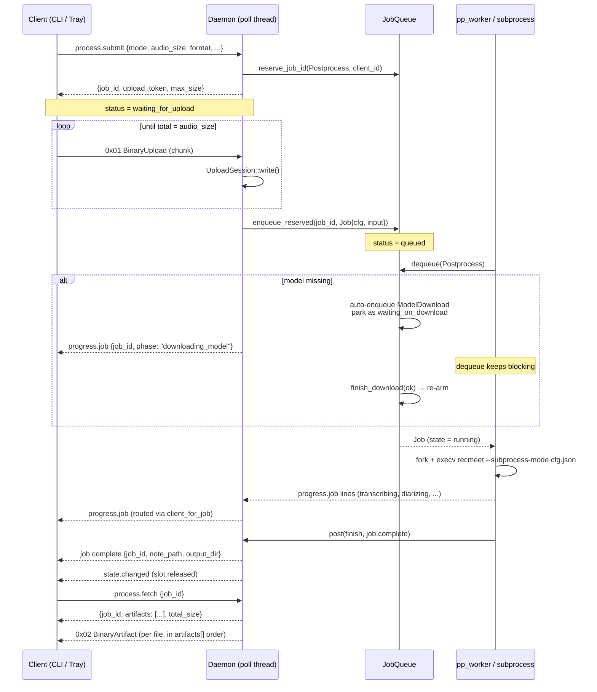

### Daemon-mode streaming session (process.stream + commit)

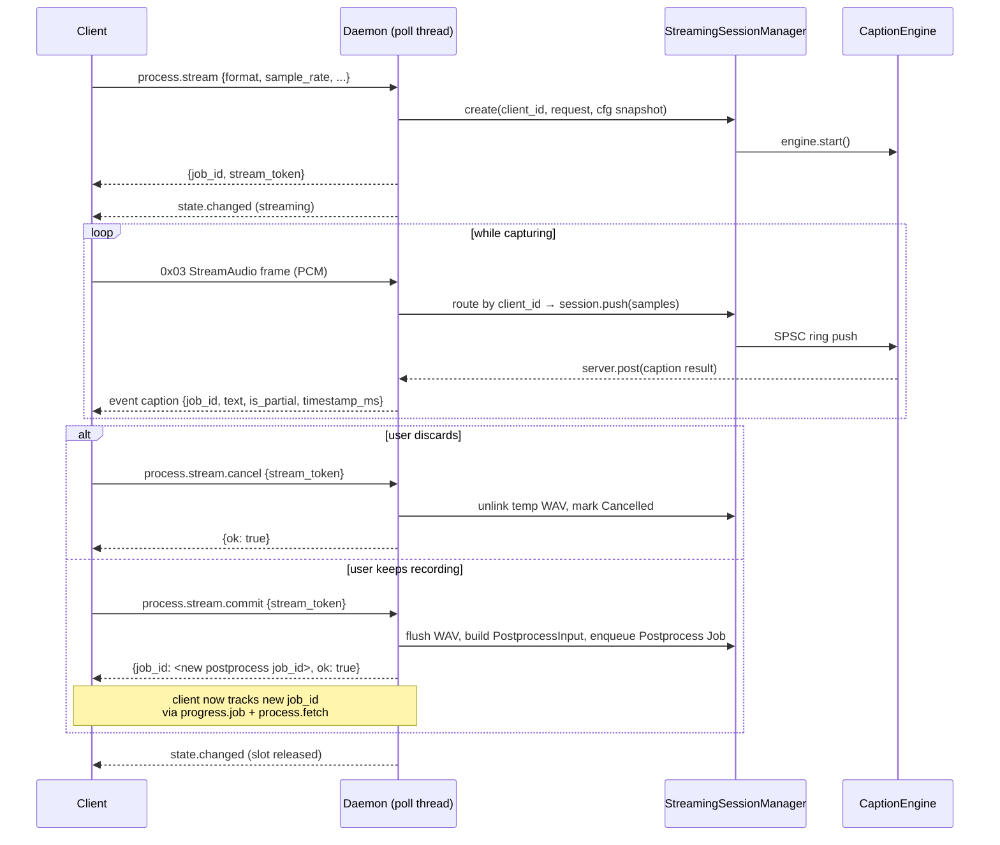

### Standalone recording session

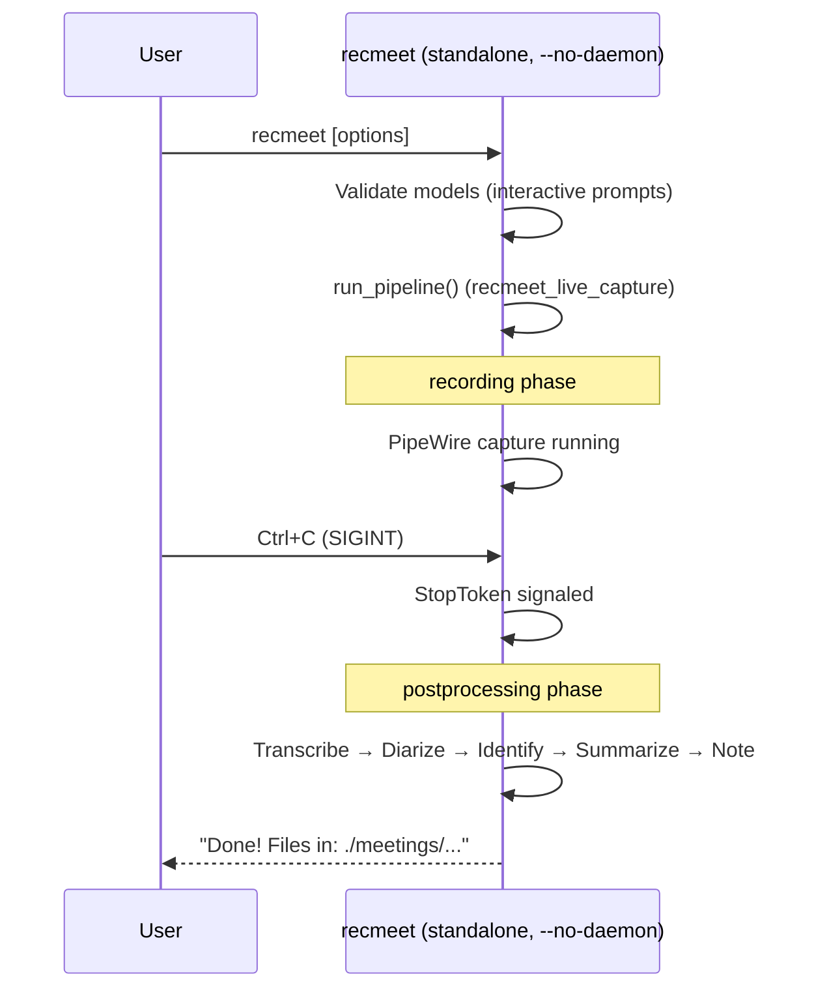

### Startup sequence

```mermaid
sequenceDiagram
    participant S as systemd
    participant D as recmeet-daemon
    participant T as recmeet-tray

    S->>D: ExecStart (recmeet-daemon.service)<br/>--listen <addr>
    D->>D: parse_ipc_address; if TCP, check RECMEET_AUTH_TOKEN<br/>(fail-stop if unset)
    D->>D: flock(PID file)
    D->>D: load_config(); resolve API keys
    D->>D: Create JobQueue; wire ModelResolver, ModelCacheChecker, JobEventSink
    D->>D: Create IpcServer; bind socket / TCP listener
    D->>D: Spawn pp_worker, dl_worker, stream_worker
    D->>D: Install SIGHUP / SIGINT / SIGTERM handlers
    D->>D: server.run() (poll loop)

    S->>T: ExecStart (recmeet-tray.service, After=daemon)
    T->>T: gtk_init, load config, init recmeet_capture
    T->>D: connect (Unix or TCP)
    opt TCP transport
        T->>D: {"type":"auth.token","token":"..."}
        D-->>T: {"type":"auth.ok","client_id":"...","protocol_version":3}
    end
    T->>D: session.init {credentials, preferences}
    D-->>T: {ok: true}
    T->>D: status.get
    D-->>T: {state: "idle", postprocessing: false, ...}
    T->>T: refresh_sources() (local — recmeet_capture)
    T->>T: gtk_main()
```

### Shutdown sequence

```mermaid
sequenceDiagram
    participant S as systemd
    participant D as recmeet-daemon
    participant Q as JobQueue
    participant W as Worker threads

    S->>D: SIGTERM
    D->>D: g_pp_stop.request() (poke any live subprocess)
    D->>D: server.stop() (write to self-pipe)
    D->>D: poll loop exits

    D->>Q: shutdown() (wakes every blocked dequeue())
    Q-->>W: dequeue returns nullopt
    D->>W: join pp_worker, dl_worker, stream_worker

    alt Postprocess child still alive
        D->>W: kill_pp_child_with_grace (SIGTERM, 5s; SIGKILL, 30s; MemoryHigh bump)
    end

    D->>D: unlink PID file, close fds
    D->>D: unlink Unix socket (if applicable)
    D->>D: log_shutdown, notify_cleanup
```

### Auto-download flow (parked postprocess + model_download slot)

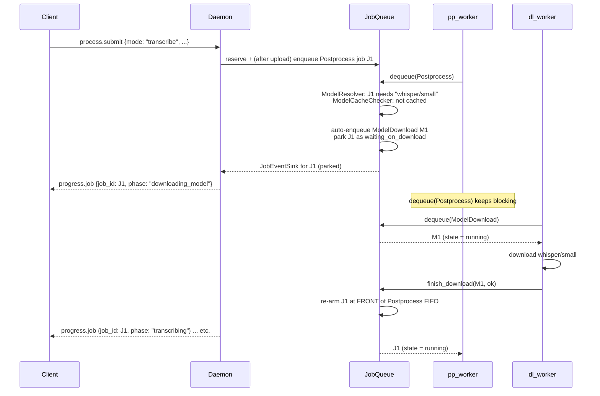

## Go Tools Module

The `tools/` directory contains a self-contained Go module (`github.com/syketech/recmeet-tools`) that provides AI-powered meeting tooling. It reads the same `config.yaml` and meeting output files as the C++ binaries but has no compile-time or runtime dependency on them.

### Module structure

```
tools/
├── go.mod                              # Module: github.com/syketech/recmeet-tools
├── cmd/
│   ├── recmeet-mcp/main.go            # MCP server entry point
│   └── recmeet-agent/main.go          # Agent CLI entry point
├── meetingdata/                         # Shared data access library
│   ├── config.go                       # Config parsing (matches C++ parser)
│   ├── meetings.go                     # Meeting directory discovery
│   ├── notes.go                        # Note parsing + search
│   ├── actionitems.go                  # Action item extraction
│   └── speakers.go                     # Speaker profile loading
├── mcpserver/                           # MCP tool implementations
│   ├── server.go                       # Server setup + registration
│   └── tools.go                        # Tool definitions + handlers
└── agent/                               # Agent internals
    ├── config.go                       # Agent-specific configuration
    ├── loop.go                         # Agentic loop (Claude API)
    ├── tools.go                        # Tool registry + definitions
    ├── workflows.go                    # Prep + follow-up workflows
    ├── search.go                       # Brave web search tool
    ├── fetch.go                        # Web page fetcher
    └── writefile.go                    # File writing tool
```

### Key dependencies

| Library | Purpose |
|---|---|
| `mark3labs/mcp-go` | Model Context Protocol server (stdio transport) |
| `anthropics/anthropic-sdk-go` | Claude API client for the agentic loop |
| `spf13/cobra` | CLI framework for the agent |
| `golang.org/x/net/html` | HTML parsing for web_fetch |

### `meetingdata` package

The shared data access layer. Both the MCP server and agent import this package to read meeting data from disk.

**Config loading** — Parses `~/.config/recmeet/config.yaml` using a line-based YAML parser that matches the C++ parser's behavior (flat sections with indented key-value pairs, not full YAML spec). Resolves `$XDG_CONFIG_HOME` and `$XDG_DATA_HOME` for paths.

**Meeting discovery** — Scans the output directory for directories matching `YYYY-MM-DD_HH-MM`, finds audio files (timestamped or legacy `audio.wav`), and locates corresponding note files across multiple directory structures (meeting dir, `YYYY/MM/` subdirs, note dir root).

**Note parsing** — Extracts YAML frontmatter, callout sections (summary, context, transcript using `> [!type]` syntax), and action items. Search supports keyword matching against title, summary, tags, and participants, with date range and participant filters.

**Action items** — Parsed from `## Action Items` sections (not inside callouts). Format: `- [ ] **[Assignee]** - description` or `- [x]` for completed items. Supports cross-meeting listing with status and assignee filters.

**Speaker profiles** — Loads JSON files from the speaker database directory. Strips embedding vectors before returning profiles (privacy — only name, creation date, update date, and embedding count are exposed).

### Binary: `recmeet-mcp` (MCP server)

**Source:** `tools/cmd/recmeet-mcp/main.go`

A Model Context Protocol server that exposes meeting data to AI tools (Claude Code, Claude Desktop, Cursor, and other MCP-compatible clients). Communicates over stdio using JSON-RPC.

**Critical implementation detail:** stdout is redirected to stderr at startup. MCP uses stdout exclusively for the JSON-RPC stream — any stray output (log messages, fmt.Println) would corrupt the protocol. All logging goes to stderr.

#### MCP tools

| Tool | Params | Description |
|---|---|---|
| `search_meetings` | `query`, `date_from`, `date_to`, `participants[]`, `limit` | Search notes by keyword, date range, participants |
| `get_meeting` | `meeting_dir` (required) | Full meeting details by directory name |
| `list_action_items` | `status`, `assignee`, `limit` | Action items filtered by status/assignee |
| `get_speaker_profiles` | — | List enrolled speaker profiles |
| `write_context_file` | `filename` (required), `content` (required) | Write pre-meeting context to staging dir |

All read tools are annotated as read-only and non-destructive. `write_context_file` sanitizes filenames to prevent directory traversal and rejects hidden files.

#### Data flow

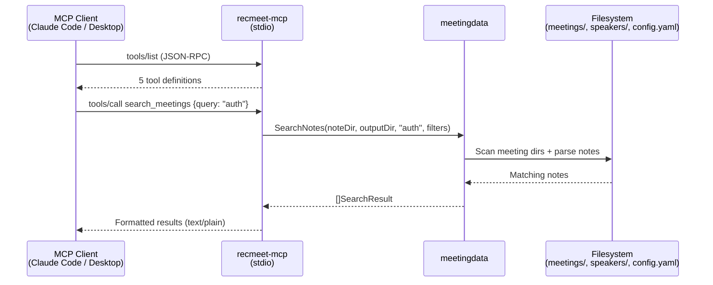

### Binary: `recmeet-agent` (AI agent CLI)

**Source:** `tools/cmd/recmeet-agent/main.go`

An AI agent CLI powered by Claude that automates meeting preparation and follow-up. Uses Cobra for CLI parsing and the Anthropic SDK for the agentic loop.

#### Commands

| Command | Args | Description |
|---|---|---|
| `prep` | `description` (positional, required) | Research past meetings and generate a briefing |
| `follow-up` | `note-path` (positional, required) | Read meeting notes and draft follow-up messages |

#### Tool registry

The agent exposes tools to Claude via the Anthropic tool-use API. Each tool implements a `Definition()` + `Execute()` interface.

| Tool | Source | Description |
|---|---|---|
| `search_meetings` | meetingdata | Search past meetings by keyword/date/participants |
| `get_meeting` | meetingdata | Get full meeting details by date (+ optional time) |
| `list_action_items` | meetingdata | List action items with status/assignee filters |
| `get_speaker_profiles` | meetingdata | List enrolled speakers |
| `web_search` | Brave API | Web search (only registered if `BRAVE_API_KEY` is set) |
| `web_fetch` | net/html | Fetch and extract text from a URL (10K char limit) |
| `write_file` | os | Write content to a file path |

#### Agentic loop

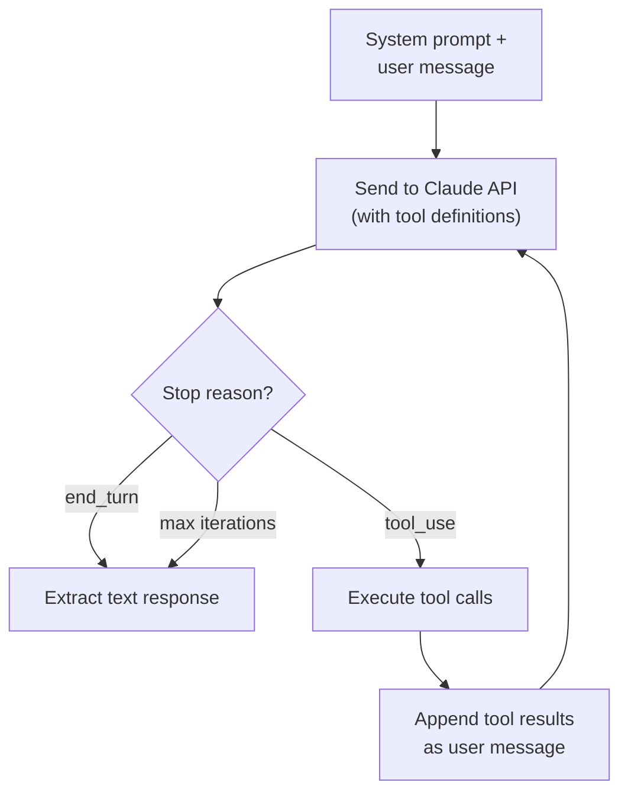

The loop runs up to 20 iterations (configurable). Each iteration sends the conversation history to Claude with the registered tools. If Claude returns `tool_use` blocks, the agent executes each tool, collects results, and feeds them back. The loop terminates when Claude returns `end_turn` or the iteration limit is reached.

**Verbose mode** (`--verbose`) logs each tool call and result to stderr for debugging.

**Dry-run mode** (`--dry-run`) prints the system prompt and user message without calling the API.

#### Prep workflow

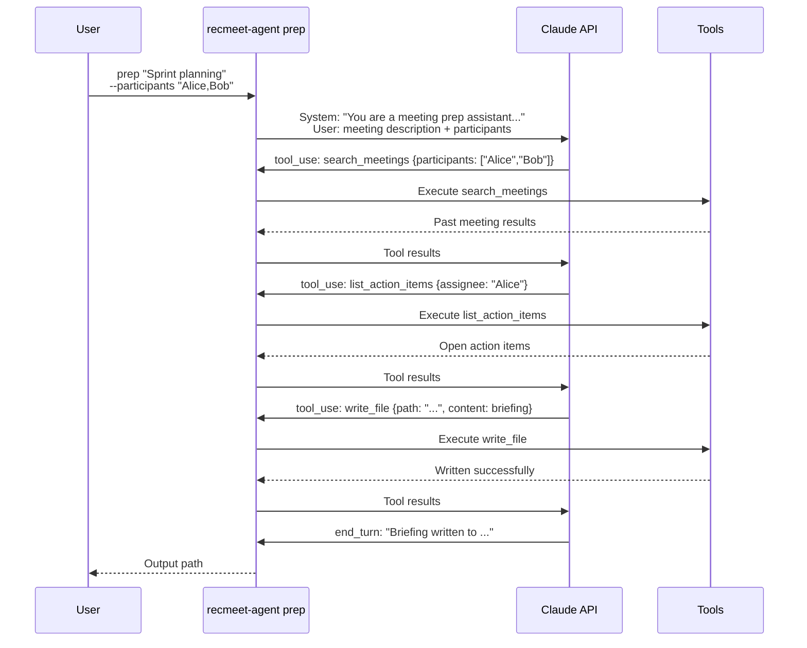

#### Follow-up workflow

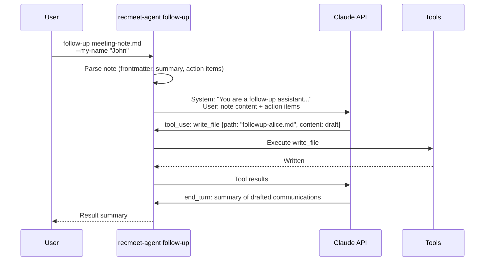

#### Configuration

The agent reads the standard recmeet `config.yaml` for meeting paths, speaker DB location, and API keys. Agent-specific settings are resolved from environment variables and CLI flags:

| Setting | Source | Default |
|---|---|---|
| Anthropic API key | `ANTHROPIC_API_KEY` env var, then `api_keys.anthropic` in config | — (required) |
| Anthropic base URL | `ANTHROPIC_BASE_URL` env var | — (SDK default; tests point this at an `httptest` mock) |
| Brave API key | `BRAVE_API_KEY` env var | — (optional, enables web_search) |
| Model | `--model` flag | `claude-sonnet-4-6` |
| Max iterations | `--max-iterations` flag (per subcommand) | `20` |
| Context staging dir | `$XDG_DATA_HOME/recmeet/context/` | `~/.local/share/recmeet/context/` |

### Testing

The Go tools have two complementary test layers; both gate `make integration` and a merge to `v1-maintenance`.

| Layer | Count | Build tag | Scope |
|---|---|---|---|
| Library + `testutil` | 118 | (default) | Unit-level — proves each component (`meetingdata` parsers, `mcpserver` handlers, `agent` workflows, `testutil` helpers) works correctly in isolation. `make test` runs these alongside the C++ suite. |
| Integration | 39 (18 `recmeet-mcp` + 21 `recmeet-agent`) | `//go:build integration` | End-to-end — builds the as-built binaries via `testutil.BuildBinaryOnce`, then drives them as real subprocesses against the MCP stdio protocol and a mock Anthropic httptest server. Proves the deployable artifacts complete a real session, not just that components compose. `make integration-go` runs these. |

`tools/testutil/` is the shared infrastructure: package-scope binary build cache (via `TestMain` + `os.MkdirTemp`), `MockAnthropic` httptest server, fixture builders (`BuildMeetingsFixture` writes `Meeting_<date>.md` files matching `meetingdata.findMDFiles`'s glob), a custom MCP stdio transport that supports stdout-teeing for the hygiene test, and a named usability-assertion table so each error-path test names its actionable-stderr expectation rather than duplicating string-match logic.

The integration suite proves end-to-end protocol/CLI behavior — stdio hygiene, MCP handshake, Cobra flag plumbing, exit codes, error-message quality, mock-Anthropic round-trip for `prep` and `follow-up`. The library tests prove component correctness — note parsing, action-item extraction, tool dispatch, agentic-loop iteration, Claude-message shape. Together they cover both directions: components compose AND the deployable composition runs.

Subprocess coverage (Go 1.20+ `GOCOVERDIR` mechanism) confirms `cmd/recmeet-mcp/main.go` at 100.0% and `cmd/recmeet-agent/main.go` at 92.8% from the integration suite alone. See `docs/BUILD.md` "Subprocess coverage" for the invocation. The build-tag mechanism means `go test ./...` stays fast for fast-feedback during development; CI and `make integration` opt in to the slower end-to-end work.
