# Architecture

## Purpose

Recmeet records, transcribes, and summarizes meetings entirely on-device. Audio is captured via PipeWire/PulseAudio, transcribed with whisper.cpp, optionally diarized with sherpa-onnx, identified against enrolled voiceprints, and summarized either locally (llama.cpp) or through a cloud API. Everything runs on the user's machine — no audio or transcript data leaves the system unless the user explicitly configures a cloud summarization provider.

The system ships as four cooperating C++ binaries connected by a Unix socket (or optional TCP) IPC layer, plus two static libraries that hold the shared logic — `recmeet_ipc` for config, IPC, and shared utilities, and `recmeet_core` for the full ML pipeline (whisper, sherpa-onnx, llama, audio capture). The split is load-bearing for the system tray applet: linking `recmeet_ipc` only means `recmeet-tray` ships without onnxruntime, whisper, llama, or ggml in its `DT_NEEDED` list, and unblocks the future thin-client architecture. Two additional Go binaries provide AI-powered meeting tooling — an MCP server for IDE integration and an agent CLI for automated meeting prep and follow-up.

## High-Level Architecture

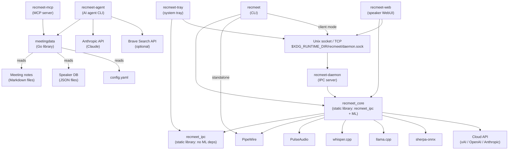

## Build System and Binary Topology

CMake builds two static libraries (the iter-104 split): `recmeet_ipc` for config + IPC + util (no ML deps), and `recmeet_core` for `recmeet_ipc` + the full ML pipeline (whisper.cpp, sherpa-onnx, llama.cpp). Four C++ executables and one test binary link against one of those libraries; two additional Go binaries are also built by `make build`.

| Target | Language | Source | Links | Feature-gated |
|---|---|---|---|---|
| `recmeet` | C++ | `src/main.cpp` | `recmeet_core` | — |
| `recmeet-daemon` | C++ | `src/daemon.cpp` | `recmeet_core` | — |
| `recmeet-tray` | C++ | `src/tray.cpp` | `recmeet_ipc` + GTK3 + ayatana-appindicator3 | `RECMEET_BUILD_TRAY` |
| `recmeet-web` | C++ | `src/web.cpp` | `recmeet_core` + cpp-httplib | `RECMEET_BUILD_WEB` |
| `recmeet_tests` | C++ | `tests/*.cpp` | `recmeet_core` + Catch2 | `RECMEET_BUILD_TESTS` |
| `recmeet-mcp` | Go | `tools/cmd/recmeet-mcp/main.go` | mcp-go | `RECMEET_BUILD_GO_TOOLS` |
| `recmeet-agent` | Go | `tools/cmd/recmeet-agent/main.go` | anthropic-sdk-go, cobra | `RECMEET_BUILD_GO_TOOLS` |

### Feature flags (CMake options)

| Flag | Default | Effect |
|---|---|---|
| `RECMEET_BUILD_TRAY` | ON | Build `recmeet-tray` |
| `RECMEET_USE_LLAMA` | ON | Link llama.cpp for local summarization |
| `RECMEET_USE_SHERPA` | ON | Link sherpa-onnx for diarization + VAD |
| `RECMEET_USE_NOTIFY` | ON | Link libnotify for desktop notifications |
| `RECMEET_BUILD_TESTS` | ON | Build Catch2 test suite |
| `RECMEET_BUILD_WEB` | ON | Build the speaker-management WebUI binary (`recmeet-web`) |
| `RECMEET_BUILD_GO_TOOLS` | ON | Build the Go-based MCP server and AI agent under `tools/` |
| `RECMEET_GGML_VULKAN` | AUTO | Vulkan GPU acceleration tri-state: `AUTO` probes the build host's toolchain, `ON` requires it, `OFF` force-disables. Selects the `libggml-vulkan.so` runtime-loadable plugin (no `DT_NEEDED` on the recmeet binary). |
| `RECMEET_PATCH_SHERPA_ARENA` | ON | T1B memory-containment patch that disables the vendored sherpa-onnx CPU memory arena. A/B-toggleable for benchmarking; toggling requires `make clean-deps` between runs. |

### systemd units

| Unit | Type | Purpose |
|---|---|---|
| `recmeet-daemon.service` | simple | Runs the daemon, restarts on failure |
| `recmeet-daemon.socket` | socket | Socket activation at `%t/recmeet/daemon.sock` |
| `recmeet-tray.service` | simple | Runs the tray, `Wants=recmeet-daemon.service` |
| `recmeet-web.service` | simple | Runs the speaker-management WebUI, `Wants=recmeet-daemon.service` (operator-launched; tray also spawns this on demand) |

## Binary: `recmeet` (CLI)

**Source:** `src/main.cpp`

The CLI operates in one of two modes, selected at startup:

1. **Client mode** — sends IPC requests to a running daemon.
2. **Standalone mode** — runs the full pipeline in-process (original single-binary behavior).

### Mode selection logic

```
if --daemon flag        → client mode (fail if daemon unreachable)
if --no-daemon flag     → standalone mode
if --status or --stop   → client mode (always)
else (auto)             → client mode if daemon_running(), otherwise standalone
```

In client mode, the CLI sends `record.start` with config overrides, installs a SIGINT handler that sends `record.stop`, and blocks on `read_events("job.complete")` until the daemon reports completion.

In standalone mode, the CLI runs `run_pipeline()` directly — model validation, audio capture, transcription, and summarization all happen in the same process.

## Binary: `recmeet-daemon`

**Source:** `src/daemon.cpp`

A long-running IPC server that owns the recording pipeline. Designed for headless or always-on operation under systemd.

### State machine

The daemon tracks state via three independent atomic flags rather than a single enum, so one workload class can begin while another finishes:

| Flag | Set when | Cleared when |
|---|---|---|
| `g_recording` | Live audio capture is running | Capture worker exits |
| `g_postprocessing` | Postprocess subprocess is alive | Subprocess exits and `waitpid` returns |
| `g_downloading` | A model download is in progress | Download worker finishes or fails |

`composite_state_name()` (`src/daemon.cpp:101`) projects the live flags into the wire-protocol state string broadcast on `state.changed` events. Possible values include `idle`, `recording`, `postprocessing`, `reprocessing`, `downloading`, `recording+postprocessing`, and `reprocessing+postprocessing`. The `reprocessing` distinction is set when `g_postprocessing` is active for a `--reprocess` or `--reprocess-batch` job (no live capture); a CLI/tray-initiated live recording produces plain `recording` or the composite `recording+postprocessing` if a previous reprocess is still wrapping up.

State transitions guard the multi-flag mutations under `g_state_mu`. The end-of-recording handoff to postprocessing flips both `g_recording=false` and `g_postprocessing=true` atomically inside the lock, with no `state.changed` broadcast emitted between the two writes — clients see exactly one transition. The `record.start` admission guard checks `g_recording || g_downloading` (NOT `g_postprocessing`), so a new live recording can begin while a previous reprocess is still postprocessing — that's the concurrent-jobs case.

### Worker threads

Heavy work runs on independent worker threads — capture (`g_capture_worker`), postprocess subprocess supervisor (`g_pp_worker`), model downloads (`g_dl_worker`). Each writes results back to the poll thread via `server.post()`, which writes to a self-pipe to wake `poll()` and execute the callback on the main thread. This keeps all IPC I/O and broadcast calls single-threaded; the worker threads never touch the wire directly.

### PID locking

The daemon creates `<socket_path>.pid` and holds an `flock(LOCK_EX|LOCK_NB)` for its lifetime, preventing duplicate instances.

### Signal handling

| Signal | Behavior |
|---|---|
| `SIGHUP` | Reload config from disk via `server.post()` |
| `SIGINT` / `SIGTERM` | Request stop on active recording, then exit the poll loop |

## Binary: `recmeet-tray`

**Source:** `src/tray.cpp`

A GTK system tray applet using ayatana-appindicator. The tray is a pure IPC client — it never runs the pipeline directly.

### GTK + GIO integration

The tray wraps the IPC client's socket fd in a `GIOChannel` watched by the GTK main loop (`g_io_add_watch`). When the daemon pushes an event, `on_ipc_data()` fires, calls `ipc.read_and_dispatch(0)`, and the event callback updates the UI.

### Reconnection

On disconnect (`G_IO_HUP`), the tray tears down the watch, schedules `try_reconnect()` via `g_timeout_add_seconds`, and uses exponential backoff (1, 2, 4, 8, 16, 30, 30, ...) until the daemon reappears.

### Menu-driven config

The tray builds a GTK menu with radio groups for mic source, monitor source, whisper model, language, summary provider, and API model. Changes are persisted to `~/.config/recmeet/config.yaml` immediately. When the user selects a whisper model, the tray sends `models.ensure` to trigger a background download.

## IPC Protocol

### Wire format

Newline-delimited JSON (NDJSON) over a Unix stream socket at `$XDG_RUNTIME_DIR/recmeet/daemon.sock` (fallback: `/tmp/recmeet-<uid>/daemon.sock`).

### Transport

Two transports are supported on the same wire format:

- **Unix domain socket (default).** Path resolves to `$XDG_RUNTIME_DIR/recmeet/daemon.sock` (fallback `/tmp/recmeet-<uid>/daemon.sock`). Used by the local CLI, tray, and WebUI clients.
- **TCP loopback / network (opt-in).** The daemon binds a TCP listener when launched with `--listen <host:port>`; clients reach it via `--daemon-addr <host:port>`. Connect uses non-blocking sockets and `TCP_KEEPALIVE`; IPv6 supported. Same NDJSON framing, no per-message length prefix on the V1 line. (See iter 107 + the `thin-client-recording-server` task for the V2 binary-frame extension.)

### Message types

| Direction | Type | Discriminant field | Structure |
|---|---|---|---|
| client → server | Request | `"method"` | `{"id": N, "method": "...", "params": {...}}` |
| server → client | Response | `"result"` | `{"id": N, "result": {...}}` |
| server → client | Error | `"error"` | `{"id": N, "error": {"code": N, "message": "..."}}` |
| server → client | Event | `"event"` | `{"event": "...", "data": {...}}` |

### JSON value types

Values are `string | int64 | double | bool | null`. Nested objects/arrays are stored as raw JSON strings in the flat `JsonMap`.

### Methods

| Method | Params | Result | Notes |
|---|---|---|---|
| `status.get` | — | `{state}` | Returns current daemon state name |
| `sources.list` | — | `{sources, count}` | JSON array of audio sources |
| `config.reload` | — | `{ok}` | Re-read config from disk |
| `config.update` | config key/values | `{ok}` | Merge into running config |
| `record.start` | config overrides | `{ok}` | Idle → Recording; error if busy |
| `record.stop` | — | `{ok}` | Signal stop; error if not recording |
| `record.cancel` | — | `{ok}` | Stop the recording loop AND discard the freshly-minted output directory. Refused during reprocess, after the recording loop's drain window opens, and when not recording. |
| `models.list` | — | `{models}` | JSON array of cached model info |
| `models.ensure` | `{whisper_model?}` | `{ok}` | Download missing models; Idle → Downloading |
| `models.update` | — | `{ok}` | Re-download all cached models |

### Events (server → all clients)

| Event | Data | When |
|---|---|---|
| `state.changed` | `{state, error?}` | Any state transition |
| `phase` | `{name}` | Pipeline phase change (recording, transcribing, etc.) |
| `progress` | `{phase, percent, segment?}` | Granular transcribe/diarize progress |
| `job.complete` | `{note_path, output_dir}` | Recording + postprocessing finished |
| `model.downloading` | `{model, status, error?}` | Model download progress |
| `caption` | `{text, is_partial, timestamp_ms, job_id}` | Live captioning streaming-ASR output (V1.5+, opt-in via `record.start {captions_enabled: true}`) |
| `caption.degraded` | `{reason, job_id}` | Caption engine unavailable / disabled mid-recording (e.g. sherpa-OFF build, model missing, non-English language) |

### Error codes

| Code | Name | Meaning |
|---|---|---|
| -32600 | InvalidRequest | Malformed JSON |
| -32601 | MethodNotFound | Unknown method |
| -32602 | InvalidParams | Bad parameters |
| -32603 | InternalError | Server-side failure |
| 1 | AlreadyRecording | — |
| 2 | NotRecording | `record.stop` when idle |
| 3 | Busy | State is not Idle |

### Concurrency model

The IPC server runs a single-threaded `poll()` loop. All socket reads, writes, and broadcasts happen on this thread. Worker threads marshal results back via `server.post()` + self-pipe wakeup, ensuring no concurrent access to client fd state.

## Recording Pipeline

The pipeline has two phases, split at the point where audio capture completes:

1. **`run_recording()`** — audio capture (blocking on `StopToken`), WAV output, validation, mixing.
2. **`run_postprocessing()`** — transcription, diarization, speaker identification, summarization, note output.

In standalone mode, `run_pipeline()` calls both sequentially. In daemon mode, the worker thread calls them separately so it can broadcast `state.changed` between phases.

`run_recording()` watches two stop tokens — `g_rec_stop` (normal stop) and `g_rec_cancel` (the `record.cancel` verb). The cancel branch is parallel to the stop branch in both dual-mode and mic-only captures: it stops the capture threads, skips drain/write_wav/validate, calls `cleanup_cancelled_recording_dir(pp.out_dir)` to remove the freshly-minted output directory, and returns `PostprocessInput{ .cancelled = true }`. The rec_worker observes `input.cancelled`, skips the postprocess enqueue, and emits a `state.changed` event carrying `cancelled: true` (consumed by the tray to flash a "Recording cancelled — discarded" notification). The verb handler shares the worker-active gate (`is_recording_loop_active()` in `caption_start_channel.{h,cpp}`) with `captions.start_engine` to close the post-loop drain-window race — between loop exit and `run_recording` return, both verbs refuse with `NotRecording`.

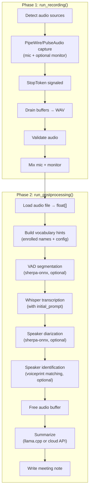

### Meeting directory layout

Every recording lives in `meetings/<YYYY-MM-DD_HH-MM>/`. All persisted artifacts inside that directory carry the meeting's timestamp as a per-instance suffix:

| File | Written when | Notes |
|---|---|---|
| `audio_<ts>.wav` | Always (live recording or pre-existing on reprocess) | 16 kHz mono S16LE |
| `context_<ts>.json` | Only when context_inline or context_file is non-empty | Persisted by the parent process before postprocessing |
| `speakers_<ts>.json` | Only when diarization ran and emitted speakers | Per-meeting voiceprint + label cache |
| `Meeting_<ts>_<title>.md` | Always | The meeting note (transcript, summary, action items) |

**Legacy-name fallback.** Meetings created before the per-instance naming convention used unsuffixed filenames (`audio.wav`, `context.json`, `speakers.json`). All read paths fall back to the legacy filenames via `find_audio_file()` / `find_context_file()` / `find_speakers_file()` (see `src/util.{h,cpp}`), so old meetings keep loading. Write paths always emit the per-instance form when a canonical timestamp is available; reprocessing a legacy meeting writes new-style files alongside the audio without renaming the audio itself.

**Save site placement.** `context_<ts>.json` is persisted in the **parent process** — `daemon::rec_worker` (after the pending-context drain, outside the `g_context_mu` lock scope) and `pipeline::run_pipeline` (between `run_recording` and `run_postprocessing`) — never inside `run_postprocessing`. The reason is that the daemon path forks a postprocess subprocess for memory containment, and the subprocess always runs with `cfg.reprocess_dir` set to the captured audio directory; an in-postprocess save guarded on `cfg.reprocess_dir.empty()` would be dead code on every daemon path. `speakers_<ts>.json` is still written from inside `run_postprocessing` because it's downstream of diarization (which only runs in postprocessing), and the same subprocess writes it before exit.

### Memory scoping strategy

The postprocessing phase uses nested scopes to minimize peak memory:

1. **Audio buffer scope** — `samples` vector is alive during transcription and diarization, freed before summarization.
2. **Whisper model scope** — the `WhisperModel` object is freed after transcription completes, before diarization begins.

This matters because whisper models (75 MB–1.5 GB) and audio buffers (16-bit, 16 kHz) can be large.

### Reprocess flow

Single-meeting (`--reprocess <dir>`) and batch (`--reprocess-batch <parent>`) share the same per-meeting code path: `run_pipeline` (standalone) or the daemon's `record.start` IPC + postprocess subprocess. The batch driver only adds orchestration and signal plumbing on top.

- **`run_reprocess_batch`** (`src/reprocess_batch.cpp`) classifies immediate `YYYY-MM-DD_HH-MM(_N)?` subdirs into `WillReprocess` / `SkipNoteExists` / `SkipNoAudio` (`classify_batch_entries`), runs `ensure_models_cached_or_fail` once before the loop so a missing whisper/sherpa/VAD/llama model fails fast, locks the dispatch mode (`BatchDispatchMode::Daemon` or `Standalone`) at batch entry, and dispatches each meeting serially via `dispatch_one_reprocess`.
- **Per-iteration `StopToken` plumbing** — each iteration owns a fresh `StopToken iter_stop`. Before dispatch the driver publishes `&iter_stop` into `g_active_iter_stop` (atomic, release-store); the standalone-mode `batch_sigint_handler` and the daemon-mode `batch_daemon_sigint_handler` (installed per-iteration around the IPC call by `dispatch_one_reprocess_daemon`) read it via acquire-load and trip the token without ever touching a mutex (POSIX async-signal-safety). The handlers also set `g_batch_stop_requested` so the loop's between-iteration check breaks out cleanly. A `SigGuard` RAII helper saves and restores the previous `sigaction` on every exit path.
- **IPC `batch_job` propagation** — the `record.start` request carries `cfg.batch_mode`; the daemon stores it on the per-job state and stamps it onto the `job.complete` event as `batch_job: <bool>`. The tray (`tray.cpp`) gates its "Meeting note ready" desktop notification on `!batch_job` so a 30-meeting batch produces a single end-of-batch summary notification (emitted by the batch driver itself in the operator's terminal), not one per meeting. Pipeline-error notifications stay unconditional — failures want operator attention regardless of mode.

## Live Captioning Architecture

Live captioning runs *during* `run_recording()` — not in postprocessing —
because its value proposition is real-time text. The architecture mirrors
the rest of the pipeline (heavy compute behind an opt-in flag, fan-out via
`broadcast()`, callback-driven state machines) but adds a producer/consumer
seam between the audio capture thread and a dedicated ASR worker thread.

**Source:** `src/caption_engine.{h,cpp}`, `src/caption_vtt.{h,cpp}`,
`src/caption_format.{h,cpp}`, `src/pipeline.cpp` (fan-out adapter +
RAII teardown), `src/daemon.cpp` (IPC broadcast wiring),
`src/main.cpp` (CLI flags, model pre-flight), `src/tray.cpp` (overlay).

### Component placement

| Component | Lives in | Notes |
|---|---|---|
| `CaptionEngine` (sherpa-onnx streaming Zipformer wrapper, SPSC ring, ASR worker thread) | `recmeet_core` | Producer (`on_audio_chunk`) is lock-free, non-allocating, non-logging |
| `VttWriter` (append-only WebVTT sidecar persistence) | `recmeet_core` | Pure I/O — no sherpa dependency |
| `normalize_caption()` (ALL-CAPS → human-readable display normalization) | `recmeet_core` | Pure function; both clients call it at render time |
| Tray caption overlay (`GtkLabel` popup window) | `recmeet-tray` | Subscribes to `caption` events, calls `normalize_caption()` before display |
| CLI stderr renderer (`[caption] <text>` lines during recording) | `recmeet` | Same render path as tray, `isatty(STDERR_FILENO)`-gated |
| Caption model manager (`ensure_caption_model()`, pre-flight prompt) | `recmeet_core` | Curated table of streaming models; same download pattern as whisper/sherpa |

### Data flow

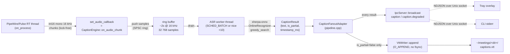

### Teardown ordering (load-bearing)

The order in which the recording loop tears down is critical because the
producer (capture thread) and the consumer (engine worker) share an
in-memory ring through a static function pointer:

1. **`cap.stop()`** — capture's RT thread exits; `set_audio_callback`'s
   atomic pointer can no longer fire.
2. **Engine teardown (RAII)** — `ActiveCaptionEngine` destructor first
   unsubscribes the callback as a belt-and-braces step, then calls
   `engine.stop()` which joins the worker thread after it drains the
   remaining ring contents and emits any pending finals.
3. **`cap.drain()`** — moves the buffered audio out of the capture for
   WAV writing.

Reversing 1 and 2 leaves a window where the destroyed engine's address is
still in the capture's atomic callback pointer; reversing 2 and 3 means
the engine could feed the recognizer with samples from a partially-drained
capture buffer. This sequence is enforced by stack-frame nesting in both
`run_recording` branches (mic-only and mic+monitor).

### V2 compatibility surface (immutable across V1 → V2)

The following V1 contracts are explicit V2-Phase-A inputs and must not
change without a V2 migration:

- **Audio callback API:** `void set_audio_callback(AudioChunkCallback cb,
  void* userdata)` on `PipeWireCapture` / `PulseMonitorCapture`. Survives
  the V2 Phase B `recmeet_capture` library extraction unchanged — same
  signature, same int16-mono-16-kHz samples.
- **`caption` event payload:** `{job_id, text, is_partial, timestamp_ms}`.
  `job_id` survives V2 Phase A.4's `client_id`-routing change because per-
  job filtering is the natural axis. Adding `client_id` later is additive.
- **`record.start` params:** `captions_enabled` (bool) and `caption_model`
  (string) become wire-compatible client request fields in V2 Phase B.
- **`.vtt` sidecar layout:** `~/meetings/<dir>/captions.vtt`, WebVTT,
  finalized cues only, no cue ids. The `~/meetings/` wire-format-at-rest
  contract is V1-frozen and additive-only.

### Default model

`sherpa-onnx-streaming-zipformer-en-2023-06-26` (int8 quantized, ~74 MB,
Apache-2.0, English-only). Resolved by `caption_model_dir(name)` in the
model manager; empty `name` resolves to this default at use time so a
future pin change touches one place.

### Limitations (V1)

- ALL-CAPS, no-punctuation engine output. Display normalization happens
  at the client (tray + CLI), not at the engine — the IPC payload is
  always raw engine text so a downstream consumer can opt out.
- Partial captions stream over IPC but never land in the `.vtt` sidecar.
- English-only. `cfg.language` other than empty/`en` disables captions
  with a warning at recording start.
- Sherpa-OFF builds: `CaptionEngine::start()` returns false with the
  canonical error message; `record.start {captions_enabled: true}`
  broadcasts a one-shot `caption.degraded` event and continues recording
  without captions.

## Diarization

Speaker diarization labels each transcript segment with `Speaker_01`, `Speaker_02`, etc. before speaker identification (or `merge_speakers()`) renames them. recmeet has two diarization paths that share the same `DiarizeResult` data shape; the pipeline picks one based on audio length.

**Source:** `src/diarize.h`, `src/diarize.cpp`, `src/pipeline.cpp` dispatch.

### Single-call path (default for short audio)

Below the chunked-path threshold (~17.5 minutes at default settings) the pipeline calls `diarize(samples, ...)` once. sherpa-onnx loads the pyannote segmentation + 3D-Speaker embedding models (~45 MB), processes the entire buffer in one streaming pass, and returns `{segments, num_speakers}`. Speaker identification then re-extracts one centroid per cluster from the audio. This path was the only one available before iter 121 and remains the lowest-overhead choice for typical meetings.

### Chunked path (long audio, T2.1)

When audio length exceeds `chunk_minutes * 60 + chunk_overlap_sec + 120` seconds the pipeline switches to `diarize_chunked()`. The implementation:

1. **Slices** the buffer into overlapping windows. Each chunk has a *core* region (the segment-ownership zone) and an *overlap* region (extra audio so adjacent chunks see context across boundaries).
2. **Reuses one `DiarizeSession` + `SpeakerEmbeddingSession`** across every chunk. Models stay loaded; only the cheap clustering object rebuilds when `set_clustering()` runs (T2.0a/T2.0b refactor).
3. **Runs `diarize_with_session` per chunk**, then extracts one raw embedding centroid per chunk-local speaker via `extract_speaker_embedding(session, ...)`.
4. **Stitches** chunk-local IDs into a global registry by cosine similarity on L2-normalized centroids (threshold `stitch_threshold`, default `0.6`). Centroids themselves are stored *raw* (non-normalized) so the persisted `MeetingSpeaker.embedding` format is byte-shape compatible with the legacy single-call path.
5. **Owns segments by midpoint-in-core** with full-extent emit. A boundary segment whose midpoint falls inside chunk[i]'s core is emitted by chunk[i] in full, even if its trailing edge spills into chunk[i+1]. `merge_speakers`'s max-overlap rule absorbs the benign duplicate.
6. **Compacts global IDs to `0..N-1` contiguous** after the post-stitch greedy-merge that enforces the optional `num_speakers` ceiling. When `--num-speakers N` is set explicitly on the CLI the same count is also enforced as a **floor**: the apply-collapse / merge loop will neither over-create above N nor over-merge below N. The floor branch fires only for CLI-supplied counts; context-derived counts (from a `Participants:` line) remain ceiling-only because context is an operator hint, not an assertion. Without the compaction pass `merge(1, 2)` of `{0,1,2,3}` would leave `{0,1,3}`, surfacing as `Speaker_01, Speaker_02, Speaker_04` in transcripts.
7. **Bypasses re-extraction in identify-speakers.** The chunked diarize already produced one centroid per global cluster; the pipeline calls `identify_speakers_with_centroids(centroids, db, threshold)` instead of `identify_speakers(samples, ...)`. This skips the ~10 GB working-set spike (iter 110 / iter 114 measurements) the second extractor pass would otherwise cost on long audio.

### Configuration

| Config field | CLI flag | Default | Description |
|---|---|---|---|
| `diarization.chunk_minutes` | `--diarize-chunk-minutes` | `15.0` | Window width in minutes; threshold = `chunk_minutes*60 + chunk_overlap_sec + 120` s |
| `diarization.chunk_overlap_sec` | `--diarize-chunk-overlap-sec` | `30.0` | Overlap between adjacent chunks (positive spacing required: `chunk_minutes*60 > chunk_overlap_sec + 60`) |
| `diarization.stitch_threshold` | `--diarize-stitch-threshold` | `0.6` | Cosine-similarity floor for merging chunk-local centroids into the global registry |
| `diarization.num_speakers` | `--num-speakers` | `0` (auto) | Post-stitch global count; sample-weighted greedy-merge enforces. When passed explicitly on the CLI, enforced as **both ceiling and floor** (no over-create above N, no over-merge below N); context-derived counts (`Participants:` line) remain ceiling-only |
| `diarization.cluster_threshold` | `--cluster-threshold` | `1.18` | Per-chunk clustering threshold forwarded to `set_clustering()` |

### Memory + wall-clock budget

The chunked path is gated by the `[benchmark][t2-1]` head-to-head bench (`tests/test_benchmark.cpp`), which runs `diarize()` and `diarize_chunked()` against the same input buffer with a 1 Hz `recmeet::read_self_rss_kb()` sampler thread. Pinned regression gates:

- 30-min synthetic: chunked **peak RSS < 4 GB**, chunked wall-clock < 1.5× single-call.
- iter-110 60-min real fixture: chunked peak RSS < 6 GB (vs un-chunked ~11 GB iter-114 baseline). Tagged `[slow]`; skip-on-missing-fixture.

The end-to-end integration gate `make integration-t2-1` reprocesses the iter-110 fixture under `systemd-run --user --scope -p MemoryMax=8G` to verify the cgroup containment goal.

## Vocabulary Hints

Vocabulary hints improve transcription accuracy for unusual names and domain-specific terms by biasing whisper's decoder via its `initial_prompt` parameter.

### Data flow

Before transcription begins, `run_postprocessing()` builds a combined prompt from two sources:

1. **Enrolled speaker names** — loaded automatically via `list_speakers()` (when speaker ID is enabled)
2. **User-specified vocabulary** — from `Config::vocabulary` (set via `--vocab`, `--add-vocab`, or `config.yaml`)

The helper `build_initial_prompt()` combines both into a comma-separated string (e.g., `"John Suykerbuyk, Alice, PipeWire, Kubernetes"`), which is passed to `TranscribeOptions::initial_prompt` and ultimately to `whisper_full_params::initial_prompt`.

### Token limit

Whisper limits `initial_prompt` to `whisper_n_text_ctx()/2` tokens (typically 224). With typical name lengths, this supports ~50-100 vocabulary entries before truncation.

### Configuration

| Config field | CLI flag | Default | Description |
|---|---|---|---|
| `transcription.vocabulary` | `--vocab` | `""` | Comma-separated vocabulary hints |
| — | `--add-vocab` | — | Add a word to persistent vocabulary |
| — | `--remove-vocab` | — | Remove a word from persistent vocabulary |
| — | `--list-vocab` | — | List persistent vocabulary words |
| — | `--reset-vocab` | — | Clear all persistent vocabulary words |

### IPC support

The `vocabulary` field flows through the daemon's IPC config system (`config_to_map` / `config_from_map`), so vocabulary hints work for recordings started via the tray or CLI in client mode.

## Speaker Identification

Speaker identification matches diarization clusters against a persistent database of enrolled voiceprints, replacing generic `Speaker_XX` labels with real names across sessions.

### Architecture

The feature reuses the same 3D-Speaker embedding model (`eres2net_base`) already downloaded for diarization. No additional models are needed. The identification step runs inside the audio buffer scope, after diarization and before `merge_speakers()`.

**Source:** `src/speaker_id.h`, `src/speaker_id.cpp`

### Data flow

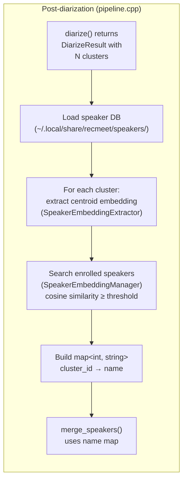

### Enrollment flow


### Speaker database

Each enrolled speaker is stored as a JSON file:

```
~/.local/share/recmeet/speakers/
├── John.json
├── Alice.json
└── Bob.json
```

**File format:**

```json
{
  "name": "John",
  "created": "2026-03-08T10:00:00Z",
  "updated": "2026-03-09T14:30:00Z",
  "embeddings": [
    [0.12, -0.34, 0.56, ...],
    [0.11, -0.32, 0.58, ...]
  ]
}
```

Each embedding is a float vector (typically 192 dimensions for the eres2net model, ~2-4 KB per enrollment). Multiple embeddings per speaker improve accuracy — they are all registered with the sherpa-onnx `SpeakerEmbeddingManager`, which handles averaging internally during search.

### sherpa-onnx API usage

The speaker identification module uses two sherpa-onnx C APIs that are separate from the high-level diarization API:

| API | Purpose | Lifecycle |
|---|---|---|
| `SherpaOnnxSpeakerEmbeddingExtractor` | Extract embedding vectors from audio segments | Created per identification run |
| `SherpaOnnxSpeakerEmbeddingManager` | Register enrolled embeddings and search by cosine similarity | Created per identification run, populated from disk DB |

**Embedding extraction** feeds all audio segments belonging to a diarization cluster into a single `OnlineStream`, then calls `ComputeEmbedding()` to get the centroid vector.

**Speaker search** uses `GetBestMatches(mgr, embedding, threshold, 1)` to find the highest-scoring enrolled speaker above the similarity threshold. Conflict resolution ensures no two clusters are assigned the same enrolled name — the highest-scoring match wins.

### Configuration

| Config field | CLI flag | Default | Description |
|---|---|---|---|
| `speaker_id.enabled` | `--no-speaker-id` | `true` | Enable/disable identification |
| `speaker_id.threshold` | `--speaker-threshold` | `0.6` | Cosine similarity threshold |
| `speaker_id.database` | `--speaker-db` | `~/.local/share/recmeet/speakers/` | Database directory path |

### Integration with merge_speakers()

`merge_speakers()` accepts an optional `std::map<int, std::string>` mapping cluster IDs to enrolled names. For clusters with no match, it falls back to `format_speaker()` (`Speaker_XX`). This keeps the merge logic clean — identification is fully decoupled from label assignment.

```cpp
// Without speaker ID (original behavior)
result.segments = merge_speakers(result.segments, diar);
// → "Speaker_01: Hello"

// With speaker ID
auto names = identify_speakers(samples, diar, db, model_path, threshold);
result.segments = merge_speakers(result.segments, diar, names);
// → "John: Hello"
```

## Dependencies

### Vendored (compiled from source)

| Library | Purpose | CMake target |
|---|---|---|
| whisper.cpp | Speech-to-text transcription | `whisper` (shared library, plus runtime-loadable `libggml-cpu-*.so` and `libggml-vulkan.so` plugins via `GGML_BACKEND_DL`) |
| llama.cpp | Local LLM summarization | `llama` (shared library, gated by `RECMEET_USE_LLAMA`) |
| sherpa-onnx | Speaker diarization, identification, VAD, streaming captions | `sherpa-onnx-c-api` (gated by `RECMEET_USE_SHERPA`) |
| onnxruntime | sherpa-onnx inference engine | Built from source via `scripts/build-onnxruntime.sh` on hosts with GCC 12+ (~20 min, installs to `vendor/onnxruntime-local/`). Pre-built system packages used otherwise. Carries its own vendored protobuf to immunize against system-package ABI skew (iter 99–100). |
| cpp-httplib | WebUI HTTP server | Header + single TU under `vendor/cpp-httplib/` (gated by `RECMEET_BUILD_WEB`) |

### Platform (pkg-config)

| Package | Purpose |
|---|---|
| `libpipewire-0.3` | Audio capture (primary) |
| `libpulse`, `libpulse-simple` | Monitor source fallback |
| `sndfile` | WAV read/write |
| `libcurl` | HTTP client (API calls, model downloads) |
| `libnotify` | Desktop notifications (optional) |
| `gtk+-3.0` | Tray UI (tray only) |
| `ayatana-appindicator3-0.1` | System tray indicator (tray only) |

### Runtime (not linked)

| Dependency | Purpose |
|---|---|
| PipeWire (running) | Audio routing |
| onnxruntime | sherpa-onnx backend (system package preferred) |

## Daemon State Machine

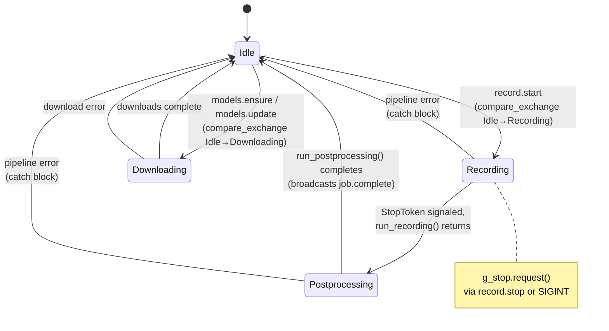

## Lifecycle Diagrams

### Daemon-mode recording session

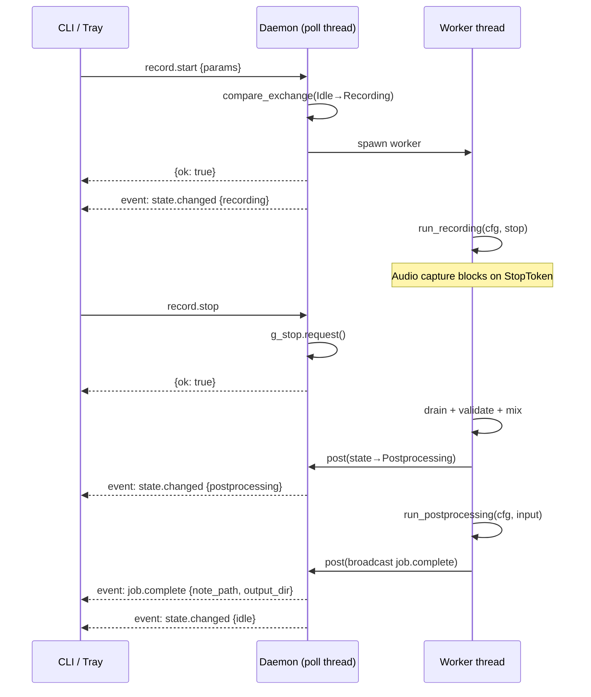

### Standalone recording session

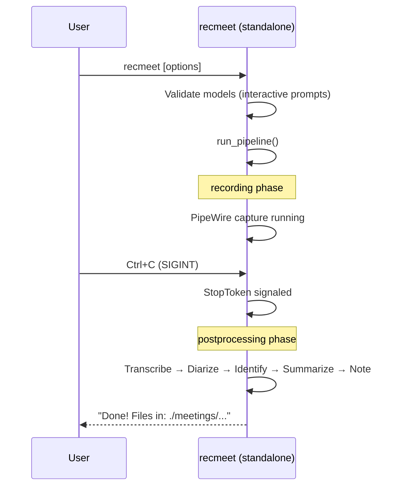

### Startup sequence

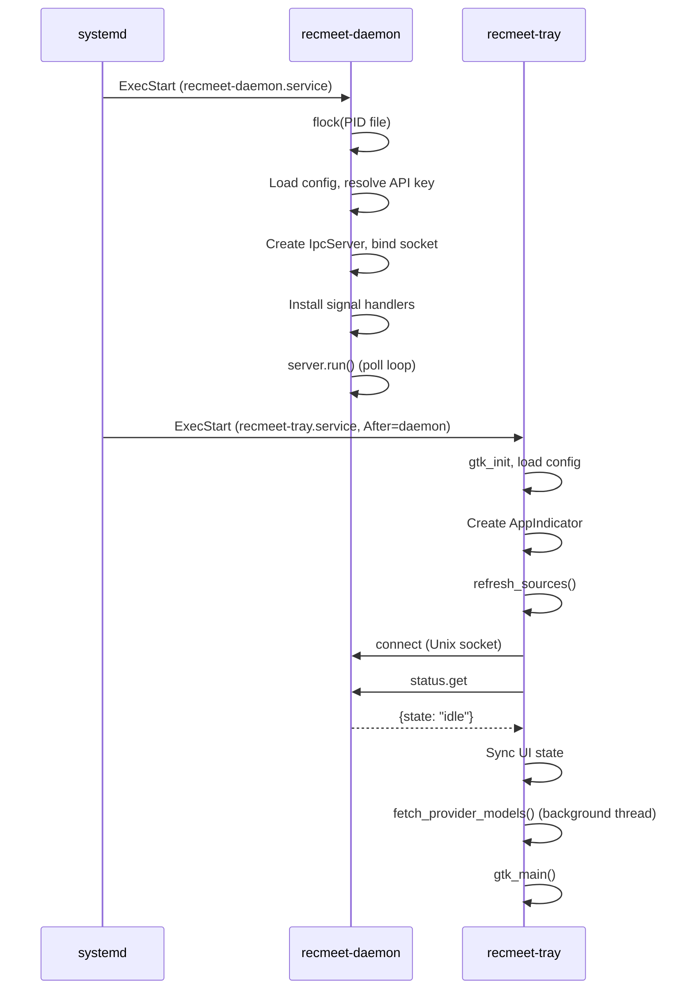

### Shutdown sequence

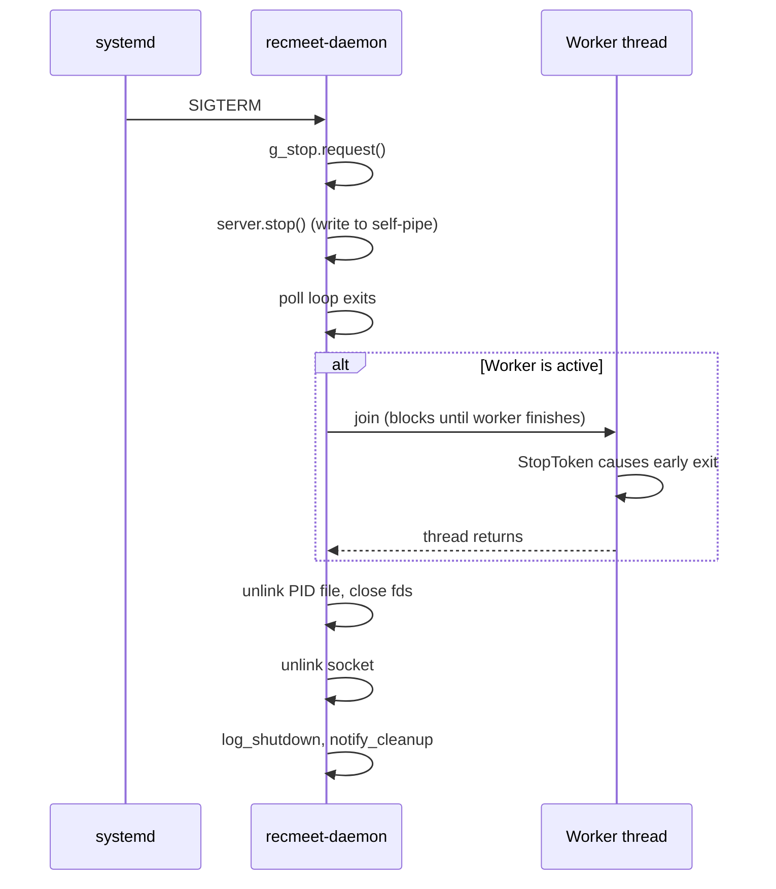

### Model download flow

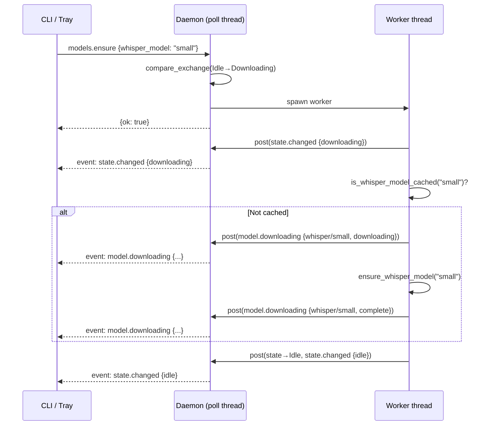

## Go Tools Module

The `tools/` directory contains a self-contained Go module (`github.com/syketech/recmeet-tools`) that provides AI-powered meeting tooling. It reads the same `config.yaml` and meeting output files as the C++ binaries but has no compile-time or runtime dependency on them.

### Module structure

```
tools/
├── go.mod                              # Module: github.com/syketech/recmeet-tools
├── cmd/
│   ├── recmeet-mcp/main.go            # MCP server entry point
│   └── recmeet-agent/main.go          # Agent CLI entry point
├── meetingdata/                         # Shared data access library
│   ├── config.go                       # Config parsing (matches C++ parser)
│   ├── meetings.go                     # Meeting directory discovery
│   ├── notes.go                        # Note parsing + search
│   ├── actionitems.go                  # Action item extraction
│   └── speakers.go                     # Speaker profile loading
├── mcpserver/                           # MCP tool implementations
│   ├── server.go                       # Server setup + registration
│   └── tools.go                        # Tool definitions + handlers
└── agent/                               # Agent internals
    ├── config.go                       # Agent-specific configuration
    ├── loop.go                         # Agentic loop (Claude API)
    ├── tools.go                        # Tool registry + definitions
    ├── workflows.go                    # Prep + follow-up workflows
    ├── search.go                       # Brave web search tool
    ├── fetch.go                        # Web page fetcher
    └── writefile.go                    # File writing tool
```

### Key dependencies

| Library | Purpose |
|---|---|
| `mark3labs/mcp-go` | Model Context Protocol server (stdio transport) |
| `anthropics/anthropic-sdk-go` | Claude API client for the agentic loop |
| `spf13/cobra` | CLI framework for the agent |
| `golang.org/x/net/html` | HTML parsing for web_fetch |

### `meetingdata` package

The shared data access layer. Both the MCP server and agent import this package to read meeting data from disk.

**Config loading** — Parses `~/.config/recmeet/config.yaml` using a line-based YAML parser that matches the C++ parser's behavior (flat sections with indented key-value pairs, not full YAML spec). Resolves `$XDG_CONFIG_HOME` and `$XDG_DATA_HOME` for paths.

**Meeting discovery** — Scans the output directory for directories matching `YYYY-MM-DD_HH-MM`, finds audio files (timestamped or legacy `audio.wav`), and locates corresponding note files across multiple directory structures (meeting dir, `YYYY/MM/` subdirs, note dir root).

**Note parsing** — Extracts YAML frontmatter, callout sections (summary, context, transcript using `> [!type]` syntax), and action items. Search supports keyword matching against title, summary, tags, and participants, with date range and participant filters.

**Action items** — Parsed from `## Action Items` sections (not inside callouts). Format: `- [ ] **[Assignee]** - description` or `- [x]` for completed items. Supports cross-meeting listing with status and assignee filters.

**Speaker profiles** — Loads JSON files from the speaker database directory. Strips embedding vectors before returning profiles (privacy — only name, creation date, update date, and embedding count are exposed).

### Binary: `recmeet-mcp` (MCP server)

**Source:** `tools/cmd/recmeet-mcp/main.go`

A Model Context Protocol server that exposes meeting data to AI tools (Claude Code, Claude Desktop, Cursor, and other MCP-compatible clients). Communicates over stdio using JSON-RPC.

**Critical implementation detail:** stdout is redirected to stderr at startup. MCP uses stdout exclusively for the JSON-RPC stream — any stray output (log messages, fmt.Println) would corrupt the protocol. All logging goes to stderr.

#### MCP tools

| Tool | Params | Description |
|---|---|---|
| `search_meetings` | `query`, `date_from`, `date_to`, `participants[]`, `limit` | Search notes by keyword, date range, participants |
| `get_meeting` | `meeting_dir` (required) | Full meeting details by directory name |
| `list_action_items` | `status`, `assignee`, `limit` | Action items filtered by status/assignee |
| `get_speaker_profiles` | — | List enrolled speaker profiles |
| `write_context_file` | `filename` (required), `content` (required) | Write pre-meeting context to staging dir |

All read tools are annotated as read-only and non-destructive. `write_context_file` sanitizes filenames to prevent directory traversal and rejects hidden files.

#### Data flow

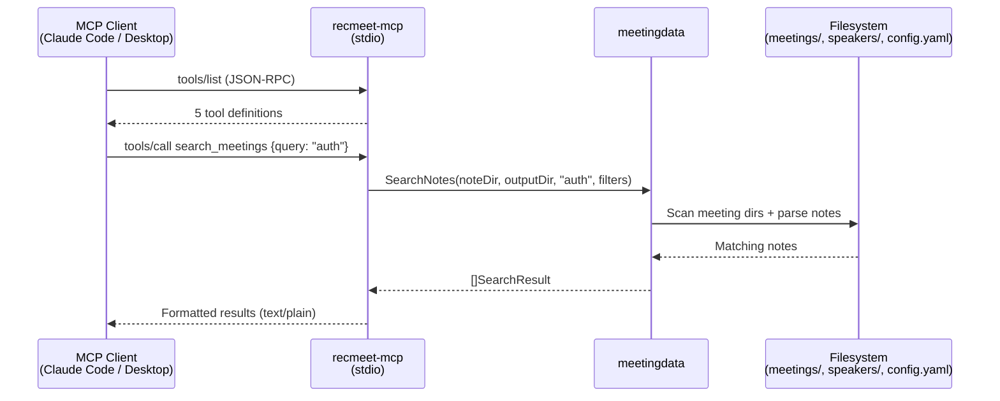

### Binary: `recmeet-agent` (AI agent CLI)

**Source:** `tools/cmd/recmeet-agent/main.go`

An AI agent CLI powered by Claude that automates meeting preparation and follow-up. Uses Cobra for CLI parsing and the Anthropic SDK for the agentic loop.

#### Commands

| Command | Args | Description |
|---|---|---|
| `prep` | `description` (positional, required) | Research past meetings and generate a briefing |
| `follow-up` | `note-path` (positional, required) | Read meeting notes and draft follow-up messages |

#### Tool registry

The agent exposes tools to Claude via the Anthropic tool-use API. Each tool implements a `Definition()` + `Execute()` interface.

| Tool | Source | Description |
|---|---|---|
| `search_meetings` | meetingdata | Search past meetings by keyword/date/participants |
| `get_meeting` | meetingdata | Get full meeting details by date (+ optional time) |
| `list_action_items` | meetingdata | List action items with status/assignee filters |
| `get_speaker_profiles` | meetingdata | List enrolled speakers |
| `web_search` | Brave API | Web search (only registered if `BRAVE_API_KEY` is set) |
| `web_fetch` | net/html | Fetch and extract text from a URL (10K char limit) |
| `write_file` | os | Write content to a file path |

#### Agentic loop

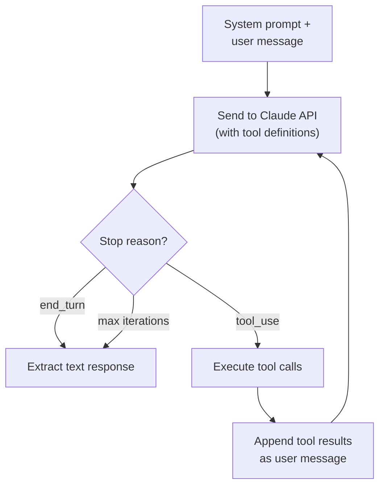

The loop runs up to 20 iterations (configurable). Each iteration sends the conversation history to Claude with the registered tools. If Claude returns `tool_use` blocks, the agent executes each tool, collects results, and feeds them back. The loop terminates when Claude returns `end_turn` or the iteration limit is reached.

**Verbose mode** (`--verbose`) logs each tool call and result to stderr for debugging.

**Dry-run mode** (`--dry-run`) prints the system prompt and user message without calling the API.

#### Prep workflow

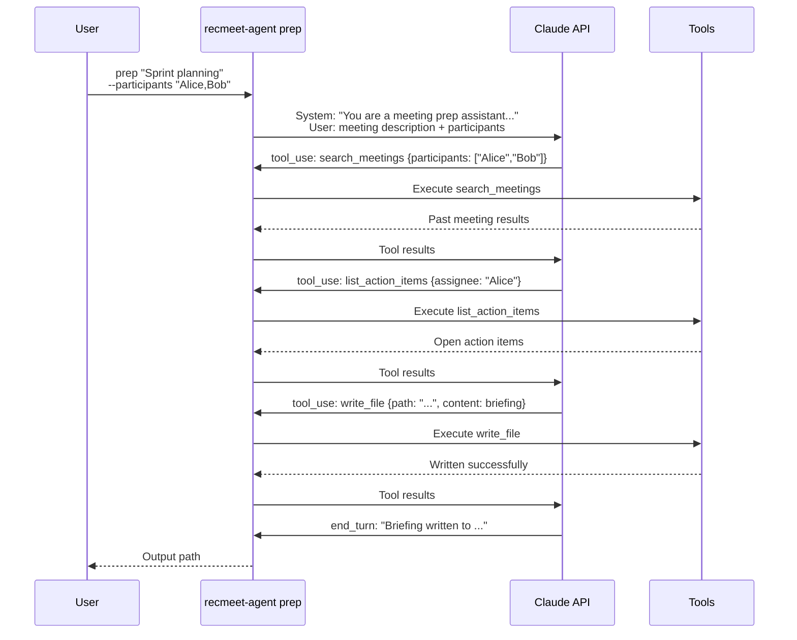

#### Follow-up workflow

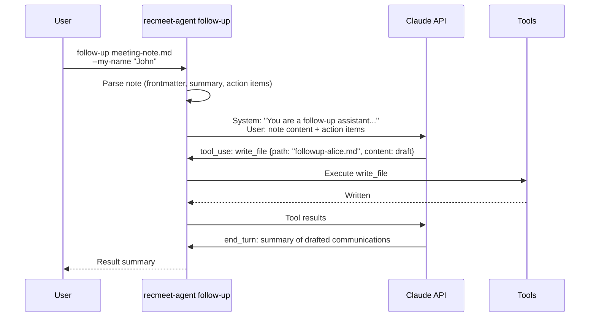

#### Configuration

The agent reads the standard recmeet `config.yaml` for meeting paths, speaker DB location, and API keys. Agent-specific settings are resolved from environment variables and CLI flags:

| Setting | Source | Default |
|---|---|---|
| Anthropic API key | `ANTHROPIC_API_KEY` env var, then `api_keys.anthropic` in config | — (required) |
| Anthropic base URL | `ANTHROPIC_BASE_URL` env var | — (SDK default; tests point this at an `httptest` mock) |
| Brave API key | `BRAVE_API_KEY` env var | — (optional, enables web_search) |
| Model | `--model` flag | `claude-sonnet-4-6` |
| Max iterations | `--max-iterations` flag (per subcommand) | `20` |
| Context staging dir | `$XDG_DATA_HOME/recmeet/context/` | `~/.local/share/recmeet/context/` |

### Testing

The Go tools have two complementary test layers; both gate `make integration` and a merge to `v1-maintenance`.

| Layer | Count | Build tag | Scope |
|---|---|---|---|
| Library + `testutil` | 123 (41 `agent` + 23 `mcpserver` + 34 `meetingdata` + 25 `testutil`) | (default) | Unit-level — proves each component (`meetingdata` parsers, `mcpserver` handlers, `agent` workflows, `testutil` helpers) works correctly in isolation. `make test` runs these alongside the C++ suite. |
| Integration | 39 (18 `recmeet-mcp` + 21 `recmeet-agent`) | `//go:build integration` | End-to-end — builds the as-built binaries via `testutil.BuildBinaryOnce`, then drives them as real subprocesses against the MCP stdio protocol and a mock Anthropic httptest server. Proves the deployable artifacts complete a real session, not just that components compose. `make integration-go` runs these. |

`tools/testutil/` is the shared infrastructure: package-scope binary build cache (via `TestMain` + `os.MkdirTemp`), `MockAnthropic` httptest server, fixture builders (`BuildMeetingsFixture` writes `Meeting_<date>.md` files matching `meetingdata.findMDFiles`'s glob), a custom MCP stdio transport that supports stdout-teeing for the hygiene test, and a named usability-assertion table so each error-path test names its actionable-stderr expectation rather than duplicating string-match logic.

The integration suite proves end-to-end protocol/CLI behavior — stdio hygiene, MCP handshake, Cobra flag plumbing, exit codes, error-message quality, mock-Anthropic round-trip for `prep` and `follow-up`. The library tests prove component correctness — note parsing, action-item extraction, tool dispatch, agentic-loop iteration, Claude-message shape. Together they cover both directions: components compose AND the deployable composition runs.

Subprocess coverage (Go 1.20+ `GOCOVERDIR` mechanism) confirms `cmd/recmeet-mcp/main.go` at 100.0% and `cmd/recmeet-agent/main.go` at 92.8% from the integration suite alone. See `docs/BUILD.md` "Subprocess coverage" for the invocation. The build-tag mechanism means `go test ./...` stays fast for fast-feedback during development; CI and `make integration` opt in to the slower end-to-end work.
