# Component Interaction Diagrams

Detailed Mermaid diagrams documenting recmeet's architecture, component
interactions, and internal control flow. These diagrams reflect the actual
source code implementation, not aspirational design.

## Table of Contents

1. [Top-Level Component Interaction](#1-top-level-component-interaction)
2. [Build Topology and Library Dependencies](#2-build-topology-and-library-dependencies)
3. [Daemon Internals](#3-daemon-internals)
4. [IPC Server Poll Loop](#4-ipc-server-poll-loop)
5. [IPC Client Flow](#5-ipc-client-flow)
6. [IPC Protocol Wire Format](#6-ipc-protocol-wire-format)
7. [Recording Pipeline](#7-recording-pipeline)
8. [Postprocessing Pipeline](#8-postprocessing-pipeline)
9. [Tray Applet](#9-tray-applet)
10. [CLI Mode Selection](#10-cli-mode-selection)
11. [Subprocess Postprocessing](#11-subprocess-postprocessing)
12. [Audio Capture Subsystem](#12-audio-capture-subsystem)
13. [Go Tools Module](#13-go-tools-module)

---

## 1. Top-Level Component Interaction

All runtime communication paths between binaries, libraries, and external
systems. Solid lines are compile-time links; dashed lines are runtime IPC or
network calls.

```mermaid
graph TB
    subgraph "C++ Binaries"
        CLI["recmeet<br/>(CLI)"]
        DAEMON["recmeet-daemon<br/>(IPC server)"]
        TRAY["recmeet-tray<br/>(system tray)"]
        WEB["recmeet-web<br/>(REST API)"]
    end

    subgraph "Static Libraries"
        IPC["recmeet_ipc<br/>(config, IPC, util)"]
        CORE["recmeet_core<br/>(ML pipeline)"]
    end

    subgraph "Go Binaries"
        MCP["recmeet-mcp<br/>(MCP server)"]
        AGENT["recmeet-agent<br/>(AI agent CLI)"]
    end

    subgraph "Vendored C/C++ Deps"
        WHISPER["whisper.cpp"]
        LLAMA["llama.cpp"]
        SHERPA["sherpa-onnx"]
        ONNX["onnxruntime<br/>(shared lib)"]
        HTTPLIB["cpp-httplib"]
    end

    subgraph "System Libraries"
        PW["libpipewire"]
        PA["libpulse /<br/>libpulse-simple"]
        SNDFILE["libsndfile"]
        CURL["libcurl"]
        NOTIFY["libnotify"]
        GTK["GTK3"]
        APPIND["ayatana-<br/>appindicator3"]
    end

    subgraph "External Services"
        CLOUD["Cloud API<br/>(xAI / OpenAI / Anthropic)"]
        CLAUDE["Anthropic API<br/>(Claude)"]
        BRAVE["Brave Search API"]
    end

    subgraph "Data (Filesystem)"
        CONFIG["~/.config/recmeet/<br/>config.yaml"]
        MEETINGS["meetings/<br/>(WAV + notes)"]
        SPEAKERS["~/.local/share/recmeet/<br/>speakers/ (JSON)"]
        MODELS["~/.local/share/recmeet/<br/>models/"]
        LOGS["~/.local/share/recmeet/<br/>logs/"]
    end

    subgraph "IPC Transports"
        UNIX["Unix socket<br/>$XDG_RUNTIME_DIR/<br/>recmeet/daemon.sock"]
        TCP["TCP socket<br/>(configurable host:port)"]
    end

    %% Library links
    CORE -->|"links"| IPC
    CORE --> WHISPER
    CORE -.->|"if RECMEET_USE_LLAMA"| LLAMA
    CORE -.->|"if RECMEET_USE_SHERPA"| SHERPA
    SHERPA --> ONNX
    CORE --> PW
    CORE --> PA
    CORE --> SNDFILE
    IPC --> CURL
    IPC --> PA
    IPC -.->|"if RECMEET_USE_NOTIFY"| NOTIFY

    %% Binary links
    CLI -->|"links"| CORE
    DAEMON -->|"links"| CORE
    WEB -->|"links"| CORE
    WEB --> HTTPLIB
    TRAY -->|"links (thin client)"| IPC
    TRAY --> GTK
    TRAY --> APPIND

    %% IPC runtime paths
    CLI -.->|"client mode"| UNIX
    CLI -.->|"client mode"| TCP
    TRAY -.->|"always"| UNIX
    TRAY -.->|"remote"| TCP
    UNIX -.-> DAEMON
    TCP -.-> DAEMON

    %% Subprocess fork/exec
    DAEMON -.->|"fork/exec<br/>postprocessing"| CLI

    %% Data access
    CLI --> CONFIG
    CLI --> MEETINGS
    DAEMON --> CONFIG
    DAEMON --> MEETINGS
    DAEMON --> LOGS
    TRAY --> CONFIG
    WEB --> MEETINGS
    WEB --> SPEAKERS
    CORE --> MODELS
    CORE --> SPEAKERS

    %% Network
    CORE -.->|"summarize_http()"| CLOUD
    CORE -.->|"model download"| CURL
    AGENT -.-> CLAUDE
    AGENT -.-> BRAVE

    %% Go data access
    MCP --> MEETINGS
    MCP --> SPEAKERS
    MCP --> CONFIG
    AGENT --> MEETINGS
    AGENT --> SPEAKERS
    AGENT --> CONFIG
```

---

## 2. Build Topology and Library Dependencies

Exact source file inventory per CMake target and the link dependency graph.

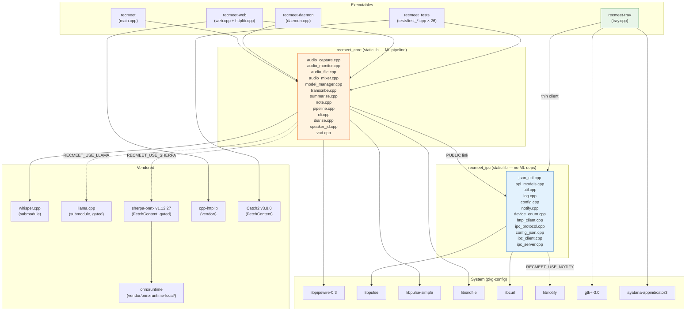

---

## 3. Daemon Internals

### 3a. Daemon Startup Sequence

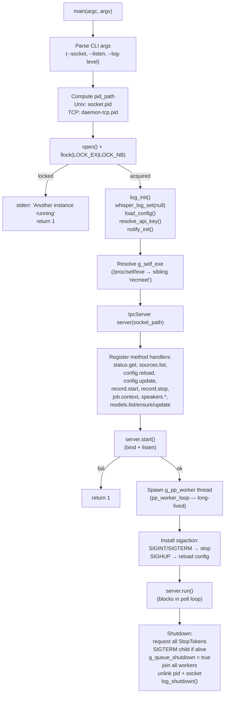

### 3b. Daemon State Machine

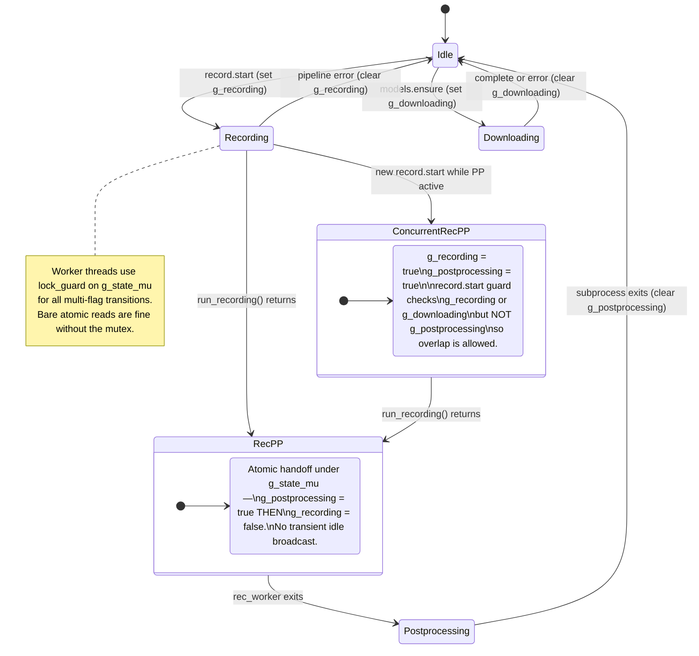

### 3c. Worker Thread Lifecycle

```mermaid
flowchart TB
    subgraph "rec_worker (one-shot per record.start)"
        RW_START["Spawned from record.start handler"]
        RW_RUN["run_recording(cfg, g_rec_stop, on_phase)"]
        RW_PHASE["on_phase callback:<br/>server.post(broadcast phase event)"]
        RW_OK{Success?}
        RW_ENQUEUE["Absorb pending context/vocab<br/>Enqueue PostprocessJob<br/>lock(g_state_mu):<br/>  g_postprocessing = true<br/>  g_recording = false<br/>g_queue_cv.notify_one()"]
        RW_ERR["lock(g_state_mu):<br/>  g_recording = false<br/>server.post(broadcast error state)"]

        RW_START --> RW_RUN
        RW_RUN --> RW_PHASE
        RW_RUN --> RW_OK
        RW_OK -->|"yes"| RW_ENQUEUE
        RW_OK -->|"exception"| RW_ERR
    end

    subgraph "pp_worker (long-lived, started at daemon init)"
        PP_WAIT["wait(g_queue_cv)<br/>until !queue.empty() || shutdown"]
        PP_SHUT{shutdown?}
        PP_DEQUEUE["Dequeue PostprocessJob"]
        PP_FLAG["if !already_flagged:<br/>  g_postprocessing = true<br/>  broadcast state"]
        PP_FORK["Fork/exec subprocess<br/>(see §11)"]
        PP_DONE["lock(g_state_mu):<br/>  g_postprocessing = false<br/>broadcast state"]

        PP_WAIT --> PP_SHUT
        PP_SHUT -->|"yes"| PP_EXIT["return"]
        PP_SHUT -->|"no"| PP_DEQUEUE
        PP_DEQUEUE --> PP_FLAG
        PP_FLAG --> PP_FORK
        PP_FORK --> PP_DONE
        PP_DONE --> PP_WAIT
    end

    subgraph "dl_worker (one-shot per models.ensure)"
        DL_START["Spawned from models.ensure handler"]
        DL_DOWNLOAD["Download models<br/>server.post(broadcast model events)"]
        DL_DONE["lock(g_state_mu):<br/>  g_downloading = false<br/>broadcast state"]

        DL_START --> DL_DOWNLOAD
        DL_DOWNLOAD --> DL_DONE
    end
```

### 3d. Signal Handling

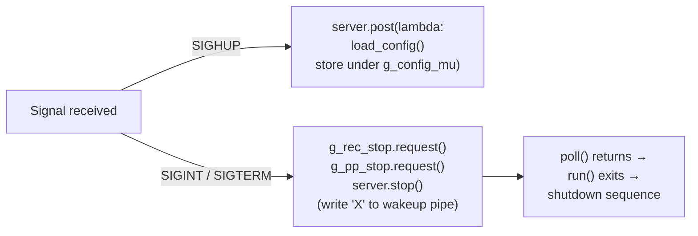

---

## 4. IPC Server Poll Loop

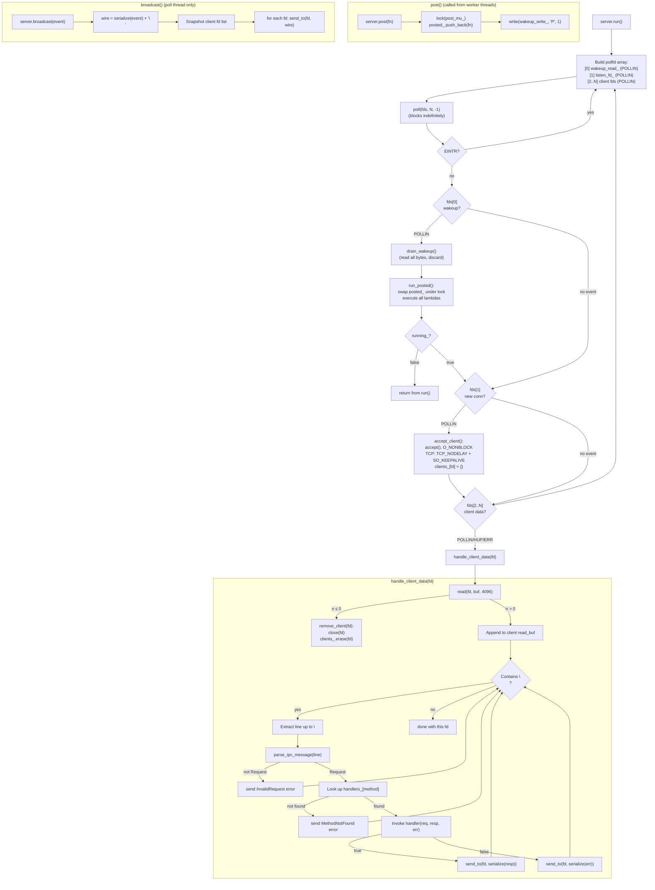

---

## 5. IPC Client Flow

### 5a. Connection

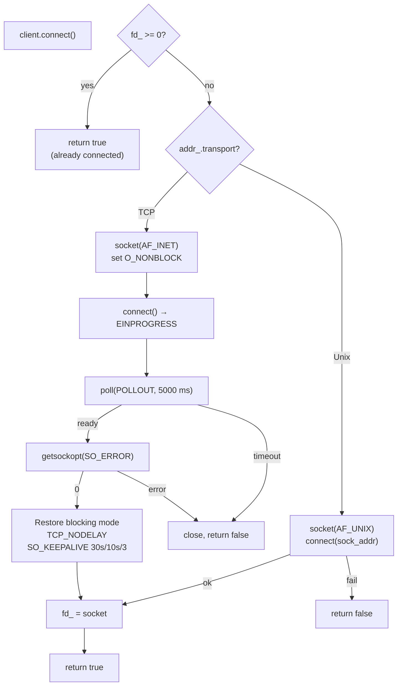

### 5b. Blocking RPC (`call()`)

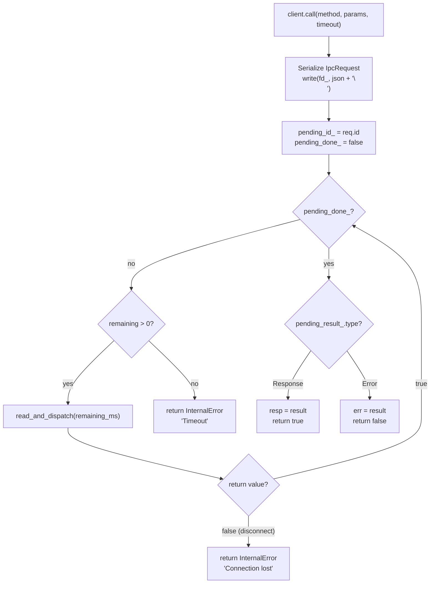

### 5c. `read_and_dispatch()` Internal

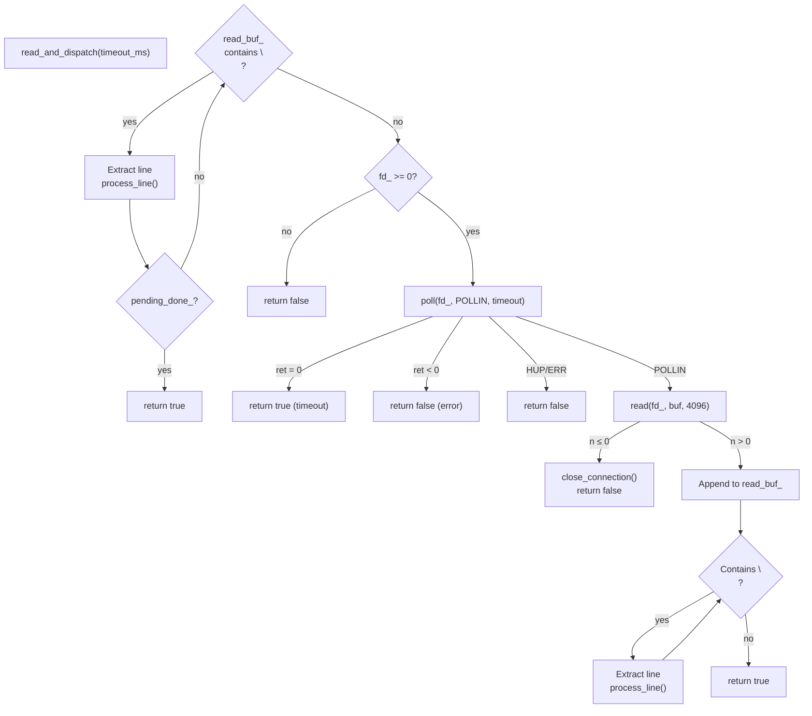

### 5d. `process_line()` Dispatch

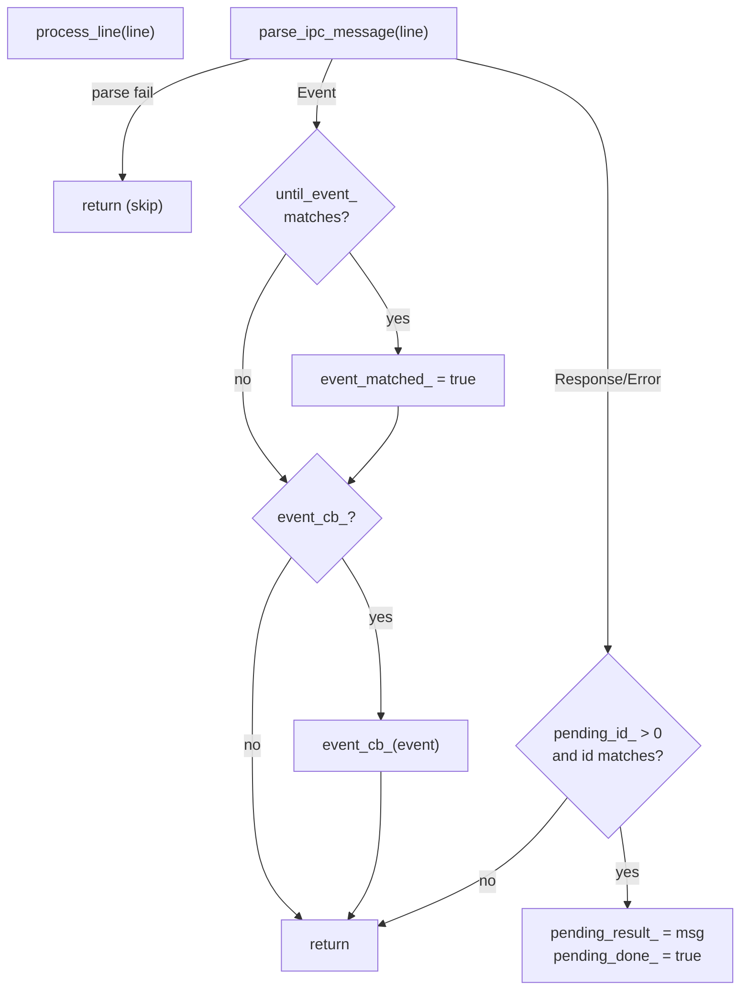

---

## 6. IPC Protocol Wire Format

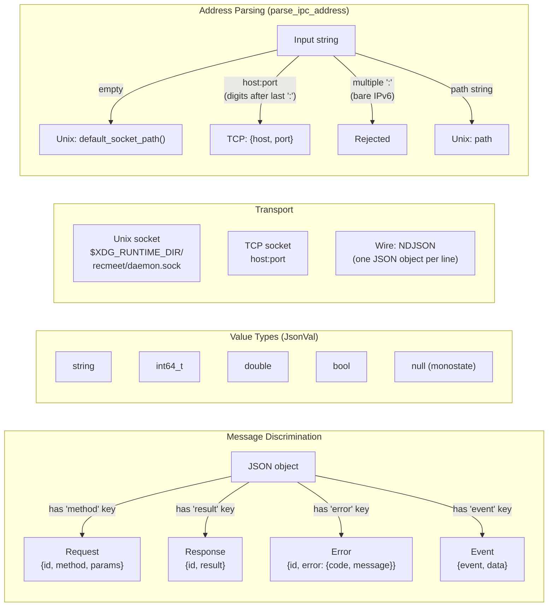

---

## 7. Recording Pipeline

`run_recording()` control flow with dual-capture and reprocess branching.

```mermaid
flowchart TD
    ENTRY["run_recording(cfg, stop, on_phase)"]
    MODE{"cfg.reprocess_dir<br/>non-empty?"}

    MODE -->|"yes"| REPROC_RESOLVE["Resolve path<br/>(absolute or relative to output_dir)"]
    REPROC_RESOLVE --> REPROC_VALIDATE["validate_reprocess_input(path)<br/>→ pp.audio_path"]
    REPROC_VALIDATE --> REPROC_DIR["pp.out_dir = output_dir_explicit ?<br/>  cfg.output_dir : parent(audio)"]
    REPROC_DIR --> REPROC_MKDIR["fs::create_directories(pp.out_dir)"]
    REPROC_MKDIR --> RETURN["Return PostprocessInput"]

    MODE -->|"no"| DETECT{"cfg.mic_source<br/>empty?"}
    DETECT -->|"yes"| AUTO["detect_sources(device_pattern)<br/>→ mic + monitor"]
    DETECT -->|"no"| USE_CFG["Use cfg.mic_source,<br/>cfg.monitor_source"]
    AUTO -->|"no mic"| THROW["throw DeviceError"]
    AUTO --> DUAL_CHECK
    USE_CFG --> DUAL_CHECK

    DUAL_CHECK{"dual_mode?<br/>(!mic_only && monitor)"}
    DUAL_CHECK -->|"no"| SINGLE

    DUAL_CHECK -->|"yes"| DUAL

    subgraph DUAL["Dual Capture Mode"]
        D_NOTIFY["notify('Recording started')"]
        D_MIC["PipeWireCapture mic(mic_source)<br/>mic.start()"]
        D_MON_CHECK{"source ends<br/>with .monitor?"}
        D_MON_CHECK -->|"yes"| D_MON_PA["PulseMonitorCapture(source)"]
        D_MON_CHECK -->|"no"| D_MON_PW["try PipeWireCapture(source, sink=true)"]
        D_MON_PW -->|"RecmeetError"| D_MON_PA
        D_MON_PW -->|"ok"| D_TIMER
        D_MON_PA --> D_TIMER

        D_TIMER["Spawn timer_thread<br/>(display_elapsed on stderr)"]
        D_LOOP["while !stop.stop_requested()<br/>  sleep_for(200ms)"]
        D_STOP["timer_stop → join timer<br/>mic.stop() → mon.stop()"]
        D_DRAIN["mic_samples = mic.drain()<br/>mon_samples = mon.drain()"]
        D_WRITE["Write mic.wav + monitor.wav"]
        D_VAL_MIC["validate_audio(mic.wav, 1.0s)<br/>→ fatal on fail"]
        D_VAL_MON["validate_audio(monitor.wav)<br/>→ non-fatal"]
        D_VAL_MON -->|"ok"| D_MIX["mix_audio(mic, mon)<br/>→ write audio_YYYY-MM-DD_HH-MM.wav"]
        D_VAL_MON -->|"AudioValidationError"| D_MIC_ONLY["Write mic-only<br/>→ audio_YYYY-MM-DD_HH-MM.wav"]
        D_MIX --> D_CLEANUP
        D_MIC_ONLY --> D_CLEANUP
        D_CLEANUP["if !keep_sources: remove raw WAVs"]

        D_NOTIFY --> D_MIC --> D_MON_CHECK
        D_TIMER --> D_LOOP --> D_STOP --> D_DRAIN
        D_DRAIN --> D_WRITE --> D_VAL_MIC --> D_VAL_MON
    end

    subgraph SINGLE["Single Mic Mode"]
        S_MIC["PipeWireCapture(mic_source)<br/>start()"]
        S_TIMER["Spawn timer_thread"]
        S_LOOP["while !stop.stop_requested()<br/>  sleep_for(200ms)"]
        S_STOP["stop() → drain()"]
        S_WRITE["Write audio_YYYY-MM-DD_HH-MM.wav"]

        S_MIC --> S_TIMER --> S_LOOP --> S_STOP --> S_WRITE
    end

    DUAL --> RETURN
    SINGLE --> RETURN
```

---

## 8. Postprocessing Pipeline

`run_postprocessing()` with memory scoping, cancellation, and all ML stages.

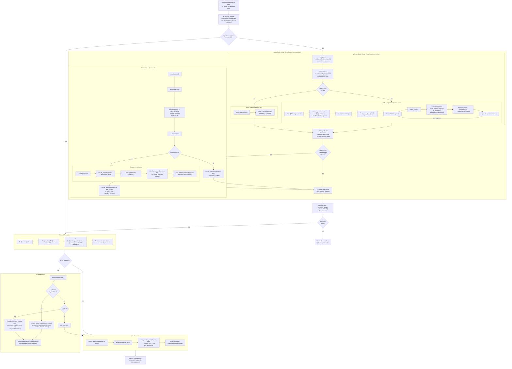

---

## 9. Tray Applet

### 9a. Tray Startup and GTK Main Loop

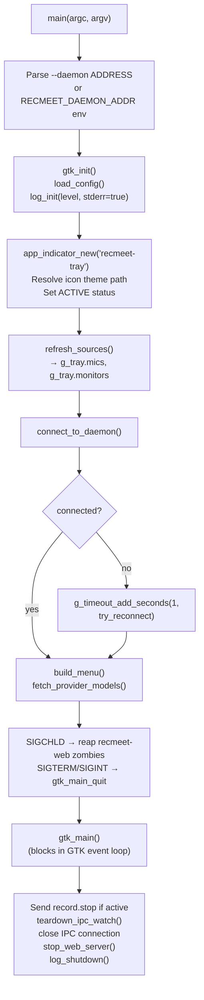

### 9b. IPC Event Integration with GTK

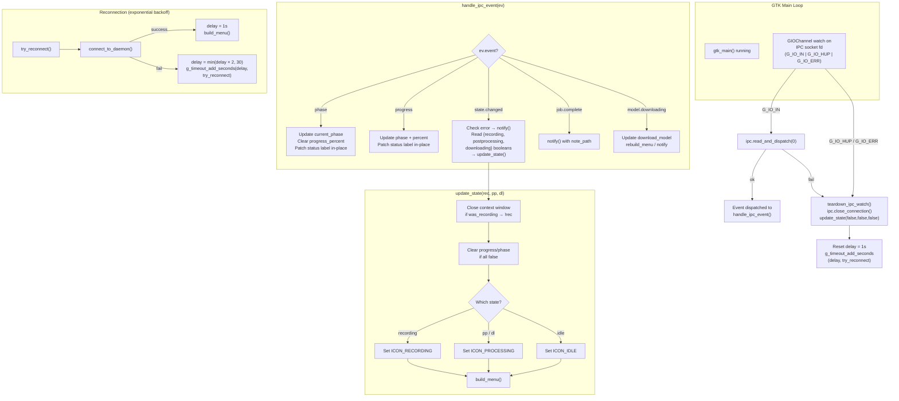

### 9c. Recording Start/Stop Flow

```mermaid
flowchart TD
    subgraph "on_record()"
        REC_GUARD{"recording ||<br/>downloading?"}
        REC_GUARD -->|"yes"| REC_RET["return"]
        REC_GUARD -->|"no"| REC_CONN{"daemon_connected?"}
        REC_CONN -->|"no"| REC_RETRY["connect_to_daemon()"]
        REC_RETRY -->|"fail"| REC_NOTIFY["notify('Cannot connect')"]
        REC_RETRY -->|"ok"| REC_KEY
        REC_CONN -->|"yes"| REC_KEY

        REC_KEY["resolve_api_key(provider)"]
        REC_KEY --> REC_KEY_CHECK{"key empty &&<br/>!no_summary?"}
        REC_KEY_CHECK -->|"yes"| REC_PROMPT["prompt_api_key() GTK dialog"]
        REC_PROMPT --> REC_SAVE["Save to api_keys + config"]
        REC_KEY_CHECK -->|"no"| REC_BUILD
        REC_SAVE --> REC_BUILD

        REC_BUILD["Build run_cfg from g_tray.cfg<br/>config_to_map() → params"]
        REC_BUILD --> REC_CALL["ipc.call('record.start',<br/>params, 10s timeout)"]
        REC_CALL -->|"fail"| REC_ERR_NOTIFY["notify(error)"]
        REC_CALL -->|"ok"| REC_STATE["update_state(true, pp, false)"]
        REC_STATE --> REC_CTX["show_context_window()"]
    end

    subgraph "on_stop()"
        STOP_GUARD{"!recording &&<br/>!postprocessing?"}
        STOP_GUARD -->|"yes"| STOP_RET["return"]
        STOP_GUARD -->|"no"| STOP_CTX{"recording &&<br/>context window?"}
        STOP_CTX -->|"yes"| STOP_CAPTURE["capture_and_clear_context()<br/>→ {context_inline, vocab}"]
        STOP_CAPTURE --> STOP_JOB_CTX["ipc.call('job.context',<br/>{context_inline, vocabulary_append})"]
        STOP_CTX -->|"no"| STOP_TARGET
        STOP_JOB_CTX --> STOP_TARGET

        STOP_TARGET["params[target] =<br/>recording ? 'recording' : 'postprocessing'"]
        STOP_TARGET --> STOP_CALL["ipc.call('record.stop',<br/>params, 5s timeout)"]
    end
```

### 9d. Tray Menu Structure

```mermaid
graph TD
    MENU["GTK Menu"]
    MENU --> STATUS["(i) Status label<br/>(insensitive, patched in-place)"]
    MENU --> SEP1["─── separator ───"]
    MENU --> REC_SECTION["Record / Stop / Cancel<br/>(context-sensitive)"]
    MENU --> SEP2["─── separator ───"]
    MENU --> MIC["▶ Mic Source<br/>  ○ Auto-detect<br/>  ○ source1<br/>  ○ source2"]
    MENU --> MON["▶ Monitor Source<br/>  ○ Auto-detect<br/>  ○ monitor1"]
    MENU --> MODEL["▶ Whisper Model<br/>  ○ tiny / base / small /<br/>    medium / large-v3"]
    MENU --> LANG["▶ Language<br/>  ○ Auto-detect<br/>  ○ en / es / fr / ..."]
    MENU --> SEP3["─── separator ───"]
    MENU --> CHECKS["☑ Mic Only<br/>☑ No Summary<br/>☑ Speaker Diarization<br/>☑ VAD Segmentation"]
    MENU --> SEP4["─── separator ───"]
    MENU --> SUMMARY["▶ Summary<br/>  ▶ Provider<br/>    ○ xAI / OpenAI / Anthropic / Local<br/>  ▶ Model<br/>    ○ (fetched from API)"]
    MENU --> OUTPUT["▶ Output<br/>  (i) Output dir<br/>  (i) Note dir<br/>  Open Latest Session<br/>  Set Output Dir...<br/>  Set Note Dir...<br/>  Set LLM Model..."]
    MENU --> SEP5["─── separator ───"]
    MENU --> EDIT["Edit Config"]
    MENU --> SPEAKER["Speaker Management"]
    MENU --> REFRESH["Refresh Devices"]
    MENU --> UPDATE["Update Models"]
    MENU --> ABOUT["About"]
    MENU --> SEP6["─── separator ───"]
    MENU --> QUIT["Quit"]
```

---

## 10. CLI Mode Selection

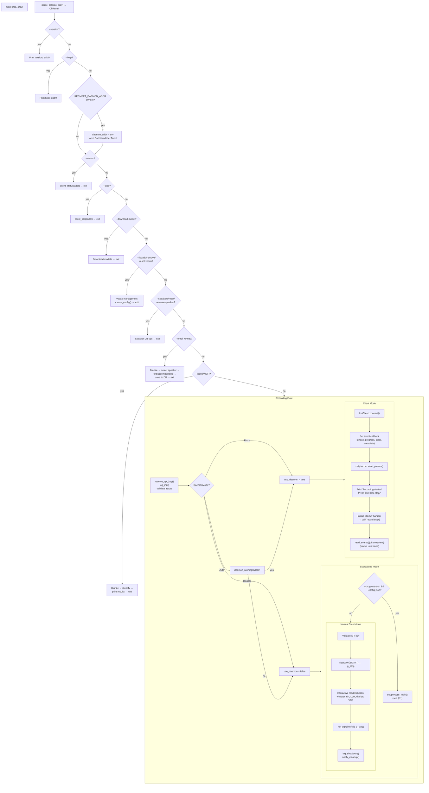

---

## 11. Subprocess Postprocessing

The daemon's `pp_worker_loop` fork/exec's the `recmeet` binary as a child
process for crash isolation. Communication is via NDJSON on stdout/stderr pipes.

### 11a. Fork/Exec Flow

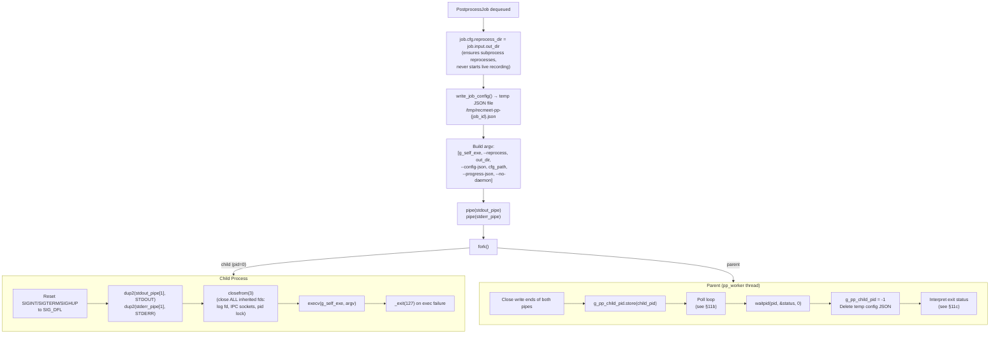

### 11b. NDJSON Poll Loop and Watchdog

```mermaid
flowchart TD
    POLL["poll({stdout_fd, stderr_fd}, 2, 1000ms)"]

    POLL --> STDOUT{"stdout<br/>readable?"}
    STDOUT -->|"yes"| PARSE_OUT["Read lines, parse NDJSON"]

    PARSE_OUT --> EV_TYPE{"event type?"}
    EV_TYPE -->|"phase"| PHASE_BC["server.post(broadcast phase)<br/>Reset last_percent = -1<br/>Update last_progress timestamp"]
    EV_TYPE -->|"progress"| PROG_THROTTLE{"pct jump ≥ 10%<br/>or elapsed ≥ 120s?"}
    PROG_THROTTLE -->|"yes"| PROG_BC["server.post(broadcast progress)<br/>Update last_progress"]
    PROG_THROTTLE -->|"no"| SKIP["Skip (throttled)"]
    EV_TYPE -->|"job.complete"| CAPTURE["Capture note_path, output_dir"]
    EV_TYPE -->|"heartbeat"| HEARTBEAT["Update last_heartbeat only"]

    STDOUT -->|"no"| STDERR
    STDERR{"stderr<br/>readable?"}
    STDERR -->|"yes"| LOG_ERR["Log line, track last_stderr_line"]
    STDERR -->|"no"| WATCHDOG

    PHASE_BC --> WATCHDOG
    PROG_BC --> WATCHDOG
    SKIP --> WATCHDOG
    CAPTURE --> WATCHDOG
    HEARTBEAT --> WATCHDOG
    LOG_ERR --> WATCHDOG

    subgraph WATCHDOG["Dual-Timestamp Watchdog"]
        WD1{"last_heartbeat<br/>> 120s stale?"}
        WD1 -->|"yes"| KILL["kill(pid, SIGTERM)<br/>killed_stale = true<br/>Close both pipes<br/>Break poll loop"]
        WD1 -->|"no"| WD2{"last_progress<br/>> 300s stale?"}
        WD2 -->|"yes"| KILL
        WD2 -->|"no"| CANCEL_CHECK
    end

    CANCEL_CHECK{"g_pp_stop<br/>requested?"}
    CANCEL_CHECK -->|"yes"| CANCEL_KILL["kill(pid, SIGTERM)<br/>g_pp_stop.reset()"]
    CANCEL_CHECK -->|"no"| EOF_CHECK

    EOF_CHECK{"Both pipes<br/>closed?"}
    EOF_CHECK -->|"yes"| EXIT_POLL["Exit poll loop"]
    EOF_CHECK -->|"no"| POLL

    CANCEL_KILL --> POLL
```

### 11c. Exit Status Interpretation

```mermaid
flowchart LR
    EXIT{"Child exit status"}
    EXIT -->|"exit(0)"| OK["server.post(broadcast<br/>job.complete event)"]
    EXIT -->|"exit(2)"| CANCELLED["Log: 'Cancelled'<br/>(no notification)"]
    EXIT -->|"exit(127)"| LAUNCH_FAIL["'Failed to launch subprocess'"]
    EXIT -->|"killed_stale"| DEADLOCK["'Processing stalled<br/>(no progress) — likely<br/>onnxruntime deadlock'"]
    EXIT -->|"signal N"| CRASH["'Processing crashed<br/>(signal N: SIGNAME)'"]
    EXIT -->|"exit(N) other"| FAIL["'Processing failed<br/>(exit N): last_stderr_line'"]

    LAUNCH_FAIL --> NOTIFY["notify() + broadcast_state(error)"]
    DEADLOCK --> NOTIFY
    CRASH --> NOTIFY
    FAIL --> NOTIFY
```

### 11d. Subprocess Internal Flow

```mermaid
flowchart TD
    ENTRY["subprocess_main(cli)"]
    LOG_OFF["log_shutdown()<br/>(no file/stderr logging;<br/>NDJSON stdout only)"]
    READ_CFG["Read config JSON from<br/>cli.config_json_path"]
    PARSE["config_from_json(content) → cfg"]
    SUPPRESS["Suppress whisper log noise"]
    SIGNALS["sigaction(SIGINT/SIGTERM)<br/>→ g_stop.request()"]
    HEARTBEAT["Spawn heartbeat thread:<br/>write NDJSON {'event':'heartbeat'}<br/>every ~10s"]
    REC["run_recording(cfg, g_stop, on_phase)<br/>→ input (reprocess mode: returns immediately)"]
    PP["run_postprocessing(cfg, input,<br/>on_phase, on_progress, &g_stop)"]
    COMPLETE["Write NDJSON job.complete<br/>{note_path, output_dir}"]
    CLEANUP["Stop heartbeat thread<br/>Remove temp config JSON"]
    RET{"result?"}
    RET -->|"success"| EXIT0["return 0"]
    RET -->|"RecmeetError('Cancelled')"| EXIT2["return 2"]
    RET -->|"other error"| EXIT1["return 1"]

    ENTRY --> LOG_OFF --> READ_CFG --> PARSE --> SUPPRESS
    SUPPRESS --> SIGNALS --> HEARTBEAT --> REC --> PP --> COMPLETE --> CLEANUP --> RET
```

---

## 12. Audio Capture Subsystem

```mermaid
flowchart TD
    subgraph "Source Selection (run_recording)"
        SEL_START["Audio source names from Config"]
        SEL_EMPTY{"mic_source<br/>empty?"}
        SEL_EMPTY -->|"yes"| SEL_DETECT["detect_sources(pattern)<br/>→ mic + monitor"]
        SEL_EMPTY -->|"no"| SEL_USE["Use config values"]
        SEL_DETECT -->|"no mic"| SEL_ERR["throw DeviceError"]
        SEL_DETECT --> DUAL{"!mic_only &&<br/>monitor found?"}
        SEL_USE --> DUAL
    end

    DUAL -->|"yes"| DUAL_CAP
    DUAL -->|"no"| SINGLE_CAP

    subgraph DUAL_CAP["Dual Capture"]
        subgraph MIC_CAP["Mic Capture"]
            MIC_PW["PipeWireCapture(mic_source)<br/>S16LE mono 16kHz"]
            MIC_START["mic.start()"]
            MIC_PW --> MIC_START
        end

        subgraph MON_CAP["Monitor Capture"]
            MON_CHECK{".monitor suffix?"}
            MON_CHECK -->|"yes"| MON_PA["PulseMonitorCapture<br/>(pa_simple, own thread)"]
            MON_CHECK -->|"no"| MON_PW_TRY["try PipeWireCapture<br/>(capture_sink=true)"]
            MON_PW_TRY -->|"RecmeetError"| MON_PA
            MON_PW_TRY -->|"ok"| MON_OK["Monitor capturing"]
            MON_PA --> MON_OK
        end

        STOP_LOOP["while !stop.stop_requested()<br/>  sleep_for(200ms)"]
        DRAIN_BOTH["mic.stop() + mon.stop()<br/>mic_samples = mic.drain()<br/>mon_samples = mon.drain()"]
        WRITE_RAW["Write mic.wav + monitor.wav"]
        VALIDATE["validate_audio(mic.wav) — fatal<br/>validate_audio(monitor.wav) — non-fatal"]
        MIX_OR_SKIP{"Monitor valid?"}
        MIX_OR_SKIP -->|"yes"| MIX["mix_audio(mic, mon)<br/>→ averaged int16_t stream"]
        MIX_OR_SKIP -->|"AudioValidationError"| MIC_FALLBACK["Use mic-only"]

        MIC_START --> STOP_LOOP
        MON_OK --> STOP_LOOP
        STOP_LOOP --> DRAIN_BOTH --> WRITE_RAW --> VALIDATE --> MIX_OR_SKIP
        MIX --> WRITE_OUT
        MIC_FALLBACK --> WRITE_OUT
        WRITE_OUT["Write audio_YYYY-MM-DD_HH-MM.wav"]
    end

    subgraph SINGLE_CAP["Single Mic Capture"]
        S_PW["PipeWireCapture(mic_source)"]
        S_START["start()"]
        S_LOOP["while !stop.stop_requested()"]
        S_DRAIN["stop() → drain()"]
        S_WRITE["Write audio_YYYY-MM-DD_HH-MM.wav"]

        S_PW --> S_START --> S_LOOP --> S_DRAIN --> S_WRITE
    end

    subgraph "PipeWireCapture Internals (Pimpl)"
        PW_INIT["pw_init(), pw_main_loop_new()<br/>pw_stream_new()"]
        PW_PROPS["Properties:<br/>S16LE, 16kHz, mono<br/>capture_sink for loopback"]
        PW_CB["on_process callback (RT thread):<br/>dequeue buffer → memcpy to ring buffer<br/>(atomic flag, no mutex)"]
        PW_THREAD["pw_main_loop runs in own thread"]
        PW_STOP["stop(): set atomic flag<br/>pw_main_loop_quit()"]
        PW_DRAIN["drain(): move ring buffer out<br/>→ vector<int16_t>"]

        PW_INIT --> PW_PROPS --> PW_CB --> PW_THREAD
    end

    subgraph "PulseMonitorCapture Internals"
        PA_INIT["pa_simple_new(source, record)<br/>S16LE, 16kHz, mono"]
        PA_THREAD["Capture thread:<br/>pa_simple_read() in loop<br/>mutex-protected vector buffer"]
        PA_STOP["stop(): set StopToken<br/>join thread"]
        PA_DRAIN["drain(): move buffer out"]

        PA_INIT --> PA_THREAD
    end
```

---

## 13. Go Tools Module

### 13a. Module Structure and Data Flow

```mermaid
graph TB
    subgraph "Go Binaries"
        MCP_BIN["recmeet-mcp<br/>(cmd/recmeet-mcp/main.go)"]
        AGENT_BIN["recmeet-agent<br/>(cmd/recmeet-agent/main.go)"]
    end

    subgraph "meetingdata (shared library)"
        MD_CONFIG["config.go<br/>Parse config.yaml<br/>(flat YAML, matches C++)"]
        MD_MEETINGS["meetings.go<br/>Scan output dirs<br/>YYYY-MM-DD_HH-MM pattern"]
        MD_NOTES["notes.go<br/>Parse frontmatter +<br/>callout sections + search"]
        MD_ACTIONS["actionitems.go<br/>Parse ## Action Items<br/>- [ ] / - [x] format"]
        MD_SPEAKERS["speakers.go<br/>Load JSON profiles<br/>(strips embeddings)"]
    end

    subgraph "mcpserver"
        MCP_SERVER["server.go<br/>Setup + registration"]
        MCP_TOOLS["tools.go<br/>5 tool handlers"]
    end

    subgraph "agent"
        AG_CONFIG["config.go<br/>Agent-specific config"]
        AG_LOOP["loop.go<br/>Agentic loop (Claude API)"]
        AG_TOOLS["tools.go<br/>7 tool definitions"]
        AG_WORKFLOWS["workflows.go<br/>Prep + follow-up prompts"]
        AG_SEARCH["search.go<br/>Brave web search"]
        AG_FETCH["fetch.go<br/>HTML text extractor"]
        AG_WRITE["writefile.go<br/>File writer"]
    end

    subgraph "External APIs"
        CLAUDE_API["Anthropic API (Claude)"]
        BRAVE_API["Brave Search API"]
    end

    subgraph "Filesystem"
        FS_CONFIG["~/.config/recmeet/<br/>config.yaml"]
        FS_MEETINGS["meetings/<br/>(dirs + notes)"]
        FS_SPEAKERS["~/.local/share/recmeet/<br/>speakers/*.json"]
        FS_CONTEXT["~/.local/share/recmeet/<br/>context/"]
    end

    MCP_BIN --> MCP_SERVER
    MCP_SERVER --> MCP_TOOLS
    MCP_TOOLS --> MD_CONFIG
    MCP_TOOLS --> MD_NOTES
    MCP_TOOLS --> MD_ACTIONS
    MCP_TOOLS --> MD_SPEAKERS

    AGENT_BIN --> AG_WORKFLOWS
    AG_WORKFLOWS --> AG_LOOP
    AG_LOOP --> AG_TOOLS
    AG_TOOLS --> MD_CONFIG
    AG_TOOLS --> MD_NOTES
    AG_TOOLS --> MD_ACTIONS
    AG_TOOLS --> MD_SPEAKERS
    AG_TOOLS --> AG_SEARCH
    AG_TOOLS --> AG_FETCH
    AG_TOOLS --> AG_WRITE

    AG_LOOP --> CLAUDE_API
    AG_SEARCH --> BRAVE_API

    MD_CONFIG --> FS_CONFIG
    MD_MEETINGS --> FS_MEETINGS
    MD_NOTES --> FS_MEETINGS
    MD_ACTIONS --> FS_MEETINGS
    MD_SPEAKERS --> FS_SPEAKERS
    AG_WRITE --> FS_CONTEXT
    MCP_TOOLS -->|"write_context_file"| FS_CONTEXT
```

### 13b. MCP Server Tool Dispatch

```mermaid
flowchart TD
    CLIENT["MCP Client<br/>(Claude Code / Desktop / Cursor)"]
    STDIO["stdio (JSON-RPC)"]
    INIT["Redirect stdout → stderr<br/>(protect JSON-RPC stream)"]

    CLIENT -->|"tools/list"| STDIO
    STDIO --> INIT
    INIT --> REGISTER["Register 5 tools"]

    CLIENT -->|"tools/call"| DISPATCH{"Tool name?"}

    DISPATCH -->|"search_meetings"| SM["SearchNotes(noteDir, outputDir,<br/>query, filters)<br/>→ formatted results"]
    DISPATCH -->|"get_meeting"| GM["FindMeeting(outputDir, meeting_dir)<br/>ParseNote(path)<br/>→ full details"]
    DISPATCH -->|"list_action_items"| LA["ListActionItems(noteDir, outputDir,<br/>status, assignee, limit)<br/>→ filtered items"]
    DISPATCH -->|"get_speaker_profiles"| SP["LoadSpeakerProfiles(dbDir)<br/>→ profiles (no embeddings)"]
    DISPATCH -->|"write_context_file"| WC["Sanitize filename<br/>Write to context staging dir"]

    SM --> CLIENT
    GM --> CLIENT
    LA --> CLIENT
    SP --> CLIENT
    WC --> CLIENT
```

### 13c. Agent Agentic Loop

```mermaid
flowchart TD
    ENTRY["recmeet-agent prep|follow-up"]
    BUILD_PROMPT["Build system prompt +<br/>user message from workflow"]
    REGISTER["Register tools:<br/>search_meetings, get_meeting,<br/>list_action_items, get_speaker_profiles,<br/>web_search (if BRAVE_API_KEY),<br/>web_fetch, write_file"]

    SEND["Send to Claude API<br/>(messages + tool definitions)"]
    CHECK{"Stop reason?"}

    CHECK -->|"end_turn"| EXTRACT["Extract text response<br/>Print to stdout"]
    CHECK -->|"max_iterations (20)"| EXTRACT
    CHECK -->|"tool_use"| EXEC["For each tool_use block:"]

    EXEC --> TOOL_DISPATCH{"Tool name?"}
    TOOL_DISPATCH --> TOOL_EXEC["Execute tool<br/>Collect result string"]
    TOOL_EXEC --> APPEND["Append tool_result<br/>to conversation"]
    APPEND -->|"more tools"| TOOL_DISPATCH
    APPEND -->|"all done"| SEND

    ENTRY --> BUILD_PROMPT --> REGISTER --> SEND --> CHECK

    subgraph "Verbose Mode (--verbose)"
        V_CALL["stderr: tool name + params"]
        V_RESULT["stderr: result preview"]
    end
```
