# Component Interaction Diagrams

Detailed Mermaid diagrams documenting recmeet's architecture, component
interactions, and internal control flow. These diagrams reflect the actual
source code implementation, not aspirational design.

## Table of Contents

1. [Top-Level Component Interaction](#1-top-level-component-interaction)
2. [Build Topology and Library Dependencies](#2-build-topology-and-library-dependencies)
3. [Daemon Internals](#3-daemon-internals)
4. [IPC Server Poll Loop](#4-ipc-server-poll-loop)
5. [IPC Client Flow](#5-ipc-client-flow)
6. [IPC Protocol Wire Format](#6-ipc-protocol-wire-format)
7. [Recording Pipeline](#7-recording-pipeline)
8. [Postprocessing Pipeline](#8-postprocessing-pipeline)
   - [8a. Chunked Diarization + Stitching](#8a-chunked-diarization--stitching)
9. [Tray Applet](#9-tray-applet)
10. [CLI Mode Selection](#10-cli-mode-selection)
11. [Subprocess Postprocessing](#11-subprocess-postprocessing)
12. [Audio Capture Subsystem](#12-audio-capture-subsystem)
13. [Go Tools Module](#13-go-tools-module)
14. [Live Captioning Pipeline](#14-live-captioning-pipeline)

---

## 1. Top-Level Component Interaction

V2 thin-client / recording-server topology. The **client tier** (tray or
CLI) owns audio capture via `recmeet_capture`; the **server tier** (daemon)
owns heavy compute via the `JobQueue`. Solid lines are compile-time links;
dashed lines are runtime IPC, framed binary upload, or network calls.

The daemon does **not** link PipeWire/PulseAudio capture — audio reaches it
only as framed binary uploads (0x01) or streaming PCM (0x03) over IPC.

```mermaid
graph TB
    subgraph CLIENT_TIER ["Client Tier (audio capture lives here)"]
        CLI["recmeet<br/>(CLI — client or standalone)"]
        TRAY["recmeet-tray<br/>(system tray)"]
    end

    subgraph SERVER_TIER ["Server Tier (heavy compute)"]
        DAEMON["recmeet-daemon<br/>(IPC server + JobQueue)"]
    end

    subgraph AUX ["Auxiliary Services"]
        WEB["recmeet-web<br/>(REST API)"]
        MCP["recmeet-mcp<br/>(Go MCP server)"]
        AGENT["recmeet-agent<br/>(Go AI agent CLI)"]
    end

    subgraph LIBS ["Static Libraries"]
        IPC["recmeet_ipc<br/>(framed protocol,<br/>config, util)"]
        CAPTURE["recmeet_capture<br/>(PipeWire/Pulse,<br/>fan-out subscribers)"]
        CORE["recmeet_core<br/>(ML pipeline,<br/>JobQueue)"]
    end

    subgraph VENDORED ["Vendored C/C++ Deps"]
        WHISPER["whisper.cpp"]
        LLAMA["llama.cpp"]
        SHERPA["sherpa-onnx"]
        ONNX["onnxruntime<br/>(shared lib)"]
        HTTPLIB["cpp-httplib"]
    end

    subgraph SYS ["System Libraries"]
        PW["libpipewire<br/>(client-side)"]
        PA["libpulse /<br/>libpulse-simple<br/>(client-side)"]
        SNDFILE["libsndfile"]
        CURL["libcurl"]
        NOTIFY["libnotify"]
        GTK["GTK3"]
        APPIND["ayatana-<br/>appindicator3"]
    end

    subgraph EXT ["External Services"]
        CLOUD["Cloud API<br/>(xAI / OpenAI / Anthropic)"]
        CLAUDE["Anthropic API<br/>(Claude)"]
        BRAVE["Brave Search API"]
    end

    subgraph DATA ["Data (Filesystem)"]
        CONFIG["~/.config/recmeet/<br/>config.yaml"]
        MEETINGS["meetings/<br/>(WAV + notes)"]
        SPEAKERS["~/.local/share/recmeet/<br/>speakers/ (JSON)"]
        MODELS["~/.local/share/recmeet/<br/>models/"]
        LOGS["~/.local/share/recmeet/<br/>logs/"]
    end

    subgraph TRANSPORT ["IPC Transports (framed wire protocol v3)"]
        UNIX["Unix socket<br/>$XDG_RUNTIME_DIR/<br/>recmeet/daemon.sock<br/>(auth bypassed)"]
        TCP["TCP socket<br/>host:port<br/>(PSK auth via<br/>RECMEET_AUTH_TOKEN)"]
    end

    %% Library composition
    CAPTURE --> PW
    CAPTURE --> PA
    CAPTURE --> SNDFILE
    CORE -->|"links"| IPC
    CORE --> WHISPER
    CORE -.->|"if RECMEET_USE_LLAMA"| LLAMA
    CORE -.->|"if RECMEET_USE_SHERPA"| SHERPA
    SHERPA --> ONNX
    CORE --> SNDFILE
    IPC --> CURL
    IPC -.->|"if RECMEET_USE_NOTIFY"| NOTIFY

    %% Client-tier binary links (capture lives client-side)
    CLI -->|"links"| CORE
    CLI -->|"links"| CAPTURE
    TRAY -->|"links (thin client)"| IPC
    TRAY -->|"links"| CAPTURE
    TRAY --> GTK
    TRAY --> APPIND

    %% Server-tier binary links (NO capture lib)
    DAEMON -->|"links"| CORE
    WEB -->|"links"| CORE
    WEB --> HTTPLIB

    %% Runtime IPC paths (framed: 0x00/0x01/0x02/0x03)
    CLI -.->|"client mode<br/>0x00/0x01/0x02/0x03"| UNIX
    CLI -.->|"client mode<br/>+ PSK auth"| TCP
    TRAY -.->|"local"| UNIX
    TRAY -.->|"remote<br/>+ PSK auth"| TCP
    UNIX -.-> DAEMON
    TCP -.-> DAEMON

    %% Postprocess subprocess (daemon fork/exec for crash isolation)
    DAEMON -.->|"fork/exec<br/>postprocess job"| CLI

    %% Data access
    CLI --> CONFIG
    CLI --> MEETINGS
    DAEMON --> CONFIG
    DAEMON --> MEETINGS
    DAEMON --> LOGS
    TRAY --> CONFIG
    WEB --> MEETINGS
    WEB --> SPEAKERS
    CORE --> MODELS
    CORE --> SPEAKERS

    %% Network
    CORE -.->|"summarize_http()"| CLOUD
    CORE -.->|"model download"| CURL
    AGENT -.-> CLAUDE
    AGENT -.-> BRAVE

    %% Go data access
    MCP --> MEETINGS
    MCP --> SPEAKERS
    MCP --> CONFIG
    AGENT --> MEETINGS
    AGENT --> SPEAKERS
    AGENT --> CONFIG

    style CLIENT_TIER fill:#e8f5e9,stroke:#2e7d32
    style SERVER_TIER fill:#fff3e0,stroke:#e65100
    style TRANSPORT fill:#e3f2fd,stroke:#1565c0
```

---

## 2. Build Topology and Library Dependencies

V2 introduces `recmeet_capture` as a separate static library. The daemon
binary links **only** `recmeet_ipc + recmeet_core` — it has no PipeWire or
PulseAudio symbols. Client-tier binaries (CLI, tray) link `recmeet_capture`
to own the audio path.

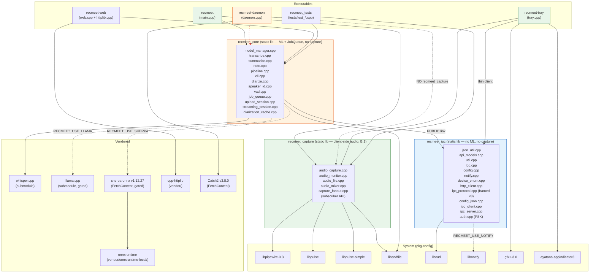

The red dashed line indicates a **prohibited** dependency: the daemon must
never link `recmeet_capture`. Build-system tests guard against accidental
relinking.

---

## 3. Daemon Internals

### 3a. Daemon Startup Sequence

V2 startup registers the new IPC verb set (no `record.start` / `record.stop`
/ `sources.list` / `job.context`) and initializes the typed `JobQueue` plus
the upload and streaming session managers. PSK auth is gated **first** for
TCP transport; Unix transport bypasses auth.

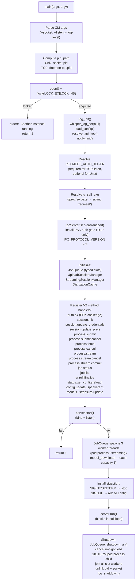

### 3b. JobQueue Per-Slot State Machine

V2 replaces the V1 global `Idle → Recording → Postprocessing` state machine
with three **independent typed slots** in the `JobQueue`. Each slot is
capacity-1 and has its own lifecycle; the three slots execute concurrently.
There is no global daemon state — `state.changed` events project from the
union of per-slot state.

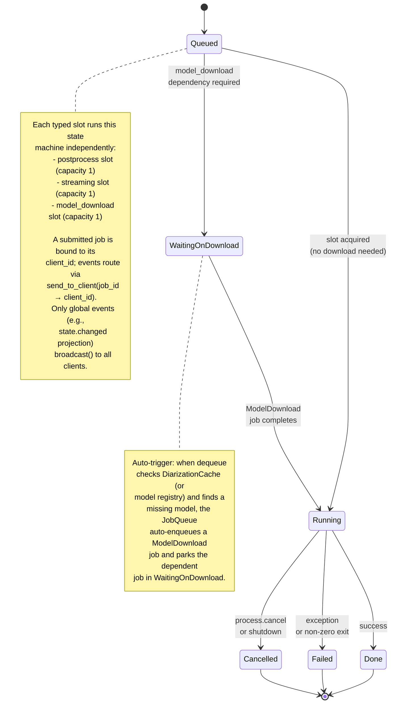

### 3b'. JobQueue Typed Slots — Concurrent Execution

The three slots run independently. A postprocess job, a streaming session,
and a model download can all be in `Running` state simultaneously. Each job
carries a `job_id`; the `send_to_client()` API resolves `job_id → client_id`
so per-job events route only to the originating client.

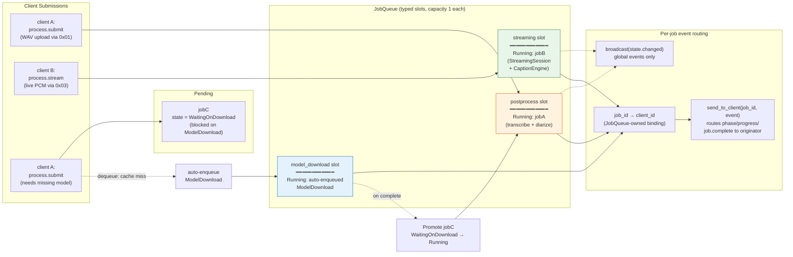

### 3c. JobQueue Slot Worker Lifecycle

Each typed slot runs an identical long-lived worker loop, parameterized by
the job type it accepts. All slot workers share the `send_to_client()` API
for per-job-id event routing.

```mermaid
flowchart TB
    subgraph PP_SLOT ["postprocess slot worker (long-lived)"]
        PP_WAIT["wait on slot CV<br/>until job available || shutdown"]
        PP_SHUT{shutdown?}
        PP_DEQUEUE["Dequeue PostprocessJob<br/>(payload: upload session id<br/>or staged audio path)"]
        PP_DEP{"model<br/>available?"}
        PP_PARK["Park in<br/>WaitingOnDownload<br/>(auto-enqueue<br/>ModelDownload)"]
        PP_RUN["state = Running<br/>send_to_client(job_id,<br/>state.changed)"]
        PP_FORK["Fork/exec recmeet subprocess<br/>(see §11)"]
        PP_DONE["state = Done|Failed|Cancelled<br/>send_to_client(job_id,<br/>job.complete | error)"]

        PP_WAIT --> PP_SHUT
        PP_SHUT -->|"yes"| PP_EXIT["return"]
        PP_SHUT -->|"no"| PP_DEQUEUE
        PP_DEQUEUE --> PP_DEP
        PP_DEP -->|"no"| PP_PARK
        PP_PARK -.->|"wake on<br/>ModelDownload done"| PP_RUN
        PP_DEP -->|"yes"| PP_RUN
        PP_RUN --> PP_FORK --> PP_DONE --> PP_WAIT
    end

    subgraph ST_SLOT ["streaming slot worker (long-lived)"]
        ST_WAIT["wait on slot CV"]
        ST_DEQUEUE["Dequeue StreamingJob<br/>(from process.stream)"]
        ST_SESSION["StreamingSessionManager:<br/>open temp WAV<br/>spin CaptionEngine"]
        ST_FRAMES["Append 0x03 PCM frames<br/>emit caption events<br/>via send_to_client(job_id)"]
        ST_COMMIT{"process.stream<br/>.commit?"}
        ST_FLUSH["Flush temp WAV<br/>enqueue PostprocessJob<br/>onto postprocess slot"]
        ST_CANCEL["process.stream.cancel:<br/>discard temp, no PP"]

        ST_WAIT --> ST_DEQUEUE --> ST_SESSION --> ST_FRAMES
        ST_FRAMES --> ST_COMMIT
        ST_COMMIT -->|"yes"| ST_FLUSH
        ST_COMMIT -->|"cancel"| ST_CANCEL
        ST_FLUSH --> ST_WAIT
        ST_CANCEL --> ST_WAIT
    end

    subgraph DL_SLOT ["model_download slot worker (long-lived)"]
        DL_WAIT["wait on slot CV"]
        DL_DEQUEUE["Dequeue ModelDownloadJob<br/>(submitted or<br/>auto-enqueued)"]
        DL_DOWNLOAD["Download model<br/>emit progress via<br/>send_to_client(job_id)"]
        DL_DONE["broadcast(state.changed)<br/>wake any parked jobs"]

        DL_WAIT --> DL_DEQUEUE --> DL_DOWNLOAD --> DL_DONE --> DL_WAIT
    end
```

### 3d. Signal Handling

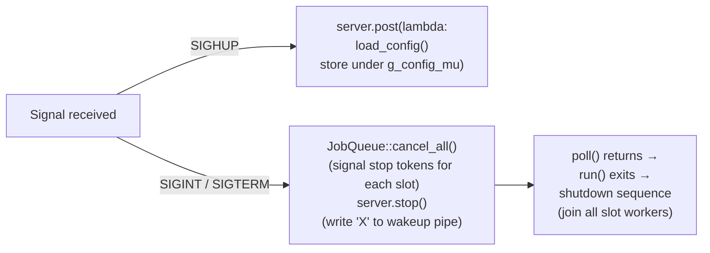

---

## 4. IPC Server Poll Loop

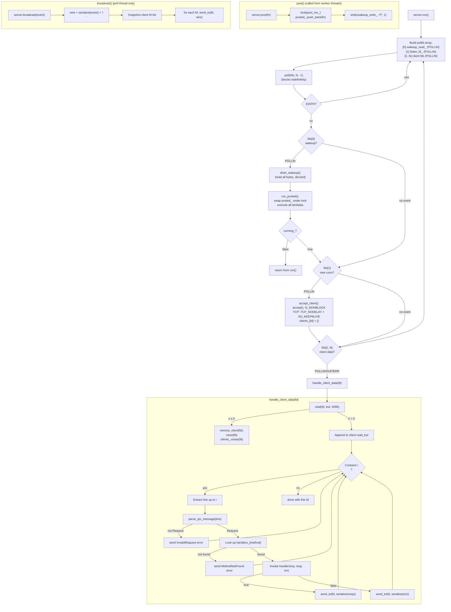

---

## 5. IPC Client Flow

### 5a. Connection + PSK Auth Handshake

V2 connection flow. After socket setup, TCP transport requires a PSK auth
challenge before any other verb is accepted. Unix transport bypasses auth.
The server enforces this by stamping each client connection with an
`authenticated` flag; only `auth.ok` is dispatched while unauthenticated.

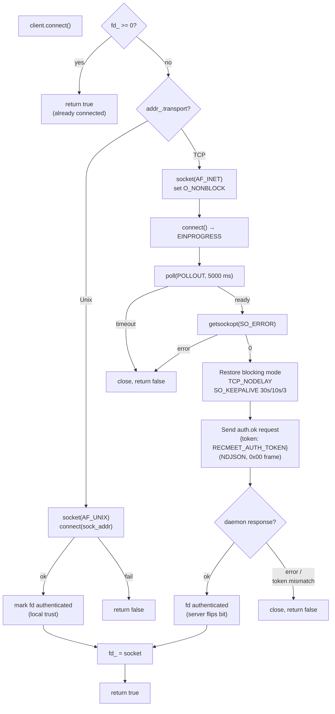

### 5b. Blocking RPC (`call()`)

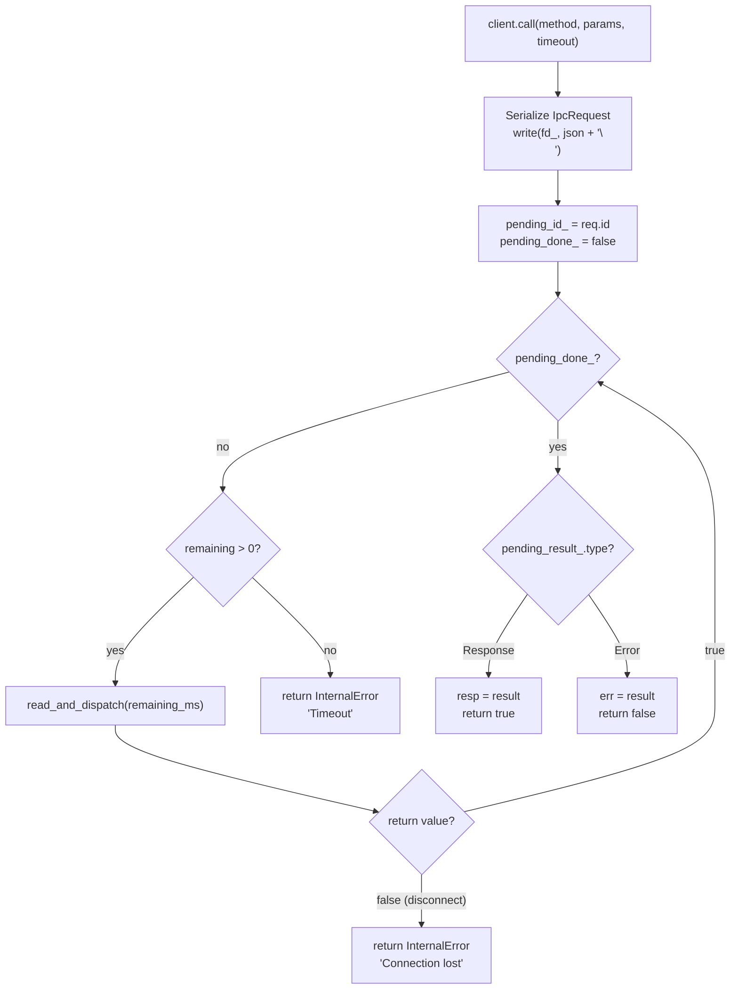

### 5c. `read_and_dispatch()` Internal

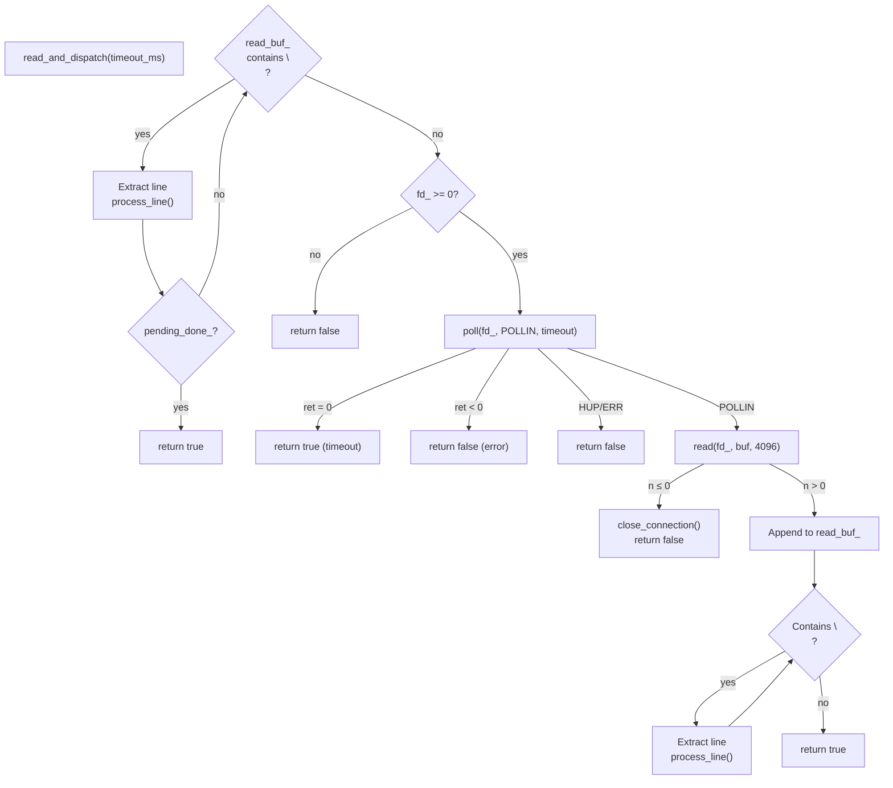

### 5d. `process_line()` Dispatch

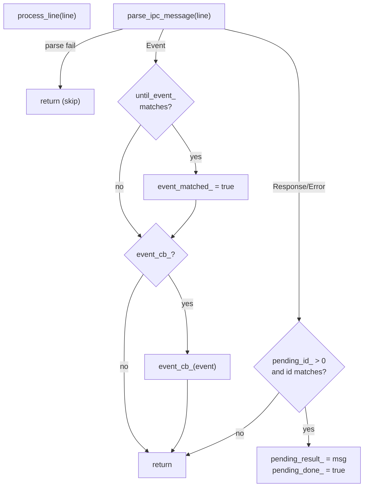

### 5e. V2 End-to-End Submit Flow (TCP)

End-to-end timeline for the canonical V2 "client uploads a WAV, daemon
postprocesses, client fetches artifact" flow over TCP. Frame discriminators
are noted inline (see `docs/IPC-WIRE-PROTOCOL.md` for the wire spec).

```mermaid
sequenceDiagram
    autonumber
    participant C as Client<br/>(CLI or tray)
    participant D as Daemon<br/>(IpcServer + JobQueue)
    participant Q as postprocess slot
    participant FS as Filesystem<br/>(meetings/)

    C->>D: TCP connect (3-way handshake)
    Note over C,D: PSK gate active
    C->>D: auth.ok {token} <<0x00>>
    D-->>C: result {authenticated:true} <<0x00>>
    Note over C,D: All other verbs now accepted

    C->>D: session.init {client_id, prefs} <<0x00>>
    D-->>C: result {session_id}

    C->>D: process.submit {kind:"postprocess", cfg} <<0x00>>
    D-->>C: result {job_id, upload_id}

    loop Upload WAV chunks
        C->>D: binary upload frames <<0x01>><br/>(header: upload_id + offset)
    end
    C->>D: process.submit finalize <<0x00>>
    D->>Q: enqueue PostprocessJob<br/>(bind job_id → client_id)
    D-->>C: event state.changed (job_id, Running)

    par Daemon processes job
        Q->>Q: fork/exec subprocess
        Q-->>C: event phase / progress<br/>(routed via send_to_client(job_id))
    and Client polls
        C->>D: job.status {job_id}
        D-->>C: result {state:"Running", progress:0.42}
    end

    Q->>FS: write Meeting_*.md, transcript, captions.vtt
    Q-->>C: event job.complete {job_id, note_path}

    C->>D: process.fetch {job_id, artifact:"note"} <<0x00>>
    D-->>C: result header <<0x00>>
    loop Stream artifact
        D-->>C: binary artifact frames <<0x02>>
    end
    D-->>C: end-of-stream marker

    Note over C,D: Errors at any step:<br/>process.cancel cancels the job;<br/>process.submit.cancel cancels<br/>the upload session.
```

---

## 6. IPC Protocol Wire Format

V2 framed protocol (`IPC_PROTOCOL_VERSION = 3`). Every wire frame begins
with a 1-byte discriminator. See **`docs/IPC-WIRE-PROTOCOL.md`** for the
authoritative frame-level spec.

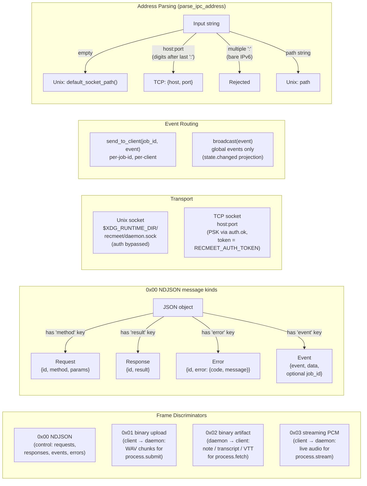

---

## 7. Recording Pipeline

`run_recording()` control flow with dual-capture and reprocess branching.
In V2 this function runs **client-side** (inside the CLI standalone mode
or invoked by the postprocess subprocess in reprocess mode); it lives in
`recmeet_core` but is never invoked by the daemon directly for live
capture. The daemon receives audio only as a finished WAV (via
`process.submit` + 0x01) or as streaming PCM (via `process.stream` + 0x03)
and dispatches `run_postprocessing()` from there.

```mermaid
flowchart TD
    ENTRY["run_recording(cfg, stop, on_phase)"]
    MODE{"cfg.reprocess_dir<br/>non-empty?"}

    MODE -->|"yes"| REPROC_RESOLVE["Resolve path<br/>(absolute or relative to output_dir)"]
    REPROC_RESOLVE --> REPROC_VALIDATE["validate_reprocess_input(path)<br/>→ pp.audio_path"]
    REPROC_VALIDATE --> REPROC_DIR["pp.out_dir = output_dir_explicit ?<br/>  cfg.output_dir : parent(audio)"]
    REPROC_DIR --> REPROC_MKDIR["fs::create_directories(pp.out_dir)"]
    REPROC_MKDIR --> RETURN["Return PostprocessInput"]

    MODE -->|"no"| DETECT{"cfg.mic_source<br/>empty?"}
    DETECT -->|"yes"| AUTO["detect_sources(device_pattern)<br/>→ mic + monitor"]
    DETECT -->|"no"| USE_CFG["Use cfg.mic_source,<br/>cfg.monitor_source"]
    AUTO -->|"no mic"| THROW["throw DeviceError"]
    AUTO --> DUAL_CHECK
    USE_CFG --> DUAL_CHECK

    DUAL_CHECK{"dual_mode?<br/>(!mic_only && monitor)"}
    DUAL_CHECK -->|"no"| SINGLE

    DUAL_CHECK -->|"yes"| DUAL

    subgraph DUAL["Dual Capture Mode"]
        D_NOTIFY["notify('Recording started')"]
        D_MIC["PipeWireCapture mic(mic_source)<br/>mic.start()"]
        D_MON_CHECK{"source ends<br/>with .monitor?"}
        D_MON_CHECK -->|"yes"| D_MON_PA["PulseMonitorCapture(source)"]
        D_MON_CHECK -->|"no"| D_MON_PW["try PipeWireCapture(source, sink=true)"]
        D_MON_PW -->|"RecmeetError"| D_MON_PA
        D_MON_PW -->|"ok"| D_TIMER
        D_MON_PA --> D_TIMER

        D_TIMER["Spawn timer_thread<br/>(display_elapsed on stderr)"]
        D_LOOP["while !stop.stop_requested()<br/>  sleep_for(200ms)"]
        D_STOP["timer_stop → join timer<br/>mic.stop() → mon.stop()"]
        D_DRAIN["mic_samples = mic.drain()<br/>mon_samples = mon.drain()"]
        D_WRITE["Write mic.wav + monitor.wav"]
        D_VAL_MIC["validate_audio(mic.wav, 1.0s)<br/>→ fatal on fail"]
        D_VAL_MON["validate_audio(monitor.wav)<br/>→ non-fatal"]
        D_VAL_MON -->|"ok"| D_MIX["mix_audio(mic, mon)<br/>→ write audio_YYYY-MM-DD_HH-MM.wav"]
        D_VAL_MON -->|"AudioValidationError"| D_MIC_ONLY["Write mic-only<br/>→ audio_YYYY-MM-DD_HH-MM.wav"]
        D_MIX --> D_CLEANUP
        D_MIC_ONLY --> D_CLEANUP
        D_CLEANUP["if !keep_sources: remove raw WAVs"]

        D_NOTIFY --> D_MIC --> D_MON_CHECK
        D_TIMER --> D_LOOP --> D_STOP --> D_DRAIN
        D_DRAIN --> D_WRITE --> D_VAL_MIC --> D_VAL_MON
    end

    subgraph SINGLE["Single Mic Mode"]
        S_MIC["PipeWireCapture(mic_source)<br/>start()"]
        S_TIMER["Spawn timer_thread"]
        S_LOOP["while !stop.stop_requested()<br/>  sleep_for(200ms)"]
        S_STOP["stop() → drain()"]
        S_WRITE["Write audio_YYYY-MM-DD_HH-MM.wav"]

        S_MIC --> S_TIMER --> S_LOOP --> S_STOP --> S_WRITE
    end

    DUAL --> RETURN
    SINGLE --> RETURN
```

---

## 8. Postprocessing Pipeline

`run_postprocessing()` with memory scoping, cancellation, and all ML stages.


---

## 8a. Chunked Diarization + Stitching

When audio length exceeds `chunk_minutes*60 + chunk_overlap_sec + 120` seconds the dispatch in `pipeline.cpp` switches from `diarize()` to `diarize_chunked()`. The chunked path keeps one `DiarizeSession` and one `SpeakerEmbeddingSession` alive across all chunks (T2.0a/T2.0b session-reuse refactor) and stitches per-chunk speaker IDs into a global registry. The pipeline then bypasses the second extractor pass via `identify_speakers_with_centroids()` (T2.2 H1), avoiding the multi-GB working-set spike that re-streaming the audio would cost on long recordings.

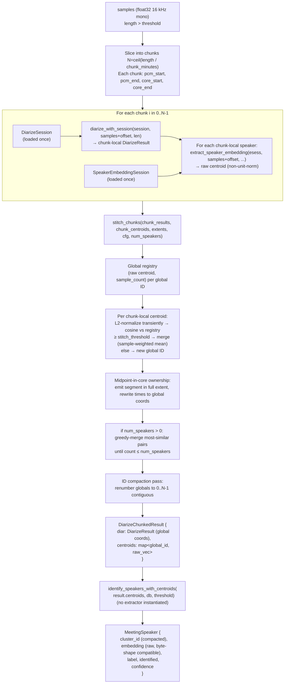

**Key invariants enforced by stitch_chunks:**

- **Raw centroid storage (T2.1 H1).** Centroids are kept as raw model output throughout — L2-normalization happens transiently for the cosine dot product only. Persisted `MeetingSpeaker.embedding` therefore stays byte-shape compatible with the legacy single-call path; `remove_embedding` and the `--enroll` matcher still work.
- **Full-extent segment emit (rev 7 M-1').** A boundary segment owned by chunk[i] is emitted with its full duration, not trimmed to the core. Adjacent-chunk benign overlap is handled by `merge_speakers`'s max-overlap rule. Trim-to-core was vulnerable to silent speech loss across chunk boundaries.
- **Sample-weighted greedy-merge.** The post-stitch count limit merges the most-similar pair using `(count_a*centroid_a + count_b*centroid_b) / (count_a+count_b)`, preserving the relative voice contribution rather than averaging blindly.
- **ID compaction (rev 7 M-2').** After all merges complete, surviving global IDs are renumbered to `0..N-1` so transcripts never show gaps like `Speaker_01, Speaker_02, Speaker_04`.

The peak-RSS gate `tests/test_benchmark.cpp` ([benchmark][t2-1]) head-to-heads `diarize()` vs `diarize_chunked()` on the same buffer, sampling `recmeet::read_self_rss_kb()` at 1 Hz; pinned thresholds are `< 4 GB` peak on 30-min synthetic and `< 6 GB` on the iter-110 60-min real fixture.

---

## 9. Tray Applet

### 9a. Tray Startup and GTK Main Loop

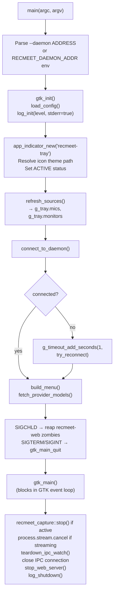

### 9b. IPC Event Integration with GTK

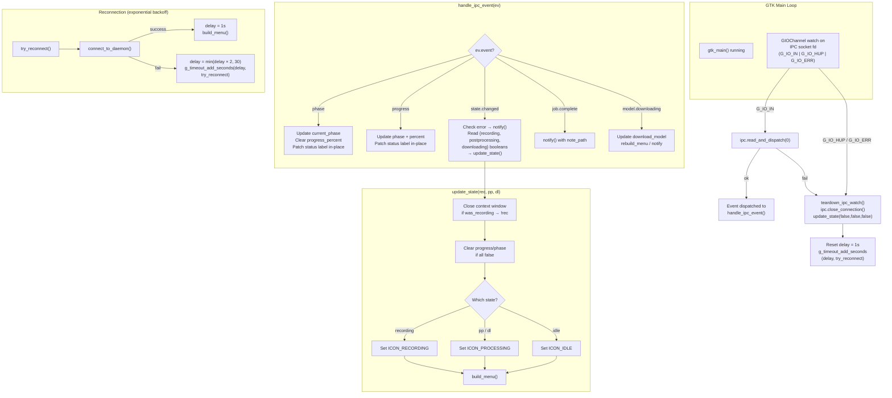

### 9c. Recording Start/Stop Flow

In V2 the tray itself owns the audio capture (via `recmeet_capture`); the
daemon never sees raw audio. The tray records to memory/disk locally, then
submits the finished WAV via `process.submit` + 0x01 frames. Stop simply
ends the local capture and triggers the upload.

```mermaid
flowchart TD
    subgraph "on_record()"
        REC_GUARD{"capture_active ||<br/>upload_in_flight?"}
        REC_GUARD -->|"yes"| REC_RET["return"]
        REC_GUARD -->|"no"| REC_CONN{"daemon_connected?"}
        REC_CONN -->|"no"| REC_RETRY["connect_to_daemon()<br/>(+ PSK auth if TCP)"]
        REC_RETRY -->|"fail"| REC_NOTIFY["notify('Cannot connect')"]
        REC_RETRY -->|"ok"| REC_KEY
        REC_CONN -->|"yes"| REC_KEY

        REC_KEY["resolve_api_key(provider)"]
        REC_KEY --> REC_KEY_CHECK{"key empty &&<br/>!no_summary?"}
        REC_KEY_CHECK -->|"yes"| REC_PROMPT["prompt_api_key() GTK dialog"]
        REC_PROMPT --> REC_SAVE["Save to api_keys + config"]
        REC_KEY_CHECK -->|"no"| REC_BUILD
        REC_SAVE --> REC_BUILD

        REC_BUILD["Build run_cfg from g_tray.cfg"]
        REC_BUILD --> REC_CAP["recmeet_capture::start()<br/>(local capture begins;<br/>WAV stager subscriber active)"]
        REC_CAP --> REC_OPT{"captions on?"}
        REC_OPT -->|"yes"| REC_STREAM["ipc.call('process.stream',<br/>{cfg}) → {job_id}<br/>+ install 0x03 sink subscriber"]
        REC_OPT -->|"no"| REC_CTX
        REC_STREAM --> REC_CTX
        REC_CTX["show_context_window()"]
    end

    subgraph "on_stop()"
        STOP_GUARD{"!capture_active &&<br/>!upload_in_flight?"}
        STOP_GUARD -->|"yes"| STOP_RET["return"]
        STOP_GUARD -->|"no"| STOP_CAP["recmeet_capture::stop()<br/>finalize WAV stager"]
        STOP_CAP --> STOP_STREAM{"streaming<br/>session open?"}
        STOP_STREAM -->|"yes"| STOP_COMMIT["ipc.call('process.stream.commit',<br/>{job_id, cfg, context_inline,<br/>vocabulary_append})<br/>→ daemon flushes temp WAV<br/>and enqueues postprocess"]
        STOP_STREAM -->|"no"| STOP_SUBMIT["ipc.call('process.submit',<br/>{cfg, context_inline, vocabulary})<br/>→ {job_id, upload_id}"]
        STOP_SUBMIT --> STOP_UPLOAD["Stream WAV bytes<br/>as 0x01 frames<br/>(header: upload_id + offset)"]
        STOP_UPLOAD --> STOP_FIN["process.submit finalize<br/>→ daemon enqueues<br/>PostprocessJob"]
        STOP_COMMIT --> STOP_DONE["Status returns to 'idle';<br/>wait for job.complete event"]
        STOP_FIN --> STOP_DONE
    end
```

### 9d. Tray Menu Structure

```mermaid
graph TD
    MENU["GTK Menu"]
    MENU --> STATUS["(i) Status label<br/>(insensitive, patched in-place)"]
    MENU --> SEP1["─── separator ───"]
    MENU --> REC_SECTION["Record / Stop / Cancel<br/>(context-sensitive)"]
    MENU --> SEP2["─── separator ───"]
    MENU --> MIC["▶ Mic Source<br/>  ○ Auto-detect<br/>  ○ source1<br/>  ○ source2"]
    MENU --> MON["▶ Monitor Source<br/>  ○ Auto-detect<br/>  ○ monitor1"]
    MENU --> MODEL["▶ Whisper Model<br/>  ○ tiny / base / small /<br/>    medium / large-v3"]
    MENU --> LANG["▶ Language<br/>  ○ Auto-detect<br/>  ○ en / es / fr / ..."]
    MENU --> SEP3["─── separator ───"]
    MENU --> CHECKS["☑ Mic Only<br/>☑ No Summary<br/>☑ Speaker Diarization<br/>☑ VAD Segmentation"]
    MENU --> SEP4["─── separator ───"]
    MENU --> SUMMARY["▶ Summary<br/>  ▶ Provider<br/>    ○ xAI / OpenAI / Anthropic / Local<br/>  ▶ Model<br/>    ○ (fetched from API)"]
    MENU --> OUTPUT["▶ Output<br/>  (i) Output dir<br/>  (i) Note dir<br/>  Open Latest Session<br/>  Set Output Dir...<br/>  Set Note Dir...<br/>  Set LLM Model..."]
    MENU --> SEP5["─── separator ───"]
    MENU --> EDIT["Edit Config"]
    MENU --> SPEAKER["Speaker Management"]
    MENU --> REFRESH["Refresh Devices"]
    MENU --> UPDATE["Update Models"]
    MENU --> ABOUT["About"]
    MENU --> SEP6["─── separator ───"]
    MENU --> QUIT["Quit"]
```

---

## 10. CLI Mode Selection

```mermaid
flowchart TD
    ENTRY["main(argc, argv)"]
    PARSE["parse_cli(argc, argv) → CliResult"]

    PARSE --> VER{"--version?"}
    VER -->|"yes"| PRINT_VER["Print version, exit 0"]
    VER -->|"no"| HELP{"--help?"}
    HELP -->|"yes"| PRINT_HELP["Print help, exit 0"]
    HELP -->|"no"| ADDR_ENV{"RECMEET_DAEMON_ADDR<br/>env set?"}
    ADDR_ENV -->|"yes"| SET_ADDR["daemon_addr = env<br/>force DaemonMode::Force"]
    ADDR_ENV -->|"no"| STATUS_CHECK
    SET_ADDR --> STATUS_CHECK

    STATUS_CHECK{"--status?"}
    STATUS_CHECK -->|"yes"| CLIENT_STATUS["client_status(addr) → exit"]
    STATUS_CHECK -->|"no"| STOP_CHECK{"--stop?"}
    STOP_CHECK -->|"yes"| CLIENT_STOP["client_stop(addr) → exit"]
    STOP_CHECK -->|"no"| MODEL_DL{"--download-model?"}
    MODEL_DL -->|"yes"| DL_LOOP["Download models → exit"]
    MODEL_DL -->|"no"| VOCAB{"--list/add/remove/<br/>reset-vocab?"}
    VOCAB -->|"yes"| VOCAB_OPS["Vocab management<br/>+ save_config() → exit"]
    VOCAB -->|"no"| SPKR{"--speakers/reset/<br/>remove-speaker?"}
    SPKR -->|"yes"| SPKR_OPS["Speaker DB ops → exit"]
    SPKR -->|"no"| ENROLL{"--enroll NAME?"}
    ENROLL -->|"yes"| ENROLL_FLOW["Diarize → select speaker →<br/>extract embedding →<br/>save to DB → exit"]
    ENROLL -->|"no"| IDENTIFY{"--identify DIR?"}
    IDENTIFY -->|"yes"| ID_FLOW["Diarize → identify →<br/>print results → exit"]
    IDENTIFY -->|"no"| RECORD_FLOW

    subgraph RECORD_FLOW["Recording Flow"]
        REC_INIT["resolve_api_key()<br/>log_init()<br/>validate inputs"]
        DAEMON_MODE{"DaemonMode?"}
        DAEMON_MODE -->|"Force"| USE_DAEMON["use_daemon = true"]
        DAEMON_MODE -->|"Disable"| STANDALONE["use_daemon = false"]
        DAEMON_MODE -->|"Auto"| PROBE["daemon_running(addr)?"]
        PROBE -->|"yes"| USE_DAEMON
        PROBE -->|"no"| STANDALONE

        USE_DAEMON --> CLIENT_RECORD
        STANDALONE --> STANDALONE_MAIN

        subgraph CLIENT_RECORD["Client Mode (V2 thin client)"]
            CR_CONNECT["IpcClient::connect()<br/>(PSK auth if TCP)"]
            CR_CB["Set event callback<br/>(phase, progress, state, complete)<br/>events routed via job_id"]
            CR_INIT["call('session.init', {prefs})"]
            CR_CAP["recmeet_capture::start()<br/>(local audio capture)"]
            CR_PRINT["Print 'Recording started.<br/>Press Ctrl+C to stop.'"]
            CR_SIGINT["Install SIGINT handler<br/>→ recmeet_capture::stop()<br/>→ call('process.submit', cfg)<br/>→ stream 0x01 WAV frames<br/>→ finalize"]
            CR_WAIT["read_events('job.complete')<br/>(blocks until done;<br/>poll via job.status if desired)"]
            CR_FETCH["call('process.fetch', job_id)<br/>→ receive 0x02 artifact frames"]

            CR_CONNECT --> CR_CB --> CR_INIT --> CR_CAP --> CR_PRINT --> CR_SIGINT --> CR_WAIT --> CR_FETCH
        end

        subgraph STANDALONE_MAIN["Standalone Mode"]
            SM_SUBPROC{"--progress-json &&<br/>--config-json?"}
            SM_SUBPROC -->|"yes"| SUBPROCESS["subprocess_main()<br/>(see §11)"]
            SM_SUBPROC -->|"no"| SM_NORMAL

            subgraph SM_NORMAL["Normal Standalone"]
                SM_KEY["Validate API key"]
                SM_SIG["sigaction(SIGINT) → g_stop"]
                SM_MODELS["Interactive model checks:<br/>whisper Y/n, LLM, diarize, VAD"]
                SM_RUN["run_pipeline(cfg, g_stop)"]
                SM_DONE["log_shutdown()<br/>notify_cleanup()"]

                SM_KEY --> SM_SIG --> SM_MODELS --> SM_RUN --> SM_DONE
            end
        end

        REC_INIT --> DAEMON_MODE
    end
```

### 10b. Batch Reprocess Orchestration

`--reprocess-batch DIR` (iter 128) wraps the single-meeting reprocess path in a classify-and-dispatch loop. The driver is `run_reprocess_batch()` in `src/reprocess_batch.cpp`; it locks the daemon-vs-standalone dispatch decision once at start and tags every dispatched job with `cfg.batch_mode = true` so the tray can suppress per-meeting notifications and emit only the end-of-batch summary.

```mermaid
flowchart TD
    BATCH_ENTRY["main: --reprocess-batch DIR<br/>(set cfg.reprocess_batch_dir)"]
    BATCH_GUARD["batch_sigint_handler installed once<br/>(daemon-mode also installs per-iter<br/>handler in dispatch_one_reprocess)"]
    CLASSIFY["classify_batch_entries(DIR)<br/>→ {needs_processing, has_note,<br/>   no_wav, malformed_dirname}"]
    PRINT_SUMMARY["Print classification tally"]

    DRY{"--dry-run?"}
    DRY -->|"yes"| DRY_EXIT["exit 0 (no work done)"]
    DRY -->|"no"| MODE_LOCK

    MODE_LOCK["Lock daemon-vs-standalone:<br/>probe daemon ONCE<br/>(failures mid-batch error out cleanly)"]
    ENSURE_MODELS["ensure_models_cached_or_fail()<br/>(once, not per meeting)"]

    LOOP_HEAD{"For each entry<br/>in needs_processing"}
    DISPATCH["dispatch_one_reprocess(entry, locked_mode)<br/>↳ daemon: client_record_no_sigaction()<br/>  standalone: subprocess pp via run_pipeline<br/>  cfg.batch_mode = true on the dispatched job"]
    OUTCOME{"Outcome?"}
    SIGNAL_CHECK{"g_batch_stop_requested<br/>set?"}

    BATCH_ENTRY --> BATCH_GUARD --> CLASSIFY --> PRINT_SUMMARY --> DRY
    MODE_LOCK --> ENSURE_MODELS --> LOOP_HEAD
    LOOP_HEAD -->|"next"| DISPATCH
    DISPATCH --> OUTCOME
    OUTCOME -->|"Success / Failed"| RECORD_RESULT["Append per-meeting status<br/>to batch summary"]
    OUTCOME -->|"Cancelled<br/>(SIGINT or batch_stop)"| RECLASSIFY["Reclassify Failed→Cancelled<br/>if iter_stop or<br/>g_batch_stop_requested set"]
    RECORD_RESULT --> SIGNAL_CHECK
    RECLASSIFY --> SIGNAL_CHECK
    SIGNAL_CHECK -->|"yes"| BREAK["Break loop<br/>print partial summary<br/>exit 130"]
    SIGNAL_CHECK -->|"no"| LOOP_HEAD
    LOOP_HEAD -->|"done"| END_SUMMARY["Print end-of-batch summary<br/>(tray emits ONE notification<br/>via batch_job gating, see §11e)"]
    END_SUMMARY --> EXIT_BATCH["exit 0 (or 1 if any meeting failed)"]
```

**Hybrid SIGINT model.** Two handlers cooperate:

- `batch_sigint_handler` (installed once at batch entry, standalone-only): sets `g_batch_stop_requested` so the loop breaks after the current iteration's clean shutdown.
- `batch_daemon_sigint_handler` (re-installed per iteration via `dispatch_one_reprocess` in daemon mode): forwards SIGINT to the daemon as `process.cancel {job_id}` for the current job, then sets `g_batch_stop_requested` so the loop breaks once the daemon reports the job ended.

A single Ctrl-C aborts the current meeting's pipeline, lets it shut down cleanly, then exits the loop with code 130. Per-meeting failures (transcription error, OOM, malformed audio) record into the summary but do not abort the batch.

**Daemon-disappearance handling.** If the daemon dies between iterations (rare), `client_record_no_sigaction()` returns the canonical exit code `kClientConnectFailedExitCode == 2` from `dispatch_one_reprocess` and the batch loop exits with a clear "daemon died mid-batch" error rather than silently switching to standalone mode mid-run.

---

## 11. Subprocess Postprocessing

The daemon's **postprocess slot worker** fork/exec's the `recmeet` binary
as a child process for crash isolation. Communication is via NDJSON on
stdout/stderr pipes. The input WAV is the one staged on disk by the
upload session (`process.submit` + 0x01) or by the streaming session
(`process.stream.commit`).

### 11a. Fork/Exec Flow

```mermaid
flowchart TD
    JOB["PostprocessJob dequeued"]
    CFG_FIX["job.cfg.reprocess_dir = job.input.out_dir<br/>(ensures subprocess reprocesses,<br/>never starts live recording)"]
    CFG_WRITE["write_job_config() → temp JSON file<br/>/tmp/recmeet-pp-{job_id}.json"]
    ARGV["Build argv:<br/>[g_self_exe, --reprocess, out_dir,<br/> --config-json, cfg_path,<br/> --progress-json, --no-daemon]"]
    PIPES["pipe(stdout_pipe)<br/>pipe(stderr_pipe)"]
    FORK["fork()"]

    JOB --> CFG_FIX --> CFG_WRITE --> ARGV --> PIPES --> FORK

    FORK -->|"child (pid=0)"| CHILD
    FORK -->|"parent"| PARENT

    subgraph CHILD["Child Process"]
        C_SIG["Reset SIGINT/SIGTERM/SIGHUP<br/>to SIG_DFL"]
        C_DUP["dup2(stdout_pipe[1], STDOUT)<br/>dup2(stderr_pipe[1], STDERR)"]
        C_CLOSE["closefrom(3)<br/>(close ALL inherited fds:<br/>log fd, IPC sockets, pid lock)"]
        C_EXEC["execv(g_self_exe, argv)"]
        C_FAIL["_exit(127) on exec failure"]

        C_SIG --> C_DUP --> C_CLOSE --> C_EXEC --> C_FAIL
    end

    subgraph PARENT["Parent (postprocess slot worker)"]
        P_CLOSE["Close write ends of both pipes"]
        P_PID["g_pp_child_pid.store(child_pid)"]
        P_POLL["Poll loop<br/>(see §11b)"]
        P_WAIT["waitpid(pid, &status, 0)"]
        P_CLEAR["g_pp_child_pid = -1<br/>Delete temp config JSON"]
        P_INTERPRET["Interpret exit status<br/>(see §11c)"]

        P_CLOSE --> P_PID --> P_POLL --> P_WAIT --> P_CLEAR --> P_INTERPRET
    end
```

### 11b. NDJSON Poll Loop and Watchdog

```mermaid
flowchart TD
    POLL["poll({stdout_fd, stderr_fd}, 2, 1000ms)"]

    POLL --> STDOUT{"stdout<br/>readable?"}
    STDOUT -->|"yes"| PARSE_OUT["Read lines, parse NDJSON"]

    PARSE_OUT --> EV_TYPE{"event type?"}
    EV_TYPE -->|"phase"| PHASE_BC["server.post(broadcast phase)<br/>Reset last_percent = -1<br/>Update last_progress timestamp"]
    EV_TYPE -->|"progress"| PROG_THROTTLE{"pct jump ≥ 10%<br/>or elapsed ≥ 120s?"}
    PROG_THROTTLE -->|"yes"| PROG_BC["server.post(broadcast progress)<br/>Update last_progress"]
    PROG_THROTTLE -->|"no"| SKIP["Skip (throttled)"]
    EV_TYPE -->|"job.complete"| CAPTURE["Capture note_path, output_dir"]
    EV_TYPE -->|"heartbeat"| HEARTBEAT["Update last_heartbeat only"]

    STDOUT -->|"no"| STDERR
    STDERR{"stderr<br/>readable?"}
    STDERR -->|"yes"| LOG_ERR["Log line, track last_stderr_line"]
    STDERR -->|"no"| WATCHDOG

    PHASE_BC --> WATCHDOG
    PROG_BC --> WATCHDOG
    SKIP --> WATCHDOG
    CAPTURE --> WATCHDOG
    HEARTBEAT --> WATCHDOG
    LOG_ERR --> WATCHDOG

    subgraph WATCHDOG["Dual-Timestamp Watchdog"]
        WD1{"last_heartbeat<br/>> 120s stale?"}
        WD1 -->|"yes"| KILL["kill(pid, SIGTERM)<br/>killed_stale = true<br/>Close both pipes<br/>Break poll loop"]
        WD1 -->|"no"| WD2{"last_progress<br/>> 300s stale?"}
        WD2 -->|"yes"| KILL
        WD2 -->|"no"| CANCEL_CHECK
    end

    CANCEL_CHECK{"g_pp_stop<br/>requested?"}
    CANCEL_CHECK -->|"yes"| CANCEL_KILL["kill(pid, SIGTERM)<br/>g_pp_stop.reset()"]
    CANCEL_CHECK -->|"no"| EOF_CHECK

    EOF_CHECK{"Both pipes<br/>closed?"}
    EOF_CHECK -->|"yes"| EXIT_POLL["Exit poll loop"]
    EOF_CHECK -->|"no"| POLL

    CANCEL_KILL --> POLL
```

### 11c. Exit Status Interpretation

```mermaid
flowchart LR
    EXIT{"Child exit status"}
    EXIT -->|"exit(0)"| OK["server.post(broadcast<br/>job.complete event)"]
    EXIT -->|"exit(2)"| CANCELLED["Log: 'Cancelled'<br/>(no notification)"]
    EXIT -->|"exit(127)"| LAUNCH_FAIL["'Failed to launch subprocess'"]
    EXIT -->|"killed_stale"| DEADLOCK["'Processing stalled<br/>(no progress) — likely<br/>onnxruntime deadlock'"]
    EXIT -->|"signal N"| CRASH["'Processing crashed<br/>(signal N: SIGNAME)'"]
    EXIT -->|"exit(N) other"| FAIL["'Processing failed<br/>(exit N): last_stderr_line'"]

    LAUNCH_FAIL --> NOTIFY["notify() + broadcast_state(error)"]
    DEADLOCK --> NOTIFY
    CRASH --> NOTIFY
    FAIL --> NOTIFY
```

### 11d. Subprocess Internal Flow

```mermaid
flowchart TD
    ENTRY["subprocess_main(cli)"]
    LOG_OFF["log_shutdown()<br/>(no file/stderr logging;<br/>NDJSON stdout only)"]
    READ_CFG["Read config JSON from<br/>cli.config_json_path"]
    PARSE["config_from_json(content) → cfg"]
    SUPPRESS["Suppress whisper log noise"]
    SIGNALS["sigaction(SIGINT/SIGTERM)<br/>→ g_stop.request()"]
    HEARTBEAT["Spawn heartbeat thread:<br/>write NDJSON {'event':'heartbeat'}<br/>every ~10s"]
    REC["run_recording(cfg, g_stop, on_phase)<br/>→ input (reprocess mode: returns immediately)"]
    PP["run_postprocessing(cfg, input,<br/>on_phase, on_progress, &g_stop)"]
    COMPLETE["Write NDJSON job.complete<br/>{note_path, output_dir}"]
    CLEANUP["Stop heartbeat thread<br/>Remove temp config JSON"]
    RET{"result?"}
    RET -->|"success"| EXIT0["return 0"]
    RET -->|"RecmeetError('Cancelled')"| EXIT2["return 2"]
    RET -->|"other error"| EXIT1["return 1"]

    ENTRY --> LOG_OFF --> READ_CFG --> PARSE --> SUPPRESS
    SUPPRESS --> SIGNALS --> HEARTBEAT --> REC --> PP --> COMPLETE --> CLEANUP --> RET
```

### 11e. batch_mode and batch_job propagation

When `--reprocess-batch` is the entry point (see §10b), each dispatched job carries `cfg.batch_mode = true`. This propagates through the IPC and subprocess boundary so the tray can render exactly one end-of-batch desktop notification instead of one per meeting.

```mermaid
flowchart LR
    BATCH_DRIVER["run_reprocess_batch:<br/>cfg.batch_mode = true<br/>per dispatched job"]
    DAEMON["daemon.cpp process.submit<br/>handler stores cfg<br/>(includes batch_mode)"]
    JSON["write_job_config():<br/>job config JSON<br/>includes 'batch_mode' field"]
    SUBPROC["subprocess_main reads<br/>config_from_json,<br/>cfg.batch_mode set"]
    JOB_COMPLETE["subprocess emits<br/>NDJSON job.complete<br/>{note_path, output_dir,<br/> batch_job: cfg.batch_mode}"]
    DAEMON_BC["daemon poll loop:<br/>send_to_client(job_id,<br/>job.complete) — routed,<br/>NOT broadcast"]
    TRAY["tray.cpp on_job_complete:<br/>if (batch_job) skip notify();<br/>else notify('Note written: …')"]

    BATCH_DRIVER --> DAEMON --> JSON --> SUBPROC --> JOB_COMPLETE --> DAEMON_BC --> TRAY
```

The standalone `--reprocess-batch` path (no daemon) bypasses the tray entirely — the CLI prints the per-meeting status lines directly and emits a single libnotify desktop notification at end of batch, gated by the same `cfg.batch_mode` flag inside `run_reprocess_batch()`.

A live single-meeting reprocess or live recording leaves `cfg.batch_mode = false`; the tray then renders a per-meeting "Note written: …" notification on `job.complete` as before.

---

## 12. Audio Capture Subsystem (Client-Side, recmeet_capture)

In V2 audio capture lives **on the client tier** in the `recmeet_capture`
library (B.1). Both `recmeet-tray` and `recmeet` (CLI) link this lib;
**the daemon does not**. A single capture instance fans out to multiple
subscribers via the B.1 `CaptureSubscriber` interface — typically a WAV
stager (which uploads the finished file via `process.submit` + 0x01) and,
when live captions are requested, a streaming sink that pushes 0x03 PCM
frames via `process.stream`.

```mermaid
flowchart TD
    subgraph CLIENT_SCOPE ["Client Tier (tray or CLI)"]
        SEL_START["Audio source names<br/>(prefs or auto-detect)"]
        SEL_EMPTY{"mic_source<br/>empty?"}
        SEL_EMPTY -->|"yes"| SEL_DETECT["detect_sources(pattern)<br/>→ mic + monitor"]
        SEL_EMPTY -->|"no"| SEL_USE["Use configured values"]
        SEL_DETECT -->|"no mic"| SEL_ERR["throw DeviceError"]
        SEL_DETECT --> CAPTURE_INIT
        SEL_USE --> CAPTURE_INIT

        CAPTURE_INIT["recmeet_capture::PipeWireCapture(mic)<br/>+ optional monitor capture<br/>S16LE mono 16 kHz"]

        subgraph FANOUT ["Capture Fan-out (B.1 subscriber API)"]
            SUB_WAV["WAV stager subscriber<br/>(buffers samples,<br/>writes audio_*.wav)"]
            SUB_STREAM["Streaming sink subscriber<br/>(optional, when<br/>captions toggle on)"]
            SUB_MIX["Mixer subscriber<br/>(mic + monitor →<br/>combined int16 stream)"]
        end

        CAPTURE_INIT --> FANOUT

        subgraph DAEMON_PUSH ["Push to daemon via IPC"]
            SUB_WAV -->|"on stop:<br/>finalize WAV"| UP_SUBMIT["process.submit + 0x01 frames<br/>(WAV bytes)"]
            SUB_STREAM -->|"every ~20 ms"| UP_STREAM["process.stream + 0x03 frames<br/>(PCM chunks)"]
        end
    end

    subgraph SERVER ["Server Tier (daemon — no capture lib)"]
        D_UPLOAD["UploadSessionManager<br/>assembles WAV<br/>→ enqueue PostprocessJob"]
        D_STREAM["StreamingSessionManager<br/>appends to temp WAV<br/>+ CaptionEngine"]
    end

    UP_SUBMIT -.->|"TCP/Unix"| D_UPLOAD
    UP_STREAM -.->|"TCP/Unix"| D_STREAM

    subgraph PW_INTERNALS ["PipeWireCapture Internals (Pimpl, B.1)"]
        PW_INIT["pw_init(), pw_main_loop_new()<br/>pw_stream_new()"]
        PW_PROPS["Properties:<br/>S16LE, 16 kHz, mono<br/>capture_sink for loopback"]
        PW_CB["on_process callback (RT thread):<br/>dequeue buffer → notify each<br/>subscriber via lock-free path"]
        PW_THREAD["pw_main_loop on its own thread"]
        PW_INIT --> PW_PROPS --> PW_CB --> PW_THREAD
    end

    subgraph PA_INTERNALS ["PulseMonitorCapture Internals (B.1 fallback)"]
        PA_INIT["pa_simple_new(source, record)<br/>S16LE, 16 kHz, mono"]
        PA_THREAD["Capture thread:<br/>pa_simple_read() in loop<br/>publishes to subscribers"]
        PA_INIT --> PA_THREAD
    end

    style CLIENT_SCOPE fill:#e8f5e9,stroke:#2e7d32
    style SERVER fill:#fff3e0,stroke:#e65100
    style FANOUT fill:#e3f2fd,stroke:#1565c0
```

**Key V2 properties:**

- One physical PipeWire/Pulse capture, many logical consumers. The B.1
  fan-out runs subscriber callbacks on the RT thread; subscribers are
  expected to be lock-free (ring-buffer copy + atomic publish).
- WAV staging and streaming are independent paths; the user can have
  captions on without recording, or recording without captions.
- Mixer + validation logic that used to run inside `run_recording()` on
  the daemon now lives on the client side; the daemon receives a finished
  WAV (`process.submit`) or a temp WAV assembled from streamed frames
  (`process.stream` → `process.stream.commit`).

---

## 13. Go Tools Module

### 13a. Module Structure and Data Flow

```mermaid
graph TB
    subgraph "Go Binaries"
        MCP_BIN["recmeet-mcp<br/>(cmd/recmeet-mcp/main.go)"]
        AGENT_BIN["recmeet-agent<br/>(cmd/recmeet-agent/main.go)"]
    end

    subgraph "meetingdata (shared library)"
        MD_CONFIG["config.go<br/>Parse config.yaml<br/>(flat YAML, matches C++)"]
        MD_MEETINGS["meetings.go<br/>Scan output dirs<br/>YYYY-MM-DD_HH-MM pattern"]
        MD_NOTES["notes.go<br/>Parse frontmatter +<br/>callout sections + search"]
        MD_ACTIONS["actionitems.go<br/>Parse ## Action Items<br/>- [ ] / - [x] format"]
        MD_SPEAKERS["speakers.go<br/>Load JSON profiles<br/>(strips embeddings)"]
    end

    subgraph "mcpserver"
        MCP_SERVER["server.go<br/>Setup + registration"]
        MCP_TOOLS["tools.go<br/>5 tool handlers"]
    end

    subgraph "agent"
        AG_CONFIG["config.go<br/>Agent-specific config"]
        AG_LOOP["loop.go<br/>Agentic loop (Claude API)"]
        AG_TOOLS["tools.go<br/>7 tool definitions"]
        AG_WORKFLOWS["workflows.go<br/>Prep + follow-up prompts"]
        AG_SEARCH["search.go<br/>Brave web search"]
        AG_FETCH["fetch.go<br/>HTML text extractor"]
        AG_WRITE["writefile.go<br/>File writer"]
    end

    subgraph "External APIs"
        CLAUDE_API["Anthropic API (Claude)"]
        BRAVE_API["Brave Search API"]
    end

    subgraph "Filesystem"
        FS_CONFIG["~/.config/recmeet/<br/>config.yaml"]
        FS_MEETINGS["meetings/<br/>(dirs + notes)"]
        FS_SPEAKERS["~/.local/share/recmeet/<br/>speakers/*.json"]
        FS_CONTEXT["~/.local/share/recmeet/<br/>context/"]
    end

    MCP_BIN --> MCP_SERVER
    MCP_SERVER --> MCP_TOOLS
    MCP_TOOLS --> MD_CONFIG
    MCP_TOOLS --> MD_NOTES
    MCP_TOOLS --> MD_ACTIONS
    MCP_TOOLS --> MD_SPEAKERS

    AGENT_BIN --> AG_WORKFLOWS
    AG_WORKFLOWS --> AG_LOOP
    AG_LOOP --> AG_TOOLS
    AG_TOOLS --> MD_CONFIG
    AG_TOOLS --> MD_NOTES
    AG_TOOLS --> MD_ACTIONS
    AG_TOOLS --> MD_SPEAKERS
    AG_TOOLS --> AG_SEARCH
    AG_TOOLS --> AG_FETCH
    AG_TOOLS --> AG_WRITE

    AG_LOOP --> CLAUDE_API
    AG_SEARCH --> BRAVE_API

    MD_CONFIG --> FS_CONFIG
    MD_MEETINGS --> FS_MEETINGS
    MD_NOTES --> FS_MEETINGS
    MD_ACTIONS --> FS_MEETINGS
    MD_SPEAKERS --> FS_SPEAKERS
    AG_WRITE --> FS_CONTEXT
    MCP_TOOLS -->|"write_context_file"| FS_CONTEXT
```

### 13b. MCP Server Tool Dispatch

```mermaid
flowchart TD
    CLIENT["MCP Client<br/>(Claude Code / Desktop / Cursor)"]
    STDIO["stdio (JSON-RPC)"]
    INIT["Redirect stdout → stderr<br/>(protect JSON-RPC stream)"]

    CLIENT -->|"tools/list"| STDIO
    STDIO --> INIT
    INIT --> REGISTER["Register 5 tools"]

    CLIENT -->|"tools/call"| DISPATCH{"Tool name?"}

    DISPATCH -->|"search_meetings"| SM["SearchNotes(noteDir, outputDir,<br/>query, filters)<br/>→ formatted results"]
    DISPATCH -->|"get_meeting"| GM["FindMeeting(outputDir, meeting_dir)<br/>ParseNote(path)<br/>→ full details"]
    DISPATCH -->|"list_action_items"| LA["ListActionItems(noteDir, outputDir,<br/>status, assignee, limit)<br/>→ filtered items"]
    DISPATCH -->|"get_speaker_profiles"| SP["LoadSpeakerProfiles(dbDir)<br/>→ profiles (no embeddings)"]
    DISPATCH -->|"write_context_file"| WC["Sanitize filename<br/>Write to context staging dir"]

    SM --> CLIENT
    GM --> CLIENT
    LA --> CLIENT
    SP --> CLIENT
    WC --> CLIENT
```

### 13c. Agent Agentic Loop

```mermaid
flowchart TD
    ENTRY["recmeet-agent prep|follow-up"]
    BUILD_PROMPT["Build system prompt +<br/>user message from workflow"]
    REGISTER["Register tools:<br/>search_meetings, get_meeting,<br/>list_action_items, get_speaker_profiles,<br/>web_search (if BRAVE_API_KEY),<br/>web_fetch, write_file"]

    SEND["Send to Claude API<br/>(messages + tool definitions)"]
    CHECK{"Stop reason?"}

    CHECK -->|"end_turn"| EXTRACT["Extract text response<br/>Print to stdout"]
    CHECK -->|"max_iterations (20)"| EXTRACT
    CHECK -->|"tool_use"| EXEC["For each tool_use block:"]

    EXEC --> TOOL_DISPATCH{"Tool name?"}
    TOOL_DISPATCH --> TOOL_EXEC["Execute tool<br/>Collect result string"]
    TOOL_EXEC --> APPEND["Append tool_result<br/>to conversation"]
    APPEND -->|"more tools"| TOOL_DISPATCH
    APPEND -->|"all done"| SEND

    ENTRY --> BUILD_PROMPT --> REGISTER --> SEND --> CHECK

    subgraph "Verbose Mode (--verbose)"
        V_CALL["stderr: tool name + params"]
        V_RESULT["stderr: result preview"]
    end
```

---

## 14. Live Captioning Pipeline (V2 Streaming)

V2 moves audio capture to the client and turns captioning into a routed
streaming verb. The client opens a `process.stream` session, pushes 0x03
PCM frames, and the daemon's `StreamingSessionManager` runs a server-side
`CaptionEngine` that emits `caption` events back to the originator via
`send_to_client()`. On `process.stream.commit` the temp WAV is flushed and
a `PostprocessJob` is enqueued onto the postprocess slot for final
transcription / diarization / note generation.

```mermaid
flowchart TD
    subgraph CLIENT ["Client Tier (tray / CLI)"]
        CAP["recmeet_capture<br/>PipeWire/Pulse RT thread<br/>(int16 mono 16 kHz)"]
        SUB_STREAM["Streaming sink subscriber<br/>(B.1 fan-out)"]
        OPEN["process.stream <<0x00>><br/>open streaming job<br/>→ {job_id}"]
        FRAMES["For each ~20 ms chunk:<br/>send 0x03 PCM frame<br/>(header: job_id + seq)"]
        COMMIT_DEC{"User<br/>action?"}
        COMMIT["process.stream.commit<br/>→ enqueue postprocess job"]
        CANCEL["process.stream.cancel<br/>→ discard temp WAV"]

        CAP --> SUB_STREAM --> FRAMES
        OPEN --> FRAMES
        FRAMES --> COMMIT_DEC
        COMMIT_DEC -->|"stop + keep"| COMMIT
        COMMIT_DEC -->|"abandon"| CANCEL
    end

    subgraph DAEMON ["Server Tier (daemon, streaming slot)"]
        SSM["StreamingSessionManager<br/>(per job_id)"]
        TEMP_WAV["Disk-backed temp WAV<br/>(append samples<br/>as they arrive)"]
        ENGINE["CaptionEngine<br/>(server-side, streaming<br/>Zipformer, int8)"]
        RING["SPSC ring buffer<br/>~32k samples (~2s)"]
        WORKER["ASR worker thread<br/>(SCHED_BATCH;<br/>nice +10 fallback)"]
        DECODE["recognizer.Decode +<br/>endpoint detection"]
        EMIT_PART["CaptionResult<br/>(is_partial=true)"]
        EMIT_FIN["CaptionResult<br/>(is_partial=false);<br/>recognizer.Reset"]
        DEGRADED["CaptionDegraded<br/>(BufferOverrun;<br/>rate-limited 1/s)"]
        VTT["VttWriter::append<br/>(O_APPEND, finalized<br/>cues only)"]

        SSM --> TEMP_WAV
        SSM --> RING
        RING --> WORKER --> DECODE
        DECODE -->|"partial"| EMIT_PART
        DECODE -->|"endpoint"| EMIT_FIN
        RING -.->|"overflow"| DEGRADED
        EMIT_FIN --> VTT
    end

    subgraph ROUTING ["Per-client routing"]
        SEND_CAP["send_to_client(job_id,<br/>caption event)"]
        SEND_DEG["send_to_client(job_id,<br/>caption.degraded)"]
    end

    subgraph POSTPROCESS ["Postprocess slot (after commit)"]
        ENQUEUE["JobQueue.enqueue(<br/>PostprocessJob from<br/>temp WAV path)"]
        PP_RUN["Standard postprocess<br/>(transcribe + diarize +<br/>summarize + note)"]
        ARTIFACTS["meetings/&lt;dir&gt;/<br/>Meeting_*.md<br/>captions.vtt"]
    end

    FRAMES -.->|"0x03 frames"| SSM
    EMIT_PART --> SEND_CAP
    EMIT_FIN --> SEND_CAP
    DEGRADED --> SEND_DEG
    SEND_CAP -.->|"NDJSON event"| CLIENT_RX["Client renders<br/>overlay / stderr<br/>(normalize_caption)"]
    SEND_DEG -.->|"NDJSON event"| CLIENT_RX

    COMMIT --> ENQUEUE --> PP_RUN --> ARTIFACTS

    subgraph TEARDOWN ["Teardown order (server-side)"]
        T1["1. process.stream.cancel<br/>or stream-close detected"]
        T2["2. StreamingSession dtor<br/>= unsubscribe + engine.stop()<br/>= worker join + ring drain"]
        T3["3. temp WAV finalized<br/>(flush or delete based on<br/>commit vs cancel)"]
        T1 --> T2 --> T3
    end

    style CLIENT fill:#e8f5e9,stroke:#2e7d32
    style DAEMON fill:#fff3e0,stroke:#e65100
    style ROUTING fill:#e3f2fd,stroke:#1565c0
```

**Key V2 invariants:**

- Audio never reaches the daemon as live PipeWire/Pulse samples; only as
  0x03 PCM frames over the IPC wire. The `recmeet_core` engine sees an
  in-memory ring buffer that's filled by the streaming-frame handler, not
  by a capture callback.
- Caption events are **routed**, not broadcast. The streaming slot binds
  `job_id → client_id` at session-open time; `send_to_client()` delivers
  events to the originator only. Other connected clients do not see
  captions from a streaming session they didn't open.
- `process.stream.commit` is what creates the postprocess job. A streaming
  session without commit is captions-only — no transcript, no note.
- `process.stream.cancel` (or client disconnect) discards the temp WAV;
  no postprocess job is created.
- The VTT writer uses `O_APPEND` with a single `write(2)` per cue (~100 B,
  well under the FS atomic-write block size). Crash recovery is "valid up
  to last fully-flushed cue."
- Sherpa-OFF builds compile every component cleanly; `CaptionEngine::start`
  returns false with the canonical error message and `process.stream`
  responds with a typed error.
